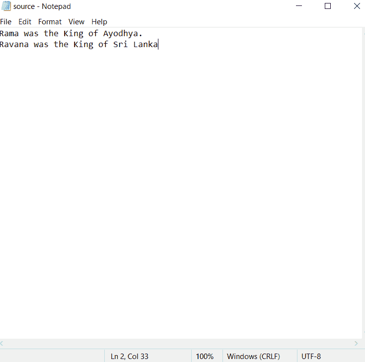
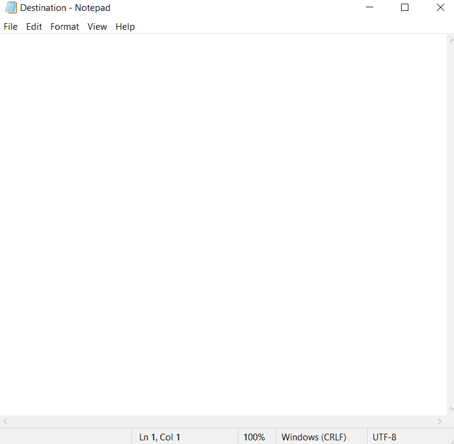
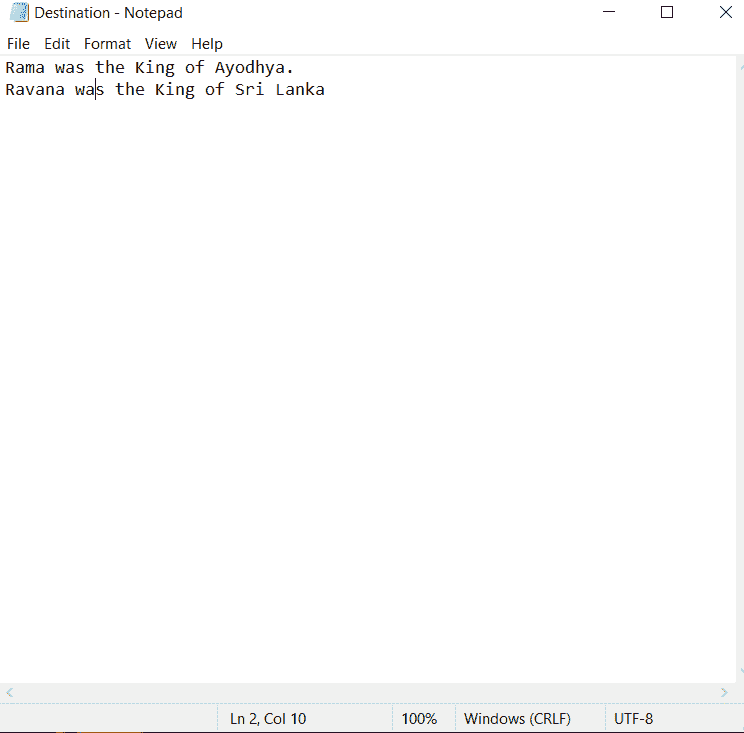

# 用 java 将数据/内容从一个文件复制到另一个文件

> 原文：<https://www.tutorialandexample.com/copy-data-content-from-one-file-to-another-in-java>

在本文中，您将了解如何将数据或内容从一个文件复制到另一个文件。此外，您将被告知在该过程中利用的类和方法。

在 Java 中，一个文件的内容可以复制到另一个文件中。FileInputStream 和 FileOutputStream 类就是为处理这种情况而设计的。

## 文件输入流

Java 中最流行和最重要的字节输入流类之一是 FileInputStream。它主要用于从文件中读取数据字节。FileInputStream 类中有许多方法可用于从文件中检索数据。

以下语法创建 FileInputStream 类的新实例:

```
FileInputStream f = new FileInputStream(file name);
```

方法构造函数接收我们想要从中检索数据的文件名。为了将数据从一个文件复制到另一个文件，我们应该使用下面两个 FileInputStream 类方法。

*   阅读()
*   关闭()

### 阅读()

从文件中提取数据时，read()方法至关重要。当它的指针接近文件的结尾时，它返回-1，并以整数形式返回数据的字节。

### 关闭()

使用 close()函数关闭 FileInputStream 类实例。

## 文件输出流

Java 中最流行和最重要的字节输出流类之一是 FileOutputStream。它主要用于将数据字节写入文件。有许多方法可以将数据传输到 FileOutputStream 类提供的文件中。

以下过程用于生成 FileOutputStream 类实例:

```
FileOutputStream f= new FileOutputStream(file name)
```

方法构造函数接收我们希望写入数据的文件名。为了将一个文件的数据复制到另一个文件，我们应该使用下面两个 FileOutputStream 类方法。

*   写()
*   关闭()

## 写()

将数据(数据字节)写入文件时，write()方法至关重要。

## 关闭()

使用 close()函数关闭 FileOutputStream 类实例。

## 文件

当从文件中写入或读取数据字节时，file 类被用来构建文件的对象。用于生成文件类实例的过程如下:

```
File fileobj = new File(file name);
```

> **注意:**如果文件类不存在，它将生成一个具有指定名称的新文件。

让我们了解所有这些将如何有助于从一个文件到另一个文件的数据复制。

文件名:Copydata.java

```
import java.io.*;
import java.util.*;
public class CopyFromFileaToFileb {

	public static void copyContent(File a, File b)
		throws Exception
	{
		FileInputStream in = new FileInputStream(a);
		FileOutputStream out = new FileOutputStream(b);

		try {

			int n;

			// read() method to obtain the data from the given file
			while ((n = in.read()) != -1) {
				// write() method to retrieve the data to another file
				out.write(n);
			}
		}
		finally {
			if (in != null) {

				// close() method is used to close the stream
				in.close();
			}
			// close() method is used to close the stream
			if (out != null) {
				out.close();
			}
		}
		System.out.println("File Copied");
	}

	public static void main(String[] args) throws Exception
	{
		Scanner sc = new Scanner(System.in);

		// obtains the name of the source file
		System.out.println(
			"Enter the name of the source file from which you wanted to copy the content or simply paste the file name :");
		String a = sc.nextLine();

		//to take source file
		File s = new File(a);

		// to get the file destination file
		System.out.println(
			"Enter the name of the destination file in which you want to copy the data or simply paste the file name :");
		String b = sc.nextLine();

		// to produce the destination file
		File d = new File(b);

		// method invoked to copy the data from the file 
		copyContent(s, d);
	}
}
```

**输出:**

```
Enter the source filename from where you have to read/copy :
source.txt
Enter the destination filename where you have to write/paste :
Destination.txt
File Copied 
```

在运行上面的程序之前。



这是源文件的截图，里面有一些文本。

这是运行上述程序之前，目标文件中没有任何内容的屏幕截图。



成功执行上述程序后。

这是运行程序后源文件的截图，其中有一些文本。


这是目标文件的屏幕截图，其中包含从源文件复制的内容

