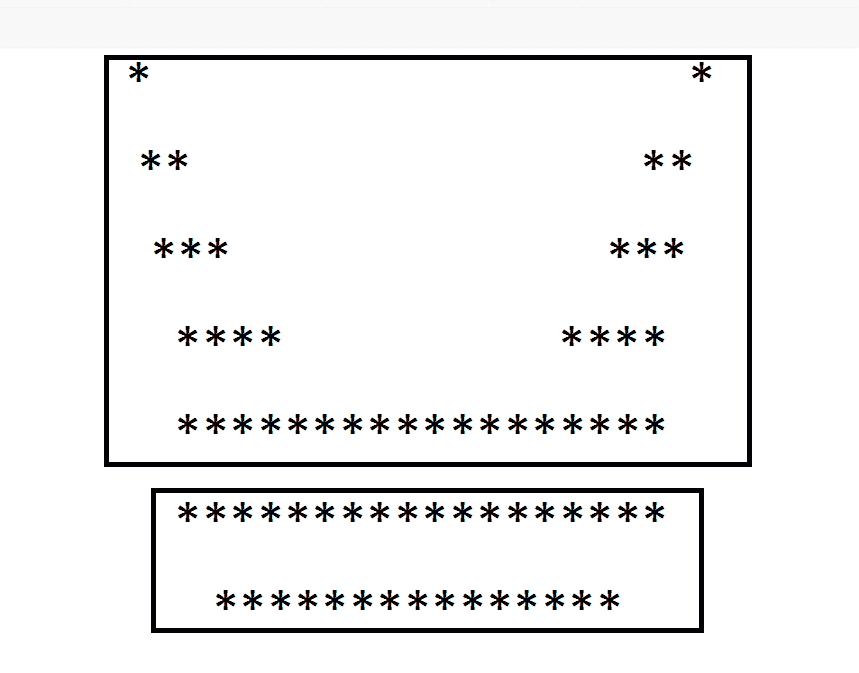
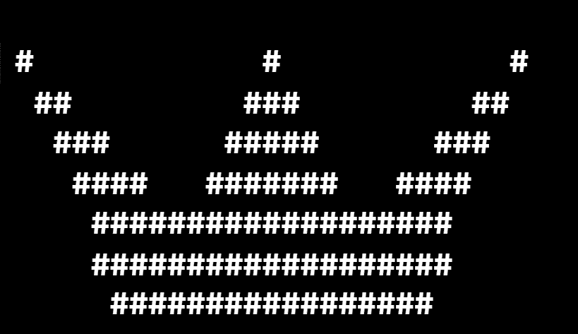
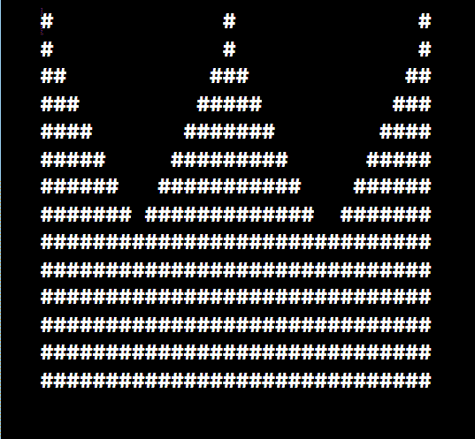
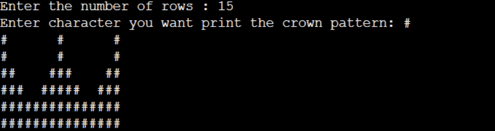

# Java 中的皇冠图案

> 原文：<https://www.tutorialandexample.com/crown-pattern-in-java>

我们知道解决模式问题的重要性。我们可以使用任何编程语言来解决模式问题。翻译成特定的编程语言没有规则。我们也可以使用 java、C++、C、python 和其他编程语言。我们可以通过解决模式来发展我们的编码技能和逻辑思维。大多数情况下，每个模式程序使用两个或多个循环。循环的数量取决于逻辑的复杂程度。在这些循环中，第一个循环用于行，第二个循环用于列。程序模式的时间和空间复杂度取决于我们使用的循环和语句的数量，以及我们在编写的程序中使用的变量的数量。

在这里，我们将学习如何使用 java 编程语言使用循环来打印冠状图案。我们可以用星星、散列和数字来打印皇冠图案。像这样，我们可以使用任何我们想要的符号来打印皇冠的图案，不仅是皇冠，还有其他图案。

## 我们如何打印皇冠图案？



为了打印牙冠图案，我们将整个牙冠分成两部分。将它分成几个部分的原因是为了方便编写代码和高效地打印模式。如果观察上图，我们把第一部分分成五行。和第二图案分成两行。

印刷冠状图案的方法。

*   我们可以提到行数，或者我们可以从键盘上读取行数，读取后将数值存储在一个整数中。
*   通过使用(rows-1)/2，我们可以计算冠状图案的高度。
*   我们必须定义两个循环来打印图案。
    第一个 for 循环是外循环，第二个 for 循环是内循环。

*   为了打印符号，我们可以使用第一个 For 循环。
*   为了打印行值，我们可以创建第一个 For 循环。
*   使用下面的条件打印图案，
    if(column = = 0)| | column = = height | | column = = row–1)and(r = = height–1)and
    if(column<r | | column>height–r)&&(column<height+row | | column>= row–r))
    否则打印图案中的空格。

*   现在根据循环打印你想要的符号。

### 示例 1:皇冠图案

**CrownPatternExampleOne.java**

```
public class CrownPatternExampleOne  
{  
  public static void main(String[]args)  
  {   
     for(int i=1; i<=5; i++)  
     {  
         for(int k=1; k<=i; k++)  
         {  
             System.out.print(" ");  
         }   
         for(int j=1; j<=i; j++)  
         {  
             System.out.print("#");  
         }   
         for(int k=1; k<=3*(4-i+1); k++)  
         {  
             System.out.print(" ");  
         }   
         for(int j=1; j<=2*i-1; j++)  
         {  
             System.out.print("#");  
         }   
         for(int k=1; k<=3*(4-i+1); k++)  
         {  
             System.out.print(" ");  
         }   
         for(int j=1; j<=i; j++)  
         {  
             System.out.print("#");  
         }   
         System.out.println();  
     }  
     for(int i=1; i<=2; i++)  
     {  
         for(int k=1; k<=5+i-1; k++)  
         {  
             System.out.print(" ");  
         }   
         for(int j=1; j<=2*(9-i+1)+1; j++)  
         {  
             System.out.print("#");  
         }   
         System.out.println();  
     }  
  }   
} 
```

  

### 示例 2:皇冠图案

**CrownPatternExampleTwo.java**

```
import java.io.*;

public class CrownPatternExampleTwo
{
    static void crown(int length, int height)
    {
        for (int i = 0; i < height; i++)
        {
            for (int j = 0; j < length; j++)
            {
                if (i == 0)
                {
                    if (j == 0 || j == height || j == length - 1)
                    {
                        System.out.print("#");
                    }
                    else {
                        System.out.print(" ");
                    }
                }
                else if (i == height - 1)
                {
                    System.out.print("#");
                }
                else if ((j < i || j > height - i) &&
                        (j < height + i || j >= length - i))
                    System.out.print("#");
                else
                    System.out.print(" ");
            }
            System.out.println();
        }
    }
    public static void main (String[] args)
    {
        int length = 30;
        int height = (length - 1) / 2;
        crown(length, height);

    }
} 
```

  

### 示例 3:皇冠图案

在这个冠状图案程序中，我们可以选择要打印的行数。

让我们看看节目单。

CrownPatternExampleThree.java

```
import java.util.*;
public class CrownPatternExampleThree
{    
    public static void main(String args[])   
    {   
    int row,r,c,h;
    char crown;
    Scanner s = new Scanner(System.in);
    System.out.print("Enter the number of rows : ");
    row = s.nextInt();
    System.out.print("Enter character you want print the crown pattern: ");
    crown = s.next().charAt(0);
    h= (row-1)/2;
    for (r = 0; r < h ; r++)
        {
            for (c = 0; c < row; c++)
            {
                if (r == 0)
                {
                    if (c == 0 || c  == h  || c == row - 1)
                        System.out.print(crown);
                    else
                        System.out.print(" ");
                }
                else if (r == h- 1)
                    System.out.print(crown);
                else if ((c < r || c > h  - r) &&(c < h  + r || c >= row - r))
                    System.out.print(crown);
                else
                    System.out.print(" ");
            }
            System.out.println();
        }
  }
} 
```

