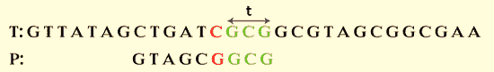
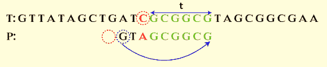

# Java Boyer Moore

> 原文：<https://www.tutorialandexample.com/java-boyer-moore>

称为 Boyer-Moore 算法的字符串搜索或匹配技术是由 Robert S. Boyer 和 J. Strother Moore 在 1977 年创建的。这是最流行和最有效的字符串匹配算法。与强力算法相比，它要快得多。Boyer-Moore 算法、它的特性以及它在 Java 程序中的应用都将在本文中讨论。它的时间复杂度为 O(nm+s)。在大多数应用程序中，Boyer-Moore 算法是最有效的字符串匹配算法。在文本编辑器中，搜索和替换命令经常使用算法的简化版本或整个算法。

### 最坏的情况

嘘…嘘…

P = psssssssss

上述序列可以在图像和 DNA 序列中找到。

## Boyer Moore 算法的特征

*   从右到左，它比较每个字符；
*   O(m+)时间和空间复杂度表征了预处理阶段。
*   搜索步骤具有 O(mn)复杂度。
*   在最坏的情况下，当寻找非周期性模式时，它比较 3n 个文本字符。
*   性能最好的复杂度为 O(n/m)。

该算法基于下面列出的两种试探法:

*   字符跳转试探法
*   镜子试探法

让我们来看看 Boyer-Moore 算法是如何工作的。

## 博耶-摩尔算法的运算

该方法从模式最右边的字符开始跟踪字符，并向左前进。它使用两个预先计算的函数，在出现任何不匹配和完全模式匹配的情况下，分别将字符向左和向右移动。好后缀移位(也称为匹配移位)和坏字符移位(或出现移位)是这两个预先计算的移位函数的名称。

> **注意:**字符需从右向左比较，并从左向右对齐，以匹配模式。

## 错误的字符移位

出现不匹配时跳过校准，直到下列情况之一不存在:

1.  不匹配变成了匹配
2.  p 避免不匹配的字符

以下面所示的文字(T)和图案(P)为例。

  

现在开始比较模式。

**第一步:**首先，从左到右对齐字符，从右到左进行比较。

我们可以看到 P 的后三个字符与 T 中的对应，第四个字符 T 是不匹配的。按照上面的指导方针，跳过比对，直到错配变成匹配。P 中的第七个字符(C)与 t 中的 C 匹配。

  

上面显示的图像显示了部分匹配。

**第二步:**向右移动三个字符匹配模式。

 **移动后，再比较一次角色，这次是从右到左。它匹配第一个字符。我们看到字符 A 不在 P 左边的位置，然后在这个例子中，P 移动到 T 中过去的不匹配字符(A)。

  

上面显示的图像显示了 P 和 T 达到匹配的过程。

**第三步:**如果 P 移过不匹配的字符，我们得到，

  

从上面显示的图像来看，模式是匹配的。序列“CCTTTTGC”在 T 和 p 中都匹配。

> **注:**坏字移位不一定好。假设 Boyer-Moore 方法在好后缀移动和坏字符移动之间应用最大值(跳过字符),那么以这种方式移动字符是合适的。

## 好后缀移位

假设一个内部循环匹配子串 t，如果是这样，跳过字符直到:

1.  P 和 t 之间不存在不匹配。
2.  p 移过 t。

以下面的模式为例。

  

**第一步:**从右到左，对比人物。我们可以看到 P 的后三个字符对应于 T 中用 T 表示的字符。

  

上面显示的图像显示了部分匹配。

**第二步:**继续，直到 P 和 T 不匹配，P (C T T A C)的前四个字符(从左到右)对应 T 中的后五个字符。

  

上面显示的图像显示了 P 和 t 不匹配的过程。

**第三步:**为了得到匹配，跳过三次比对。结果，我们得到了匹配。

  

上面显示的图像显示了匹配。序列“CTTACTTAC”在 T 和 p 中都匹配。

### 上面描述的双换档功能可以定义如下:

好后缀移位函数存储在称为“bmGs”的 m+1 大小的表中。使用定义如下的表格“suff”计算表格“bmGs ”:

```
for 1 ? i < m, suff[i]=max{k : x[i-k+1 .. i]=x[m-k .. m-1]} 
```

坏字符移位函数存储在大小为 s 的表 bmBc 中。

```
bmBc[c] = min{i : 1 ? i <m-1 and x[m-1-i]=c} if c occurs in x, m otherwise. 
```

## 使用 Boyer Moore 的模式匹配示例

想想下面的模式。

  

让我们开始配对。

**第一步:**字符要从右向左比较。第一个字符不匹配，因为 G 与 t 不匹配。

  

**第二步:**跳过下面几个字符，直到找到匹配的为止。六个字符后，匹配成功。在这种情况下，好的后缀移动规则将不适用。

  

根据错误的字符移位，p 移过不匹配的字符(例如)。

  

**第三步:**再次从右向左比较字符。我们可以观察到 P 的前三个字符与 T 匹配(T ),但它的第四个字符不匹配。

  

在这种情况下，好坏字符后缀都可以使用。当使用坏字符后缀时，只跳过一个字符。使用好的字符后缀时会忽略两个对齐方式。因此，由于算法说要跳过额外的对齐，我们将使用好的字符后缀。因此，我们省略了两个比对。

  

对齐的三个字符被改变，结果是:

  

在这里，我们可以看到 C 从 P 的左边区域消失了。好的字符对齐跳过七个对齐，差的字符对齐跳过两个对齐。

**第四步:**我们可以观察到，字符串在改变了几个字符后就匹配了。

  

在前面的模式中，我们跳过了 15 个对齐，并且忽略了 11 个 T 字符。

## Boyer Moore 预处理阶段

以下定义适用于模式 T: A A T C A A T A G C 和 P: T C G C 的计算跳过。

  

上表(字符)显示了跳过对正的数量。

## Boyer Moore 算法的伪代码

```
BoyerMooreMatch(H, T, ?)  
K<- lastOccurenceFunction(T, ?)  
i <- m-1  
j <- m-1  
repeat  
                    if H[i]=T[j]  
                             if j=0  
                                  return i {match at i}  
                             else  
                                  i <- i-1  
                                  j <- j-1  
                    else  
                         {character-jump}  
                         K<-K[H[i]]  
                         i <- i +m -min(j, 1+ l)  
                         j <- m-1  
until i>n-1  
return-1 {no match} 
```

## 用于模式搜索的 Java 程序

让我们来看看寻找模式的 Java 程序。强力字符串搜索算法在下面的程序中实现。

**文件名:**【PatternSearchingExample.java T2】

```
import java.util.HashMap;  
import java.util.Map;  
public class PatternSearchingExample  
{  
/**  
* @example text -- trace the text to see if it contains pattern 
* @example pattern -- look for this text inside the text parameter 
* @return -- return index of the first match or -1 if not found 
*/  
public static int findBruteForce(char[] text, char[] pattern)   
{  
System.out.println("Brute force looking for " + String.valueOf(pattern) + " in " + String.valueOf(text)) ;  
int n = text.length ;  
int m = pattern.length ;  
//checks if the string is empty  
if (m == 0) return 0 ;  
//brute force it -- loop over all characters in text O(n)  
for (int i=0;i<=n-m;i++)   
{ //index into the text  
//loop over all characters in pattern while characters match O(m)  
//index into the pattern  
int k = 0 ;   
while (k<m && text[i+k] == pattern[k])   
{  
k++ ;  
}  
//if at the end of the pattern, then found match starting at index i in text  
if (k==m)   
{  
System.out.println("\tFound match in the given text at index " + i) ;  
return i ;  
}  
}  
//if a match is not found  
System.out.println("\tNo match found in the given text.") ;  
return -1 ;  
}  
/** 

* @example text -- search this text to see if it contains pattern 
* @example pattern -- look for this text inside the text parameter 
* @return -- return index of the first match or -1 if not found 
*/  
public static int findBoyerMoore(char[] text, char[] pattern)   
{  
System.out.println("Boyer-Moore looking for " + String.valueOf(pattern) + " in " + String.valueOf(text)) ;  //valueOf method is used
int n = text.length ;  // n stores length of the text
int m = pattern.length ;  
// Test for empty string  
if (m == 0) return 0 ;  
// Initialization, create Map of last position of each character = O(n)  
Map<Character, Integer> last = new HashMap<>() ;  //Map
for (int i = 0; i < n; i++)   
{  
// set all chars, by default, to -1      
last.put(text[i], -1) ;     
}          
for (int i = 0; i < m; i++)   
{  
// update last seen positions      
last.put(pattern[i], i) ;   
}  
//Start with the end of the pattern aligned at index m-1 in the text.   
//index into the text  
int i = m - 1 ;    
// index into the pattern  
int k = m - 1 ;    
while (i < n)   
{   
if (text[i] == pattern[k])   
{  
// match! return i if complete match; otherwise, keep checking      
if (k == 0)   
{  
System.out.println("\tFound match in the given text at index " + i) ;  
return i ;   
}  
i = i - 1 ; 
k--;   
}   
else   
{ // jump step + restart at end of pattern  
//iterate over the text   
i += m - Math.min(k, 1 + last.get(text[i])) ;    
//move to the end of the pattern  
k = m - 1 ;   
}  
}  
System.out.println("\tNo match found in the given text.") ;  
// prints as not found  
return -1 ;   
}  
public static void main(String args[])   
{  
char[] text = "abcfefabddef".toCharArray() ;  //string to character array
char[] pattern = "abddef".toCharArray() ;  //string to character array
//function calling  
findBruteForce(text,pattern) ;  //calls the findBruteForce function
findBoyerMoore(text,pattern) ;          //calls the findBruteForce function
}  
} 
```

**输出**

  

上面显示的图像是上面程序的输出，输出显示“abddef”出现在“abcfefabddef”的索引 6 处。

让我们用一个 Java 程序来实现这个算法。

## Boyer Moore Java 程序

让我们用一个 Java 程序来实现 Boyer-Moore 算法和搜索模式。

**程序 1**

**文件名:BoyerMooreImplementation.java**

```
public class BoyerMooreImplementation  
{  
static int NO_OF_CHARS = 256;   
static int max (int a, int b)   
{   
return (a > b)? a: b;   
}   
static void badCharHeuristic( char []str, int size, int badchar[])   
{   
int i;   
for (i = 0; i < NO_OF_CHARS; i++)   
badchar[i] = -1;   
for (i = 0; i < size; i++)   
badchar[(int) str[i]] = i;   
}   
static void search( char txt[],  char pat[])   
{   
int m = pat.length;   
int n = txt.length;   
int badchar[] = new int[NO_OF_CHARS];   
//function calling  
badCharHeuristic(pat, m, badchar);   
int s = 0;    
while(s <= (n - m))   
{   
int j = m-1;   
while(j >= 0 && pat[j] == txt[s+j])   
j--;   
if (j < 0)   
{   
System.out.println("Patterns occur at character = " + s);   
s += (s+m < n)? m-badchar[txt[s+m]] : 1;   
}   
else  
s += max(1, j - badchar[txt[s+j]]);   
}   
}   
public static void main(String args[])   
{   
//text in which pattern occurs  
char txt[] = "123651266512".toCharArray();   
//pattern to search  
char pat[] = "12".toCharArray();   
search(txt, pat);   
}   
} 
```

**输出**

  

让我们看看另一个 Java 程序，其中我们实现了不同的模式查找逻辑。接下来的代码确定文本是否包含所需的模式。

**程序 2**

**文件名:**【BoyerMooreExample.java】T2

```
public class BoyerMooreExample  
{  
public static void main(String args[])   
{  
        System.out.println("Matching Pattern");  
        test("aabbccdef", "cde", 0);  
        test("zzzzaaapppxyzabc", "pqrs", 1);  
        test("mango", "ngo", 2);  
        test("abc", "d", -1);  
        test("catdog", "tdo", 2);  
        test("pqrsabcdxyzamnop", "cdxyza", 1);  
        test("cool", "", 0);  
        test("", "car", -1);  
}  
    public static void test(String text, String word, int exp)   
    {  
        char[] textC = text.toCharArray();  
        char[] wordC = word.toCharArray();  
        int result = bm(textC, wordC);  
        if(result == exp)  
            System.out.println("Pattern Matched");  
        else   
        {  
            System.out.println("Pattern Not Matched");  
            System.out.println("\ttext: " + text);  
            System.out.println("\tword: " + word);  
            System.out.println("\texp: " + exp + ", res: " + result);  
        }//end of else  
    }//end of function  
    public static int[] makeD1(char[] pat)   
    {  
        int[] table = new int[255];  
        for(int i=0; i<255; i++)  
            table[i] = pat.length;  
        for(int i=0; i<pat.length-1; i++)  
            table[pat[i]] = pat.length-1-i;  
        return table;  
    }//end of the function  
    public static boolean isPrefix(char[] word, int pos)   
    {  
        int suffixlen = word.length - pos;  
        for(int i=0; i<suffixlen; i++)  
            if(word[i] != word[pos+i])  
                return false;  
        return true;  
    }//end of the function  
    public static int suffix_length(char[] word, int pos)   
    {  
        int i;  
        for(i=0; ((word[pos-i] == word[word.length-1-i]) & (i < pos)); i++)  
            {  

            }//end of for loop  
        return i;  
    }//end of the function   
    public static int[] makeD2(char[] pat)   
    {  
        int[] delta2 = new int[pat.length];  
        int p;  
        int last_prefix_index = pat.length - 1;  
        for(p = pat.length-1; p>=0; p--)   
        {  
            if(isPrefix(pat, p+1))  
                last_prefix_index = p+1;  
            delta2[p] = last_prefix_index + (pat.length-1-p);  
        }//end of for loop  
        for(p=0; p<pat.length-1; p++)   
        {  
            int slen = suffix_length(pat, p);  
            if(pat[p-slen] != pat[pat.length-1-slen])  
                delta2[pat.length-1-slen] = pat.length-1-p+slen;  
        }//end of for loop  
        return delta2;  
    }//end of function  
    public static int bm(char[] string, char[] pat)   
    {  
        int[] d1 = makeD1(pat);  
        int[] d2 = makeD2(pat);  
        int i = pat.length-1;  
        while(i < string.length)   
        {  
            int j = pat.length-1;  
            while(j>=0 && (string[i] == pat[j]))   
            {  
                i--; //decrement i by 1  
                j--; //decrement j by 1  
            }//end of while  
            if(j < 0)  
                return (i+1);  
            i += Math.max(d1[string[i]], d2[j]);  
        } //end of while  
        return -1;  
    }//end of the function  
} 
```

**输出**

**