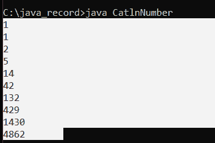
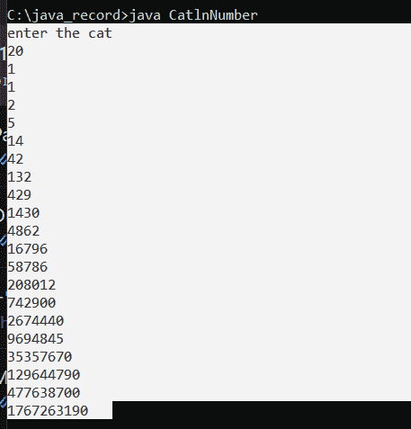
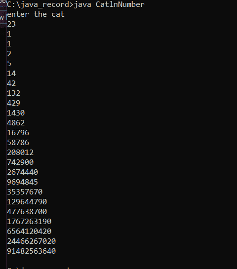
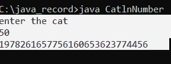

# Java 中的加泰罗尼亚数字

> 原文：<https://www.tutorialandexample.com/catalan-number-in-java>

在普通数学中，加泰罗尼亚数可以定义为在递归定义的对象中经常遇到的计数问题中经常出现的自然数序列。

**加泰罗尼亚数的数学公式**

谈到加泰罗尼亚数字的技术方面，我们经常被要求找出一个给定的数字是否是加泰罗尼亚数字。那么我们该怎么做呢？

为此，我们有识别它的步骤。

首先，在数学公式中，给变量 n 赋一个正整数值。

然后找到 2nCn，n 值将是步骤 1 中取的任意整数。

即 **2nCn = (2n！)/((n+1)！n！)**

**加泰罗尼亚语号码的用途**

*   Catalan 数被用来寻找用 n 个键可能得到的二分搜索法树的个数。
*   也用来寻找 1 的排列...n 通过避免像 123 或 1234 这样的模式
*   以及 n+2 边的多边形通过连接顶点可以分成多少个三角形。
*   完整 btrees 的数量。
*   前几个加泰罗尼亚数字可以是 1，1，2，5，14，42，132，429，1430....其中 n 可以是 0，1，2，3.....

### CatlnNumber.java:

```
class CatlnNumber {
    // this logic serves the procedure for a recursive function to find the nth Catln number
    int Catln (int n)
    {
        int result = 0;
        // Base condition 
        if (n <= 1)
        {
            return 1;
        }
        for (int i = 0; i < n; i++)
        {
            result += Catln(i) * Catln(n - i - 1);
        }
        return result;
    }
    public static void main (String [] args)
    {
        CatlnNumber cn = new CatlnNumber ();
        for (int i = 0; i < 10; i++)
        {
            System.out.print (cn.Catln (i) + " ");
        }
    }
}
```

**输出:**

  

CatlnNumber1.java:

```
import java.io.*;
import java.util.*;

class CatlnNumber {

    // A dynamic programming method or function that can be used to find nth
    // catln number
    static int CatlnDP(int n)
    {
        // store results of subproblems
        int catln[] = new int[n + 2];

        // Initialization first two catalan values into the table
        catln[0] = 1;
        catln[1] = 1;

        // Filling the entries into catln[]
        // using the recursive formula
        for (int i = 2; i <= n; i++) {
            catln[i] = 0;
            for (int j = 0; j < i; j++) 
           {
                catln[i] += catln[j] * catln[i - j - 1];
            }
        }

        // Returning the last entry
        return catln [n];
    }
    public static void main (String [] args)
    {
        Scanner scan = new Scanner (System.in);
        System.out.println("enter the cat");
        int cat=scan.nextInt();
        for (int i = 0; i < cat; i++) 
       {
            System.out.println(CatlnDP(i) + " ");
        }
    }
}
```

**输出:**

  

### 使用二项式系数:

**CatlnNumber.java**

```
import java.io.*;
import java.util.*;
class CatlnNumber {

    // Returns value of Binomial Coefficient C(n, k)
    static long binoCoeff(int n, int k)
    {
        long result= 1;

        // Since C(n, k) = C(n, n-k)
        if (k > n - k) {
            k = n - k;
        }

        // Calculating the value of [n*(n-1)*---*(n-k+1)] /
        // [k*(k-1)*---*1]
        for (int i = 0; i < k; ++i) {
            result *= (n - i);
            result /= (i + 1);
        }

        return result;
    }

    // using the binomial coefficient concept to generate a function 
    //  that finds nth catln number in O(n) time
    static long Catalan (int n)
    {
        // Calculate value of 2nCn
        long c = binoCoeff(2 * n, n);

        // return 2nCn/(n+1)
        return c / (n + 1);
    }

    public static void main (String [] args)
    {
        Scanner scan = new Scanner (System.in);
        System.out.println ("enter the cat");
        int cat=scan.nextInt ();

        for (int i = 0; i < cat; i++) {
            System.out.println (catalan(i) + " ");
        }
    }
} 
```

**输出:**

  

使用上述方法，我们可以计算多达 80 个加泰罗尼亚数字。对于大于 80 的数字，我们更喜欢在 Java 中使用 BigInteger 方法。

**用大整数:**

**CatlnNumber.java**

```
import java.io.*;
import java.util.*;
import java. math.*;

class CatlnNumber
{
        public static BigInteger CatalnFind(int n)
       {
             // using BigInteger to find out the factorials of larger numbers
              BigInteger big = new BigInteger("1");
                  // calculating factorial of n
             for (int i = 1; i <= n; i++) 
            {
                  big = big.multiply(BigInteger.valueOf(i));
             }
            // n! * n!
            big = big.multiply(big);

           BigInteger de = new BigInteger("1");
           // calculate (2n)!
          for (int i = 1; i <= 2 * n; i++) 
         {
                de = de.multiply(BigInteger.valueOf(i));
		}

                // calculate (2n)! / (n! * n!)
               BigInteger answer = de.divide(big);
              // calculate (2n)! / ((n! * n!) * (n+1))
              answer = answer.divide(BigInteger.valueOf(n + 1));
              return answer;
             }
              public static void main (String [] args)
               {
                         Scanner scan = new Scanner (System.in);
                         System.out.println ("enter the nth cat");
                         int cat = scan.nextInt();
                         System.out.println (CatalnFind (cat));    
                  }
}
```

**输出:**

