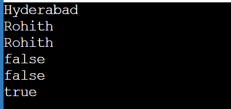
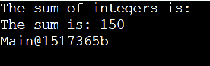
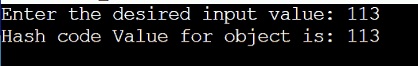

# Java 中的宇宙超类

> 原文：<https://www.tutorialandexample.com/cosmic-superclass-in-java>

所有 Java 类的父类都是 Object 类。Java 对象类是所有 Java 类的父类，不管是直接的还是间接的。因此，所有 Java 类都扩展了 Object 类。为了继承该类，我们不需要编写下面的语句。

```
Class Main extends object
```

在内部，子类继承了 Object 类的所有方法。因此，我们可以认为 Java 的对象类是宇宙的超类。java.lang 包包含该类。

Java 对象类:任何种类的任何对象都可以被属于宇宙超类的 Object 类型的变量引用。

使用 Object 类的 equals()函数测试指向同一个内存的两个对象。

如果我们希望自己定义一个对象的相等性，我们必须覆盖 equals()方法。

替换默认函数 toString()方法来打印类的表示。

每次用“+”运算符将一个对象连接到一个字符串时，Java 编译器都会调用函数 toString()函数。

为了打印类名和对象的内存位置，object 类提供了函数 toString()方法。

使用函数 toString()技术可以简化跟踪调试。


| 方法 | 描述 |
| 对象克隆() | 它制作一个对象的副本。 |
| 布尔等于(对象对象) | 确定两个对象是否相等。这种技术比较两个变量的引用，而不是两个对象的内容。 |
| toString()字符串 | 当您调用字符串函数时，它返回对象的字符串表示形式 |
| int hashCode() | 返回范围内的整数 |


## 比较 Java 中的对象

所有 Java 类的超类是 Java 对象类。默认情况下，每个 Java 类都实现 Object 类。用于比较两个 Java 对象的 equals()和 hashCode()方法由 Java Object 类提供。本节解释 equals()和 hashCode()方法的操作。

## 与类的对象进行比较的程序

Compare.java

```
// importing required packages 
// import util package to take the user input during run time using scanner class
import java.util.*;
import java.io.*;
// class 
public class Compare  
{    
// Main section of the program where execution of the program starts
public static void main(String args[])     
{    
// creating object for Scanner class with name sc
System.out.println(" Enter the strings which need to be compared ");
Scanner sc = new Scanner ( System . in ) ;
// Accessing the object of the Scanner class to take the inputs from the user
// Storing the inputs in string variable s1
String s1 = sc . next ( ) ;
// Storing the inputs in string variable s2
String s2 = sc . next ( ) ;
// Storing the inputs in string variable s3
String s3 = sc . next ( ) ;
// Checking the reference ids of two strings s1 and s2
System.out.println( " Are s1 and s2 strings are equal "+ s1.equals(s2) ) ;  
// Checking the reference ids of two strings s2 and s1
System . out . println  ( " Are s2 and s1 strings are equal "+ s2.equals(s1) ) ;  
// Checking the reference ids of two strings s2 and s3
System . out . println ( " Are s3 and s2 strings are equal "+ s2.equals(s3) ) ;   
}    
} 
```

**输出**

  

## ToString()

若要返回对象的字符串表示形式，请使用函数 toString(){[本机代码] }函数。每当打印任何对象时，函数 toString()由 Java 编译器在内部调用。否则，调用用户实现或修改的函数 toString()函数。使用函数 toString()来表示 string 中的对象。

## 转换成字符串的程序

ConvertStrings.java

```
 // importing the necessary package
import java.util.*;
public classConvertStrings  
{    
int c; 
// default constructor for the program
ConvertStrings()     
{     
// Creating Scanner classs object to read the inputs
Scanner sc=new Scanner(System.in);
// storing the value in integer variable a
int a=sc.nextInt();
// storing the value in integer variable b
int b=sc.nextInt();
System.out.println("The sum of integers is: ");    
// caluclating the sum of a and b
c=a+b;    
System.out.println("The sum is: "+c);            
}         
// Main section of the code where execution of the program starts
public static void main(String args[])     
{     
// creating object for the Main class with name o1
Main o1 = new Main();      
System.out.println(o1.toString());     
}      
}
```

**输出**

  

## 对象克隆

Java 中最重要的活动是复制或克隆一个对象。顾名思义，引用副本创建引用对象的引用变量的副本。例如，如果我们创建一个 Byke 对象的引用副本，并且已经有一个 myByke 变量引用它，那么原始对象将仍然存在。对象的副本是由实际对象构成的。因此，如果我们再次克隆我们的字节对象，我们将复制该对象和指向它的第二个引用变量。对象的浅层副本是一个全新的对象，与原始对象具有相同的实例变量。例如，集合的浅层克隆通过指针与原始集合共享对象，并且具有与原始集合相同的成员。有时有人声称浅拷贝使用了引用语义。引用只是表面上的复制。因此，原始对象和对象的引用是相同的。创建对同一存储单元的新引用的过程。请记住，我们对克隆对象中的数据所做的任何修改也会影响原始数据。

### 对象克隆的优势

对象。尽管存在这些设计问题，clone()仍然是克隆对象的一种常用且简单的技术。

不需要长而重复的代码。

只对 4 行或 5 行 clone()方法使用抽象类。这是复制东西最简单和最有效的方法，特别是当我们把它集成到一个老的或者更老的项目中的时候。

简单地构造一个父类，包括 Cloneable 实现，并提供 clone()函数的定义，就足以完成任务。

使用克隆是复制数组的最简单方法()。

### 对象克隆的缺点

要在实现可克隆接口时使用 Object.clone()函数，请声明 clone()方法，解决 CloneNotSupportedException，然后调用 Object.clone()。

尽管它缺乏方法，我们仍然需要创建一个可克隆的接口。我们只需要利用它让 JVM 知道我们可以克隆()我们的对象。

我们必须提供自己的 clone()并从它间接调用 Object.clone()，因为 Object.clone()是受保护的。

因为 object.clone()不调用任何函数 Object()，所以我们实际上无法控制如何创建对象。

## 克隆对象的程序

Clone.java

```
class Clone implements Cloneable {  
int id ;  
String s ;  
Clone ( String s , int id ) 
{  
this . id = id ;  
this. s = s ;  
}  
public Object clone ( ) throws CloneNotSupportedException
{  
return super . clone ( ) ;  
}  
public static void main ( String args [ ] )
{  
try  {  
Clone s1=new Clone ( "Rohith" ,9 ) ;  
Clone s2 = (Clone)s1 . clone ( ) ;  
System . out . println ( " Name is " + s1 . s+ "  and rollno is " + s1 . id );  
System . out . println ( " Name is " + s2 . s + " and rollno is " + s2 . id ) ;  
} catch ( CloneNotSupportedException c )
{
}  
}  
}
```

**输出**

  

## 哈希码

Java Integer 类函数 hash code()返回所提供输入的哈希代码。Java 的 hashCode()函数有两种类型，可以通过它们各自的参数来区分。

**hashCode()技术**

Java Integer 类的 hashCode()函数查找指定整数的哈希代码。在类对象中，它覆盖 hashCode。默认情况下，该函数会产生一个随机的、特定于实例的数字。

**hashCode(int value)**

使用内置的 Java Integer 类函数 hashCode(int value)为给定的 int 值生成哈希代码。整数和这种技术一起工作。hashCode()。

### hashcode 程序代码

```
import java.io.*;
import java.util.*;
public class IntegerHashCode {  
    public static void main ( String[] args )  
    {  

        Integer r = new Integer ( "113" ) ;           
        int hashValue = r . hashCode ( ) ;  
        System . out . println ( "Hash code Value for object is: " + hashValue ) ;  
    }  
} 
```

**输出**

  

**HashCode2.java**

```
import java.util.Scanner;  
public class HashCode2{  
    public static void main(String[] args) {  
      System.out.print("Enter the desired input value: ");  
      Scanner sc = new Scanner(System.in);         
        Integer i = sc.nextInt();  
        sc.close();  
        int h = Integer.hashCode(i);  
        System.out.println("Hash code Value for object is: " + h);  
        }  
} 
```

**输出**

