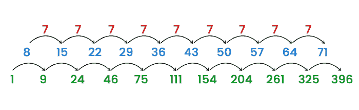
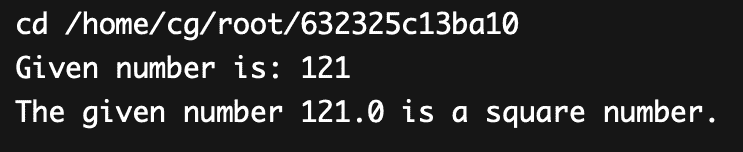
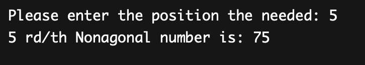

# Java 中的数字

> 原文：<https://www.tutorialandexample.com/figurate-number-in-java>

在历史上，数字有几种用法。可以用均匀分布的点来表示的规则的、不同的几何形状的数称为图形数。如果点的排列形成正多边形、正多面体或正多面体，那么整数可以是六边形、多面体或多面体数。

## 节俭数字

当整齐的线连接圆上一般位置的 n 个点时，就产生了一定数量的三角形(所有三角形的顶点都落在圆内)。

数字，有时称为图形标识符。如果配置创建了不规则多边形，则该数字为多边形整数。它是一个整数，可以用一系列均匀有序的几何排列的点来表示。下面显示了数字以及它们的顺序。

1.三角数:1，3，6，10，15，21，28……

2.平方数:1，4，9，16，25，36，49……

3.五角数字:1，5，12，22，35，51，70…

## 性能

(a1 + a2 + a3 + a4 + a5 + a6 + a7)^n)的展开有字数 a(n)。这个序列只包含一个素数:7。六维中的三角形数，第六部分[1，0，0，0，...].

谬误(n，6)/6 = a(n)。也是一个秩为 6，维数 n >= 1，非对称张量的总的独立分量数。在这种情况下，Fallfac 是下降阶乘。

每当轨道的主键等于 645120 时，Aut(Z7)轨道的数量被提供为轨道表面上的样本整数点的无穷范数 n 的函数。

## 计算数字的公式

一般计算:x6/ (1-x) ^7

指数方程:exp(x)*x^6/720

假设:a(n+3) = Sum{0 <= k，l，m < = n；k + l + m <= n} k*l*m

它包含一些其他公式:

a(n)=(n^6-15*n^5+85*n^4-225*(n^3)+274*(n^2)-120 * n)/720。

a(n) = 3*C(n+1，6)

**数字的例子**

 **以集合 Z = 1，2，3，4，5，6 为例。应用第五个属性将帮助我们确定图形数。

制作所提供的集合 Z 的子集，每个子集必须包含五个项目。

我们将获得以下集合。

{1, 2, 3, 4, 5}, {1, 2, 3, 4, 6}, {1, 2, 3, 5, 6}..等等

从上述子集中选择最低的两个整数，然后求和。那就是:

a(6)=(1+2)+(1+2)+(1+2)+(1+2)+(1+3)+(2+3)= 21

对于某些情况，我们可以应用公式 a(n) = 3*C(6+1，6)。当我们输入 n=6 的值时，我们得到:

a(6) = 21 = 3*C(6+1，6)

让我们用一个不同的公式来确定 84 是否是一个数字。

a(9) = (1，3，3，1)。(1, 6, 15, 20) = (1 + 18 + 45 + 20) = 84

因此，84 是第九个数字。

最初的数字如下:0，0，0，0，0，0，0，0，1，7，28，84，210，462，924，3003，5005，8008，12376，27132，38760，54264...

## 使用逐次差分法

我们可以用连续差来计算图形数。让我们讨论下面这个基于 Java 的图形数的例子。



但是上面提到的方法并不总是有用的。

## 各种类型的数字:

### 用四维图表示数字(A002417)

这些公式可以用来计算它:

a(n)= n *二项式(n+2，3)。

序列是来自 OEIS 的 A002417。

四维空间中最初的数字是:

1, 8, 30, 80, 175, 336, 588, 960 .....

**属性:**

 **1.  A(n)是具有(n+2)种颜色组合的 2×2 六边形阵列中颜色组合的数量。
2.  n^2)*(n+1)*(n+2)/6
3.  非负实整数 t，u 不表示为 t*(n+1) + u*(n+2)的所有整数之和等于 a(n)。
4.  由 n 行(或 2n-1 个底)正方形组成的步进金字塔内的多边形(包括正方形)的总数用符号 a(n)表示。
5.  (n + 2) X (n + 2)矩阵的特征多项式，沿主垂直方向有 2，到处都是 1，有一个(n) = -1 倍于矩阵的 x^3 系数。
6.  卷积阵列的第 n 个反对角线求和表示为 a(n)。

此外,( n+2)三角图中 3-圈的个数。

### 常规比喻数字(A090466)

高阶 k 目标数已排序。如果包含排名 2 或 2 个目标的数字，每个整数都会显示出来。序列是来自 OEIS 的 A090466。它也被称为多边形数。

对于 k = 1，2，3，...，有以下小于等于 10k 的词:3，57，622，6357，63889，639946，6402325，64032121，640349979，6403587409，64036148166，640362343980 等等。

对于每一个 p >= 5 的素数的平方，最多有一个 p2 = a(n) + 1 的 a(n)(a 001248)。因此，只需要秩为 3 的子集 P s(3)。

## Java 数字编程

下面的 java 程序将给定的数字描述为平方数:

**FigurateExample.java**

```
//This program is for checking whether the given number is figurate or not
//import section
import java.util.Scanner;    
public class FigurateExample  
{     
//method for checking whether the given number is the square number    
static boolean isSqureF(double number)      
{     
//finding the root of the given number    
double squareroot=Math.sqrt(number);     
//finding the floor of the square root value and then checking it with 0  
return ((squareroot - Math.floor(squareroot)) == 0);     
}     
//main method    
public static void main(String[] args)      
{     
System.out.print("Given number is: ");    
//creating an object for the scanner class
Scanner sc=new Scanner(System.in);    
//a number of double(data type) is read as an input from the user   
double number=sc.nextDouble();     
//   
if (isSqureF(number))     
System.out.print("The given number "+number+" is a square number.");     
else    
System.out.print("The given number "+number+" is not a square number.");     
}     
}
```

**输出**



**例 2:NonaExample.java**

```
//This program is for checking the given nonagonal number
//import section
import java.util.Scanner;  
public class NonaExample
{  
//function to check the Nonagonal number  
static int isNonagonal(int n)  
{  
//finding the n-th Nanagonal number
return n * (7 * n - 5) / 2;  
}  
//Main program 
public static void main(String args[])  
{  
Scanner sca = new Scanner(System.in);  
System.out.print("Please enter the position the needed: ");  
int n=sca.nextInt();  
System.out.println(n+" rd/th Nonagonal number is: "+isNonagonal(n));  
}  
} 
```

**输出**

****