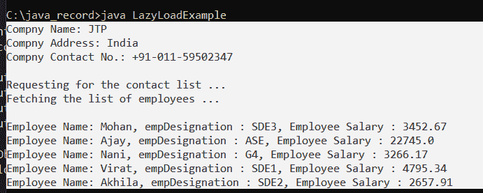
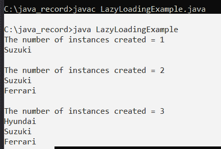

# Java 中的延迟加载

> 原文：<https://www.tutorialandexample.com/lazy-loading-in-java>

延迟加载是指等到需要的时候再加载对象。换句话说，就是将类实例化推迟到必要的时候。当构造一个对象的成本很高，或者程序很少使用这个对象时，延迟加载就变得至关重要。一种提高程序效率的方法是延迟加载。在这一节中，我们将更详细地讨论延迟加载。

仅在真正需要的时候初始化一个类被称为“惰性加载”，这只是对过程的一个花哨的说法。

为了保持易用性和提高效率，惰性加载是一种软件设计风格，其中对象初始化仅在真正需要时发生，而不是在之前。

当创建一个项目的成本非常昂贵，并且它的使用非常不常见时，延迟加载是至关重要的。因此，这种情况证明了延迟加载的实现是正确的。仅在必要时加载对象和数据是延迟加载的核心概念。

例如，假设您正在开发一个带有 ContctList 对象的应用程序，该对象包含公司雇员的列表和代表公司的 organization 对象。一个公司可能有数千名员工。从数据库中加载 ContctList 对象、Company 对象和 ContctList 对象的所有公司雇员列表可能需要很长时间。即使在不需要人员名单的情况下，也往往要等到公司的信息加载到 RAM 中。

使用惰性加载设计模式，可以延迟加载 employee 对象，直到需要它们的时候，这样可以节省时间和内存。

**惰性加载的实现:**

**虚拟代理:**

虚拟代理是一种节省内存的技术，它鼓励延迟对象的创建。请注意下面的程序。

**LazyLoadExample.java**

```
// demonstrating Lazy Loading in Java (virtual Proxy)   

// import statements  
import java.io.*;
import java.util.ArrayList;  
import java.util.List;  

// declaring the interfaces 
interface IcontctList  
{  
	public List<Employees> getEmploList ();  
}  

class Company  
{  
	// fields or variables or attributes of the compny class  	
	String cNam;	  
	String cAdd;  
	String cContctNo;  
	IcontctList contList;  

	// constructor helpful in initializing the class variables and fields
	public Company (String cNam, String cAdd, String cContctNo, IcontctList contList)  
	{  
		this.cNam = cNam;  
		this.cAdd = cAdd;  
		this.cContctNo = cContctNo;  
		this.contList = contList;  
	}  

	// a get method to retrieve the name of compny  
	public String getCompanyName ()  
	{  
		return this.cNam;  
	}  

	// a get method to retrieve the address of compny 
	public String getCompanyAddress ()  
	{  
		return this.cAdd;  
	}  
	public String getCompanyContactNo ()  
	{  
		return this.cContctNo;  
	}  

	// a get method to get the contct list 
	public IcontctList getcontList ()  
	{  
		return this.contList;  
	}  

}  

class ContactList implements IcontctList   
{  
	// retrieving the list  
	@Override  
	public List<Employees> getEmploList()  
	{  
		return getEmpList();  
	}  
	private static List<Employees> getEmpList ()  
	{  
		List<Employees> empList = new ArrayList<Employees> (5);  

		// adding employees to list  
		empList.add (new Employees ("Mohan", 3452.67, "SDE3"));  
		empList.add (new Employees ("Ajay", 22745, "ASE"));  
		empList.add (new Employees ("Nani", 3266.17, "G4"));  
		empList.add (new Employees ("Virat", 4795.34, "SDE1"));  
		empList.add (new Employees ("Akhila", 2657.87, "SDE"));  

		return empList;  
	}  
}  

class ContactListProxy implements IcontctList   
{  

	private IcontctList contList;  

	@Override  
	public List<Employees> getEmploList ()  
	{  
		if (contList == null)   
		{  
			System.out.println ("printing the list of employees ... \n");  
			contList = new ContactList ();  
		}  

		return contList.getEmploList ();  
	}  
}  

class Employees  
{  
	// Attributes of the employee's class  
	private String empNam;  

	private double empSal;  
	private String empDes;  

	// constructor  initializing the class attributes/fields   	
	public Employees (String empNam, double empSal, String empDes)  
	{  
		this.empNam = empNam;  
		this.empSal = empSal;  
		this.empDes = empDes;  
	}  

	// a get method to get employee name  
	public String getempNam ()  
	{  
		return empNam;  
	}  

	// a get method to figure out  the employee salary  
	public double getempSal ()  
	{  
		return empSal;  
	}  

	// a get method to get the designation  
	public String getempDes ()  
	{  
		return empDes;  
	}  

	@Override  
	public String toString ()  
	{  
		String res = "employee Name: " + empNam + ", empDesignation : " + empDes + ", Employee Salary : " + empSal;  

		return res;  
	}  
}  

// main class  
public class LazyLoadExample  
{  

	public static void main (String [] args)  
	{  
		// ContactListProxy class   
		IcontctList contListObj = new ContactListProxy ();  

		// instant of the compny class  
		Company compObj = new Company ("JTP", "India", "+91-011-59502347", contListObj);  

		System.out.println ("Compny Name: " + compObj.getCompanyName ());  
		System.out.println ("Compny Address: " + compObj.getCompanyAddress ());  
		System.out.println ("Compny Contact No.: " + compObj.getCompanyContactNo () + "\n");  
		System.out.println ("Requesting for the contact list ...");  

		contListObj = compObj.getcontList ();  
		List<Employees> employeeList = contListObj.getEmploList ();  

		for (Employees emp : employeeList)   
		{  
			System.out.println (emp);  
		}  
	}  
} 
```

**输出:**



我们在代码中创建了 ContactListProxy 类的一个实例。雇员的名单还没有出来。这是因为目前不需要雇员名单。当需要工人列表时，调用函数 getEmployeeList()，同时生成列表，说明雇员列表的生成被推迟到需要时。

**惰性初始化:**

惰性初始化技术展示了如何在需要使用类字段时检查它的值。如果类字段的值为 null，则在返回之前用正确的值修改该字段。下面的例子说明了这一点。

**LazyLoadingExample.java**

```
import java.util.Map;  
import java.util.HashMap;  
import java.util.Map.Entry;  
enum CarTypes   
{  
Hyundai ,  
suzuki,  
Ferrari  
}  

class CarModel   
{  
// a class field that keeps CarTypes as the key and its object as the value
private static Map<CarTypes, CarModel> typeMap = new HashMap<>();  

// private(access specifier) constructor of the class CarModel 
private CarModel (CarTypes type)   
{  

}  

public static CarModel getCarByTypeName (CarTypes type)  
{  
CarModel carObj;  

// load the type in the map typeMap  if type is not present 
if (!typeMap.containsKey(type))   
{  

carObj = new CarModel (type);  
typeMap.put (type, carObj);  
}   
else   
{  
// if present currently  
carObj = typeMap.get (type);  
}  

return carObj;  
}  

public static void displayAll ()  
{  
// calculation of the size of the map  
int size = typeMap.size ();  

// displaying when  map isn’t empty  
if (size > 0)   
{  

System.out.println (" instances created = " + size);  

// looping through each entry of the typeMap, displaying them  
for (Entry<CarTypes, CarModel> entry : typesMap.entrySet())   
{  
String car = entry.getKey().toString();  
car = Character.toUpperCase (car.charAt (0)) + car.substring (1);  
System.out.println (car);   
}  

System.out.println ();  
}  
}  
}  
public class LazyLoadExample  
{  
public static void main (String args [])  
{  
CarModel.getCarByTypeName (CarTypes.suzuki);  
CarModel.displayAll ();  
CarModel.getCarByTypeName (CarTypes.Ferrari);  
     CarModel.displayAll ();  
     CarModel.getCarByTypeName (CarTypes.Hyundai );  
      CarModel.displayAll ();  
      }  
} 
```

**输出:**



map 字段的惰性初始化在代码中由 getCarByTypeName()方法完成。它首先确定所请求的汽车类型是否存在。如果还没有相关的汽车类型，就会创建相关的汽车类型，然后加载到地图上。请注意，Cars 类的 function Object(){[本机代码]}已经被有意保密。私有函数 Object(){[本机代码]}确保永远不会创建 Cars 类的对象。Cars 类的合适实例仅在必要时产生或加载，因为 Cars 类的实例仅在使用 getCarByTypeName()方法时创建。