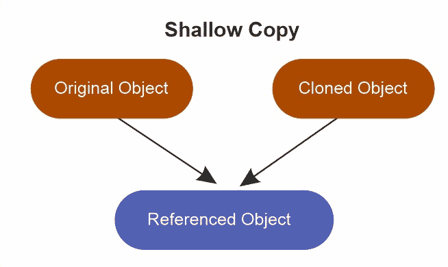
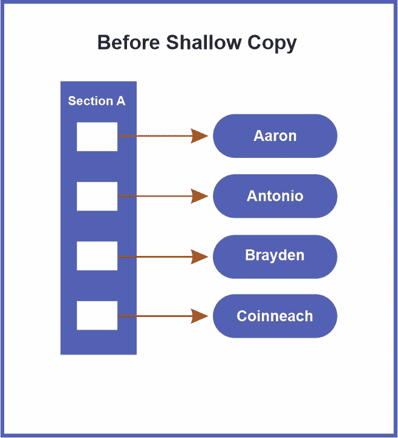
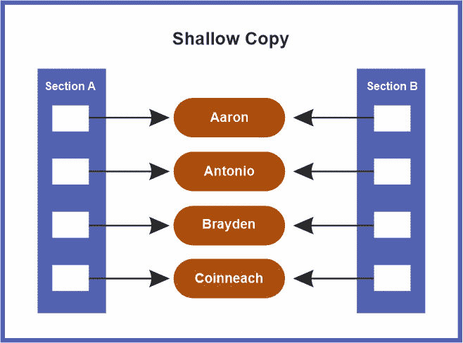

# Java 中的浅层拷贝

> 原文：<https://www.tutorialandexample.com/shallow-copy-in-java>

Java 最重要的任务是复制或克隆一个对象。在这一部分，我们将讨论 Java 中的浅拷贝以及如何将它们变成 Java 对象。在继续浅拷贝之前，将首先介绍 Java 中拷贝的定义以及引用副本和条目副本之间的区别。

顾名思义，引用副本复制指向对象的引用变量。举例来说，如果我们创建一个 Byke 对象的引用副本，并有一个 myByke 变量指向它，那么尽管有两个 myByke 变量，原始对象仍然存在。

对象的副本是由实际对象构成的。因此，如果我们要再次复制我们的 byke 对象，我们可以复制原始对象和指向它的第二个引用变量。



与原始对象具有相同实例变量的新对象被称为原始对象的浅层副本。例如，一个集合的浅副本通过指针与原始集合共享对象，并且包含与前一个集合相同的成员。一些人声称浅拷贝使用参考意义。



建立对确切内存位置的新引用。换句话说，我们可以得出结论，只有引用在浅拷贝中是重复的。因此，原始对象和对象也引用同一个源。值得注意的是，我们对复制对象信息的任何修改也会影响原始对象。

每当我们使用浅层复制技术生成一个对象的副本时，我们就复制原始对象的所有字段。但是，如果它包含对象作为字段，则只会复制对对象的引用，而不会复制实际的对象。需要注意的是，只传输原始数据类型，而不传输对象引用。



> **注意:** clone()方法可以默认创建浅层对象。

看看下面的代码示例。

```
Public class ShallowCopy  
{  
private int[] d;  
//this method will create a shallow copy 
public ShallowCopy(int[] value)   
{  
d= value;  
}  
public void displayData()   
{  
System.out.println(Arrays.toString(d) );  
}  
} 
```

## 用于浅层复制的 Java 程序

## ShallowExample.java

```
//This program is for shallow copy in java
//import section
import java.io.*;
import java.util.*;
//creating the People class 
class People implements Cloneable   
{  
//a lower level of object
private Bike bike;  
private String names;  
public Bike getBike()   
{  
return bike;  
}  
public String getNames()   
{  
return names;  
}  
public void setName(String str)   
{  
names = str;  
}  
public People(String str, String temp)   
{  
names = str;  
bike = new Bike(temp);  
}  
public Object clone()   
{  
//shallow copy  
try   
{  
return super.clone();  
}   
catch (CloneNotSupportedException e)   
{  
return null;  
}  
}  
}  
class Bike   
{  
private String names;  
public String getNames()   
{  
return names;  
}  
public void setNames(String str)   
{  
names = str;  
}  
public Bike(String str)   
{  
names = str;  
}  
}  
//main section
public class ShallowExample 
{  
public static void main(String args[])   
{  
//Original Object of the class People 
People p1 = new People("People-A", "Civic");  
System.out.println("Exact Values (orginal values): " + p1.getNames() + " - "+ p1.getBike().getNames());  
// the clone contains the shallow object 
People q1 = (People) p1.clone();  
System.out.println("Clone (the changes before): " + q1.getNames() + " - "+ q1.getBike().getNames());  
//the primitive member of the clone has been changed  
//q1.setNames("People-B");  
//the lower level object has been changed
q1.getBike().setNames("Mossiac");  
System.out.println("Clone (after change): " + q1.getNames() + " - "+ q1.getBike().getNames());  
System.out.println("Original (the values after the modification of the clone object): " + p1.getNames()+ " - " + p1.getBike().getNames());  
}  
} 
```

**输出**


**ShallowExample2.java**

```
//This program is for shallow copy in java
//import section
import java.io.*;
import java.util.*;
class XYZ
{  
// an instance variable n is created for the class XYZ  
int n = 30;  
}  
public class ShallowExample2   
{     
// Main method of the program 
public static void main(String argvs[])   
{  
//creating an object for the class XYZ  
XYZ object1=new XYZ();  
//the reference will be created, but the value is not copied
XYZ object2 = object1;  
// the value is updated to 10  
// using the reference variable object2  
object2.n=10; 
//the result is printed using the reference variable object1 
System.out.println("The number value is : " + object1.n);  
}  
} 
```

**输出**


## 浅层拷贝与深层拷贝


| **浅抄** | **深度复制** |
| 原始对象和克隆对象并不完全不同。 | 原始项目和克隆项目根本没有联系。 |
| 克隆的对象可以被修改，然后在原始对象中被模仿，反之亦然。 | 一个原创的东西可以反过来被改变和复制，反之亦然。 |
| clone()方法的默认实现产生一个对象的浅层副本。 | 我们必须覆盖 clone()函数来构造对象的深层副本。 |
| 如果这样的对象只包含基本字段，建议使用浅层拷贝 | 。如果一个项包含对那些作为字段的其他项的引用，则应使用深度重复。 |
| 它成本低得多，也快得多。 | 深的很慢，而且比较贵。 |
| 在浅层复制中，内存利用非常高效。 | 与深度复制的情况一样，内存利用率没有达到标准。 |
| 这是非常有效的错误倾向。 | 容易出错，效率不高。 |

