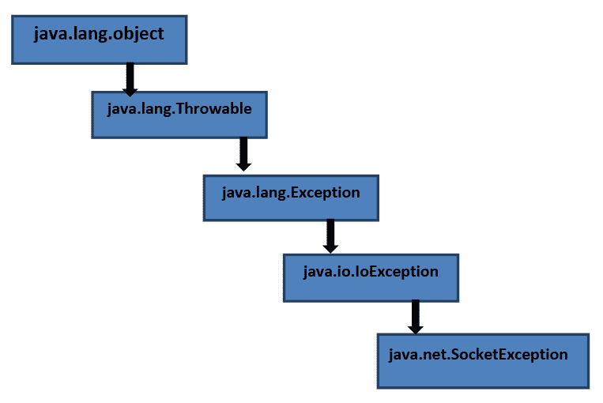
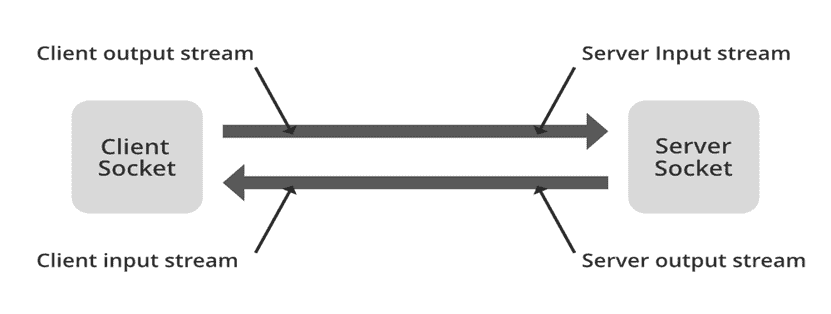
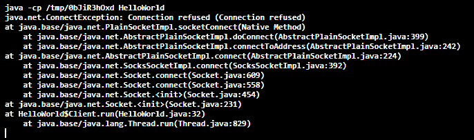

# Java.net.SocketException

> 原文：<https://www.tutorialandexample.com/java-net-socketexception>

### 例外

问题发生在程序执行过程中。如果程序中出现异常，程序就会终止。为了跳过异常发生的语句，我们必须处理异常。

为了处理异常，我们有四个关键字:

1.  尝试
2.  捕捉
3.  扔
4.  投
5.  最后

例外有两种类型。

1.  **已检查异常**

    **Ex:**io Exception、SQlException、ClassNotFoundException、FileNotFoundException 等。

2.  **未检查异常**

    **Ex:**ArithematicException，ArrayIndexOutOfBoundException，NullPointerException，ClassCaseException。

### Java.net.SocketException

IOException 是 SocketException 类的父类。当问题试图打开或访问套接字时，会发生 SocketException。SocketException 类继承 IOEception 类的属性。所有的异常类都存在于异常类中，这个类是 Object 类的子类。

如您所知，我们明确鼓励您使用最明确的附件免除类来更精确地分配问题。另外很重要的一点是，SocketException 通常伴随着一条错误消息，这条错误消息对导致该特例的情况非常有启发性。

套接字异常层次结构:



### 什么是套接字编程？

编程思想利用附件来布置关联，并使各种项目能够利用一个组织相互连接。附件提供了一个交互点，以利用组织约定堆栈来布置通信，并使项目能够在组织内共享消息。

附件是网络通信中的端点。附件服务器通常是多串服务器，可以确认附件关联需求。附件客户端是启动附件通信需求的程序/进程。



### java.net.SocketException:连接重置

当客户端关闭客户端应用程序中的附件关联时，SocketException 发生在服务器端，然后才能通过附件返回反应。例如，在反应恢复之前停止程序。关联重置实质上意味着获得了 TCP RST。TCP RST 包是远程端，让您知道发送过去的 TCP 包的关联没有被察觉，可能关联已经关闭，可能端口没有打开，等等。重置包基本上是一个没有有效载荷并且在 TCP 报头横幅中设置了 RST 位的包。

目前，很明显，我们需要两个项目，一个处理客户端，另一个处理服务器。它们如下所示:

**例 1:** 服务器端

```
// java program to implement SocketException in server-side App
// Importing required packages and class
import java.io.BufferedReader;
import java.io.IOException;
import java.io.InputStreamReader;
import java.net.ServerSocket;
import java.net.Socket;
import java.net.SocketTimeoutException;
public class HelloWorld {
	// Main driver method
	public static void main(String[] args)
		throws InterruptedException
	{
		new Thread(new Server()).start(); // calling the constructor and running the thread
	}
	static class Server implements Runnable {
	// run() method for thread
		@Override public void run()
		{
			ServerSocket s = null;
			// To check exception we are using try block
			try {
				s = new ServerSocket(3333);
				s.setSoTimeout(0);
				// the loop iterates till the condition is true
				while (true) {
					try {
						Socket client
							= s.accept();
						// Object creation to the BufferReader class
						BufferedReader inputReader
							= new BufferedReader(
								new InputStreamReader(
									client
										.getInputStream()));
						System.out.println(
							"Client said :"
							+ inputReader.readLine());
					}
					// Exception handling
					catch (SocketTimeoutException e) {
						e.printStackTrace();
					}
				}
			}
			// Exception handling using catch block
			catch (IOException e1) {
				e1.printStackTrace();
			}
			finally {
				try {
					if (s != null) {
						s.close();
					}
				}
				catch (IOException e) {
					e.printStackTrace();
				}
			}
		}
	}
} 
```

**例 2:** 客户端

```
// java program to implement SocketException in client-side App
// Importing required packages and class
import java.io.IOException;
import java.io.PrintWriter;
import java.net.Socket;
import java.net.SocketException;
import java.net.UnknownHostException;
public class HelloWorld{
	public static void main(String[] args)
	{

		// anonymous inner class
		// calling the constructor and running the thread
		new Thread(new Client()).start();
	}

	static class Client implements Runnable {

		@Override public void run()
		{

			// initializing  value to the Socket s
			Socket s = null;

				// checking Exception using try block
try {
				s= new Socket("localhost", 3333);

				// object creation to the PrintWriter class
				PrintWriter outWriter = new PrintWriter(
					s.getOutputStream(), true);

				// Display message
				System.out.println("Wait");

				// making thread to sleep for 1500 nanoseconds
				Thread.sleep(15000);

				// Display message
				outWriter.println("Hello Mr. Server!");
			}
			// Handling the Exceptions using the catch block

			// Catch block 1 for Exception handling
			catch (SocketException e) {

				// displaying the line where the Exception has occured
				e.printStackTrace();
			}

			// Catch block 2for Exception handling
			catch (InterruptedException e) {
				e.printStackTrace();
			}

			// Catch block 3for Exception handling
			catch (UnknownHostException e) {
				e.printStackTrace();
			}

			// Catch block 4for Exception handling
			catch (IOException e) {
				e.printStackTrace();
			}
			finally {
				try {
					// If the value of the socket is NULL then close the Socket
					if (s != null)
						// Close the socket
						s.close();
				}
                                          // catching the IOException
				catch (IOException e) {
					e.printStackTrace();
				}
			}
		}
	}
}
```

**输出:**

