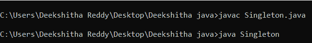
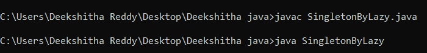
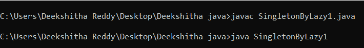

# Java 中的单例类

> 原文：<https://www.tutorialandexample.com/singleton-class-in-java>

## 什么是 Java 中的 Singleton 类？

单例意味着它是一个。这意味着我们只能创建一个类的一个实例或对象。例如，让我们有一个 Abc 类。我们可以举一个例子

```
Abc o1 = new Abc() ; // one instance of class Abc
```

我们还可以有另一个实例来分类 Abc。

```
Abc o2 = new Abc() ; // instance 2 of class Abc
```

这里我们创建了两个实例。这意味着 o1 有不同的值，o2 也有不同的值。但是如果您只想创建类的一个实例呢？这意味着我们不允许创建实例 2 ( o2)。这意味着我们的类是单例类。一个类只允许一个实例被称为单例类。

## 如何创建单例类？

为了用 Java 创建一个单例类，我们必须记住几个步骤。

步骤 1:我们必须为类创建一个静态实例或静态对象。

```
class Abc
{
	static Abc o1 = new Abc () ; // creating static object 
} 
```

在这里，我们只在类中创建它的实例或对象。

步骤 2:不允许用户用默认的构造函数创建实例。它定义了一个私有的构造函数。

```
public class Singleton
{
public static void main(String args[])
{
Abc o1 = new Abc () ; // calling the default constructor which is public 
}
}
class Abc
{
	static Abc o = new Abc () ;
	private Abc()
	{

	}
}
```

这里 new Abc()是一个默认的构造函数，默认情况下它是公共的。但是如果我们在类中创建一个私有构造函数，我们就不能调用默认构造函数。

步骤 3:我们应该创建一个静态的方法，它将返回 Abc 类的对象或实例。

```
public class Singleton
{
public static void main(String args[])
{
Abc o1 = new Abc () ; // calling the default constructor which is public 
}
}
class Abc
{
	static Abc o = new Abc () ;
	private Abc()
	{

	}
	public static Abc getObject()
	{
		return o;
	}
} 
```

这里使用了“惰性实例化”的概念来编写静态方法。惰性实例化没什么，但是对象创建是根据需求完成的。

如果你遵循这三个步骤，那就是了，这意味着你只允许一个类的一个实例。

现在，如何获得一个类的实例？由于这个 getObject()方法是一个静态方法，我们可以简单地说

```
Abc o1 = Abc.getObject () ;
```

在任何情况下，我们只能创建 Abc 类的一个实例。

```
public class Singleton
{
public static void main(String args[])
{
Abc o1 = Abc.getObject();
}
}
class Abc
{
	 public static Abc o = new Abc() ;
	private Abc()
	{

	}
	public static Abc getObject()
	{
		return o;
	}
} 
```

**输出**



既然物体 o 是静态的。这个静态对象将被创建，并且当类被加载时它将在内存中，所以它成为一个全局变量。即使我们不使用这个对象，它也会存在于内存中。这是缺点之一。如果这个对象消耗了大量的资源，如果这个对象很大，那就是对内存的浪费。因此，在 Singleton 类中这种类型的对象创建被称为早期实例化。因为如果我们不使用它，它就会被创造出来。

### 使用惰性实例化的单例类

我们可以在调用静态方法时创建一个类的实例。

SingletonByLazy.java

```
public class SingletonByLazy
{
public static void main(String args[])
{
Abc o = Abc.getObject();
}
}
class Abc
{
	static Abc o; // declaring the static object 
	private Abc()
	{

	}
	public static Abc getObject()
	{ 
		o = new Abc(); // lazy instantiation
		return o;
	}
}
```

**输出**



当我们说 getObject()时，它将创建一个新对象，并返回该对象。这意味着如果我们创建另一个对象，比如说 o1，这意味着我们调用了 getObject()方法两次。因此，它将创建两个对象。这里我们丢失了我们的单例类步骤 1。因此，我们可以在创建对象之前进行验证。我们需要验证这是我们第一次调用我们的对象。

SingletonByLazy1.java

```
public class SingletonByLazy1
{
public static void main(String args[])
{
Abc o = Abc.getObject();
}
}
class Abc
{
	static Abc o; // declaring the static object 
	private Abc()
	{

	}
	public static Abc getObject()
	{ 
		if ( o == null ) // verifying whether object creation is null
		{
			o = new Abc(); // lazy instantiation
                         }
			return o;
}
} 
```

**输出**

