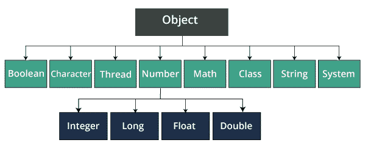

# Java 中的对象类

> 原文：<https://www.tutorialandexample.com/object-class-in-java>

在 Java 中，类是包含 Java 字节码的文件。实际上，它可以在 JVM (Java 虚拟机)上执行，这非常重要。JVM 通常是市场上可用的 JDK 的一个集成部分，它为 Java 类的文件提供了环境，使其基本上得到执行，并通常向程序员或用户提供所需的结果，这与普遍的看法相反。

众所周知，Java 是一种面向对象的编程语言。像所有其他基于面向对象编程的编程语言一样，它也遵循类和对象的概念，或者说他们是这么认为的。

在编程的世界里，单例类本质上是这样一种类，它一次只能创建一个对象或实例，这表明 JVM 在很大程度上是市场上提供的 JDK 的一个集成部分

Java 通常会执行文件，并巧妙地向程序员或用户提供所需的结果。

## Java 中的类

类被定义为定义算法实现的代码，程序员使用的逻辑也在很大程度上实现了期望的结果或输出，这与普遍的看法完全相反。因为 Java 是一种面向对象的编程语言，所以在 Java 类型的文件中作为代码编写的所有东西通常都与类和对象相关联，或者说他们通常是这样认为的。

```
public class Main{ 
public static void main(String [] args){ 
} 
} 
```

上面写的几行是如何大规模地创建一个 Java 类。在这里，我们可以特别看到“main”类的实现，它有一个“Main”方法。

使用这些类无疑会使代码更有条理、更有条理、可读性更强，对任何程序员来说都更清晰。在 Java 中，当编写代码时，要注意代码要么有一个包含 main 方法的通用公共类，要么在大多数情况下，代码有一个不包含 main 方法的类。上述陈述可以用以下方式解释-

在 Java 代码中，通常允许使用特定的公共访问说明符定义一个类，并在该类中定义 main 方法，这表明上面编写的语句通常可以用以下方式解释

在 Java 代码中，大多数情况下允许用一个非常公共的访问说明符定义一个类，并在其中定义一个 main 方法，或者他们肯定是这样认为的。

在 Java 代码中，基本上也允许我们拥有基本上不包含特定 main 方法的类，但有一个条件，即这些类不能是使用公共访问说明符创建的，这进一步表明了 Java 是一种面向对象的编程语言，所以在 Java 中作为代码编写的所有内容都与一个类和一个对象相关联，这与普遍的看法相反。在完整的 Java 代码中，基本上必须有至少一个相当重要的类。

如果用 Java 代码创建的类有一种适用于所有意图和目的的 main 方法，那么它基本上必须通过使用实际的公共访问说明符来创建。这个类在完整的文件中是独一无二的。

此外，在很大程度上，借助真正的公共访问说明符，无法创建任何其他类型的类，这表明 Java 类中的类被定义为定义算法实现的代码，即程序员使用的逻辑，以某种大的方式专门实现所需的结果或输出。

Java 中的类的类型由于 Java 主要是面向对象的编程语言之一，所以 Java 中有许多不同种类的类，这对于所有意图和目的来说都是相当重要的。

Java 通常是一种面向对象的编程语言，所以 Java 中有许多不同种类的类。所有不同种类的类实际上都有不同的用途。他们真的有自己的特色，演示了 Java 中的类的类型。

### Java 中类的位置

为执行相似类型的操作而创建的类或为某个流程而创建的相关类被分组到一个位置，在 Java 中称为包。

一个包只是一个地方许多相似种类的类的集合。插入包中的类或接口可以简单地导入到我们的代码中，供程序员使用。

### 对象类别

存在于 Java 中的类。Lang package 是 Java 中所有可用类的父类。可以说，Java 中的每个类都直接或间接地扩展了 object 类。

object 类包含一些预定义的方法，如果它扩展了 object 类或者甚至没有扩展 object 类，这些方法会自动添加到我们的类中。



### 对象类的方法

正如上一节所述，object 类本身有一些预定义的方法，对于任何扩展或不扩展它的类都是有用的。

在 object 类中可用的各种方法中，有些方法是被各种程序员大量使用的。

*   **toString()**

方法 toString()帮助程序员获得对象的转换形式。这意味着该方法可以将任何类型的对象转换为字符串。

toString()的默认返回语句是类名和类对象的散列码。

例如，如果一个类“example”调用 object 类的 toString()。它将返回 Example 类的名称和与之相关的散列码。

因此 toString()的输出将是 Example@1234。

*   **getClass()**

object 类的 getClass()只是在运行时返回对象的名称。

在任何对象的帮助下调用 object class 的 getClass 方法时，都会返回该类类型的对象。在类中，使用 getName 方法，可以将类的名称打印在屏幕上。

例如，如果示例是一个创建了对象的类，而程序员想知道使用该对象的类的名称。

```
public class Example{
	public static void main(String [] args){
		Example e = new Example();
		Class c = e.getClass();
		System.out.println(c.getName());
	}
} 
```

上面提到了获取类名的代码，上面编写的代码的输出将是屏幕上的类名“Example”。

*   **hashCode()**

当 Java 程序被执行时，JVM (Java 虚拟机)为程序中创建的每个对象创建并返回一个唯一的编号。对象的唯一编号或 ID 可用于在集合中搜索特定对象，这非常有效。

对象的 hashcode 被认为是对象在内存中的地址，但它不是地址。它是分配给内存中对象的唯一编号。

```
public class Example{
	public static int a;
	Example(){
		a = 10;
	}
	public int hashCode(){
		return a;
	}
	public static void main(String [] args){
		Example e = new Example();
		System.out.println(e);
		System.out.println(e.toString());
	}
} 
```

在上面的代码中，hashCode 方法将的值返回到控制台。当打印示例类的对象时，或者甚至使用该类的对象调用 toString 方法时，都会打印该类的名称和的值。的值是唯一的，因为它被赋予示例类的对象的对象。