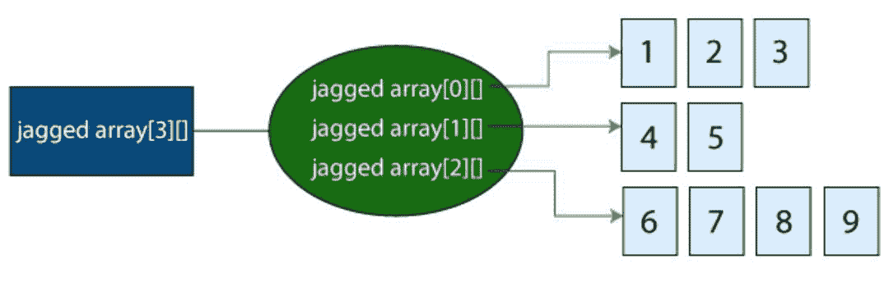
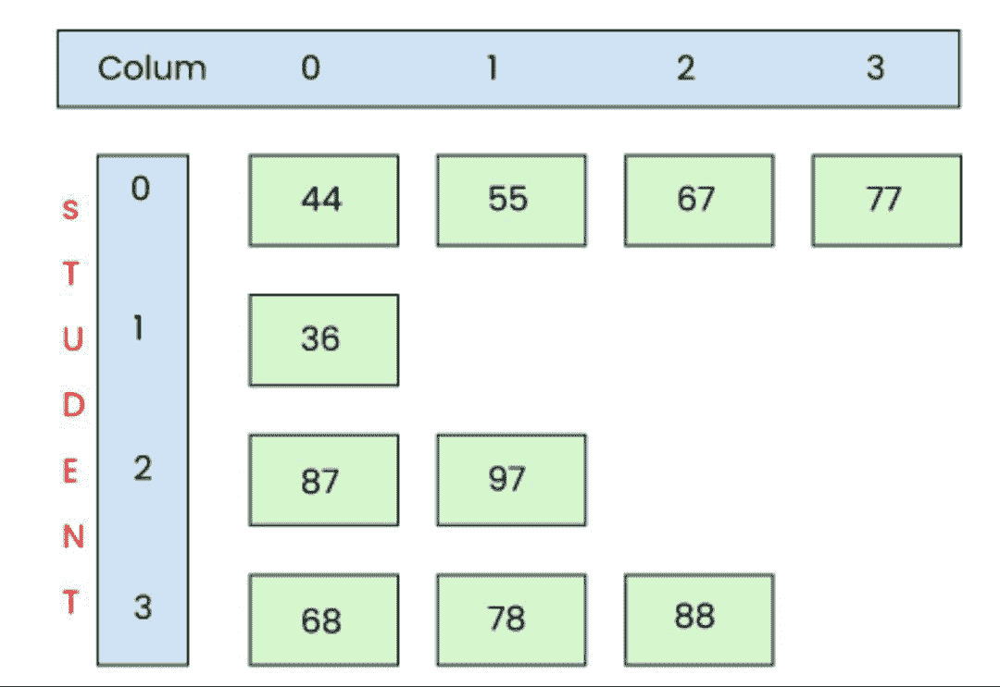

# Java 中的交错数组

> 原文：<https://www.tutorialandexample.com/jagged-array-in-java>

### 先决条件

在了解交错数组之前，我们必须先了解什么是数组，什么是多维数组。

**Java 数组** **:** 相似的数据类型的集合称为数组。数组是同一类型值的容器对象。因为数组的大小必须在声明时定义，所以它也被称为静态数据结构。

数组从**零**开始，一直运行到 **n-1** ，其中 n 是数组的长度。在 Java 中，数组被视为一个对象，存储在堆内存中。它支持原始值或参考值的存储。在 Java 中，数组可以是一维的，也可以是多维的。

**阵列特征**

1.  它一直被编入索引。索引从零开始。
2.  它是相似数据类型的集合。
3.  它占据了一个连续的内存位置。
4.  它允许随机访问元素。

### 多维数组

多维数组在外观上类似于一维数组。与只能有一行索引的一维数组不同，它可以有多行和多列。它是数据的表格表示，数据保存在行和列中。

### 多维数组的声明

```
datatype[ ][ ] array_name;
```

**数组初始化**

```
datatype[ ][ ] array_name = new int[rows_no][columns_no];
```

array_name 是数组的名称，new 是内存分配关键字，rows_no 和 columns _ no 用于指定行和列的大小。

我们可以像初始化一维数组一样静态初始化多维数组。

```
int[ ][ ] arr = {{5,6,3,4,2,17},{7,8,10,9,11,18},{12,15,16,14,1,19}};
```

**举例:**

```
class Demo
{
public static void main(String[] args)
  {
	int arr[ ][ ] = {{5,6,3,4,2,17},{7,8,10,9,11,18},{12,15,16,14,1,19}};

for(int j =0; j <3;j++)
        {
	for (int k = 0;k<6 ; k++) {

		System.out.print(arr[j][k]+" ");
			}
	System.out.println();

        }

     // assigning a value
System.out.println("element at first row and second column: " +arr[0][1]);
   }
} 
```

在第一行和第二列中，有 5，6，3，4，2，17，7，8，10，9，11，18，12，15，16，14，1，19 个元素。

## 什么是交错阵列？

交错数组是一种特殊类型的数组，具有不同数量的列元素。参差不齐的数组是交错数组的另一个名称。术语“数组的数组”有时用于描述交错的数组。在 Java 中，交错数组是一个多维数组，包含各种大小的列。但是在一个参差不齐的数组中所有单个数组的大小都是互不相同的。

换句话说，一个数组中的每一行都有不同数量的元素。如果我们在二维数组中创建不同数量的列，这就是所谓的交错数组。

**比如:**在 Java 中，一维数组的数组称为二维数组。在二维数组中，每个一维数组都有自己的列。

下图显示了一个锯齿状阵列。



我们从前面的图画描述中了解到它的样子。上面看到的是一个二维的锯齿状数组。如上所述，该数组的每个元素都是大小不同的一维数组。

第一 1D 数组的第一行包含三列，第二行包含两列，第三行包含四列。

## 如何创建交错数组

在构建数组的数组时，只指定第一维度，它指定数组中的行数。

作为一个例子，下面是如何制作一个二维交错数组:

```
int arr[][] = new int[3][];
```

前面的声明中声明了一个包含三行的二维数组。

一旦声明了数组，就可以将其定义为交错数组，如下所示:

```
arr[0] = new int[4];
arr[1] = new int[1];
arr[2] = new int[2];  
arr[3] = new int[3]; 
```



第一句话表明 2D 数组的第一行将有两列。第二行将有三列，第三行将有四列，从而形成一个交错的数组。

构造完数组后，可以用值填充它。如果没有显式初始化这个数组(如上例所示)，默认值将被用作初始值，这取决于数组的数据类型。

您也可以使用以下语法来创建数组:

```
intarr[][] = newint[][]
{
    newint[] { 3 , 4 , 5 , 6};
    newint[] { 7 , 8 , 9} ;
    newint[] { 10 , 11} ;
} ; 
```

**创建交错数组的另一个技巧是去掉第一个新操作符，如下所示:**

```
int[][] arr = {
    newint[] { 3 , 4 , 5 , 6 };
    newint[] { 7 , 8 , 9 };
    newint[] { 10 , 11};
}; 
```

省略了 new 运算符，数组在同一个语句中被初始化和定义，如上所示。

你也可以使用声明和初始化语句来代替所有的新操作符，如下所示。

```
int[][] arr = {
  { 3 , 4 , 5 , 6} ,
    { 7 , 8 , 9} ,
    { 10 , 11} } ; 
```

通过给每一行赋予初始值，下面的软件创建了一个参差不齐的数组。在数组的每一行中初始化列值。

```
classMain

{

    publicstaticvoidmain(String[] args)

    {

        // Declare a three-row, two-dimensional array.

       intarr[][] = newint[5][];

       // jagged array definition and initialization

       arr[0] = newint[]{ 1 , 2};
       arr[1] = newint[]{ 3 , 4 , 5};
       arr[2] = newint[]{6,7};
       arr[3] = newint[]{ 8 , 9 , 10 , 11 };
       arr[4] = newint[]{ 12 , 13 , 14 };

       // show the jagged array

       System.out.println("Jagged Array in Two Dimensions:");

       for(inti=0; i&lt;arr.length; i++)
       {

          for(intj=0; j&lt;arr[i].length; j++)
              System.out.print(arr[i][j] + " ");
          System.out.println();
        }
    }
} 
```

**输出:**

```
Jagged Array in Two Dimensions:
1          2
3       4         5         
6          7          
8          9           10          11          
12        13         14 
```

交错数组的第一行有三列，第二行有两列，第三行有五列，如输出所示。

**交错数组的一个例子**

```
class Demo
{
public static void main(String[] args)
  {
	int arr[ ][ ] ={{ 3 , 4 , 5 , 6} , { 7 , 8 , 9} , { 10 , 11} } ;

for(int i=0;i<3;i++)
        {
	for (int j = 0; j <arr[i].length; j++) {

		System.out.print(arr[i][j]+" ");
			}
	System.out.println();

        }

   }
} 
```

**输出:**

```
3, 4, 5, 6, 7, 8, 9, 10, 11
```

这里，行数是三，每行的列是不同的。术语“交错阵列”指的是这种形式的阵列。

### 最常见的问题:

**Q #1)在 Java 中，到底什么是交错数组？**

**回答**:是一个多维数组，这个数组的每个元素大小不一，是另一个数组。因此，我们可以制作一个包含不同大小的列的二维交错数组。

一个交错的数组有什么用途？

**答案:**多维交错数组可以显著提升性能。

**Q #3)什么叫做数组的数组？**

**答案:**多维数组，通常被称为数组的数组，通常被表示为矩阵。

多维数组的用途是什么？

**答案:**需要矩阵形式的信息，如时刻表、时刻表、楼层布局等，可以存储在多维数组中，包括交错数组。