# Java 摆动时间选择器

> 原文：<https://www.tutorialandexample.com/java-swing-time-picker>

### 先决条件

在本教程中，我们将学习 java swing 中的时间选择器。在学习时间选择器之前，我们应该先了解一下 java swing。

### Java Swing 游戏介绍

Java 基础类包括 Java Swing。它适合构建轻量级桌面应用程序，因为它用于生成基于窗口的应用程序。

Java Swing 基于一个完全用 Java 实现的抽象窗口工具包 API。

Java Swing 提供了轻量级和平台无关的组件，使其成为设计和创建基于桌面的应用程序(系统)的理想选择。

### Java AWT 和 Java Swing 的区别

为了在 Java 中创建图形用户界面，利用了 Java 抽象窗口工具包(AWT)和 Java Swing。

虽然，取决于一个人想做什么，他们有差异，使一个比另一个更合适。

以下是一些不同之处:

*   Java AWT 框架包含一组用于开发应用程序的函数和过程，这些应用程序可以从操作系统、其他程序甚至服务中访问功能或数据。Java AWT 应用程序编程接口(API)用于创建 Java 图形用户界面。另一方面，Java Swing 由 Java 基础类组成，可以用来创建独立的应用程序。

*   因为它们与操作系统接口，所以 Java AWT 组件很大。另一方面，Java Swing 提供了比 Java AWT 更多的功能，因为它的组件又轻又强。

*   与 Java AWT 应用程序相比，Java Swing 应用程序更快、更高效。swing 的执行时间比 AWT 少。

*   因为它的组件是平台相关的，所以 Java AWT 是一个平台相关的 API 框架。另一方面，Swing 组件独立于平台。因此，Swing 是平台不可知的。

### 常用桌面应用程序的 Swing 组件(GUI):

如前所述，Swing 用于创建基于窗口的应用程序。javax.swing 包包含 swing 组件。

Java Swing 元素是设计、开发和部署应用程序的关键元素。对于 Java 编程语言，Swing 图形用户界面小部件工具包由这些组件组成。

组件位于 NetBeans IDE 的调色板下。Java Swing 组件允许用户与应用程序进行交互。

在本教程中，我们将研究一些在桌面应用程序开发中经常使用的 Swing 组件。

其中包括:

*   JFrame
*   JLabel
*   jtextfield(jtextfield)
*   JButton

其他包括:JComboBox，JPanel，JCheckBox，JRadioButton，JList，JTable，JFileChose，ImageIcon，JTextArea。

### JFrame

在 Java Swing 组件层次结构中，JFrame 是第一个组件。它可以通过两种方式之一实现:

*   通过构造一个框架类对象。这是基于关联的生产。

**例如:**

```
import javax.swing.JFrame;
public class Main {
	public static void main(String[] args) {
            JFrame sectionFrame = new JFrame();
            sectionFrame.setSize(600, 600); // 600 width & 600 height
            sectionFrame.setLayout(null); // no layout managers
            sectionFrame.setVisible(true); // frame visible
	}
} 
```

*   您可以通过扩展 Frame 类来实现这一点。这就是基于类继承的 OOP 结构。

**例如:**

```
import javax.swing.JFrame;
public class sectionHomeWindow extends JFrame {
    /**
     * Creates new form sectionHomeWindow
     */
    public sectionHomeWindow() {

    }
} 
```

### JLabel

JLabel 是一个 Swing 容器用户界面组件，显示可读的文本或图像。应用程序用户不能编辑 JLabel 中显示的文本。

但是，应用程序本身可以通过动作事件来更改文本。使用 JLabel 组件可以显示普通文本和 HTML 文本。

**例如:**

```
JLabel labelName = new JLabel("Name"); 
```

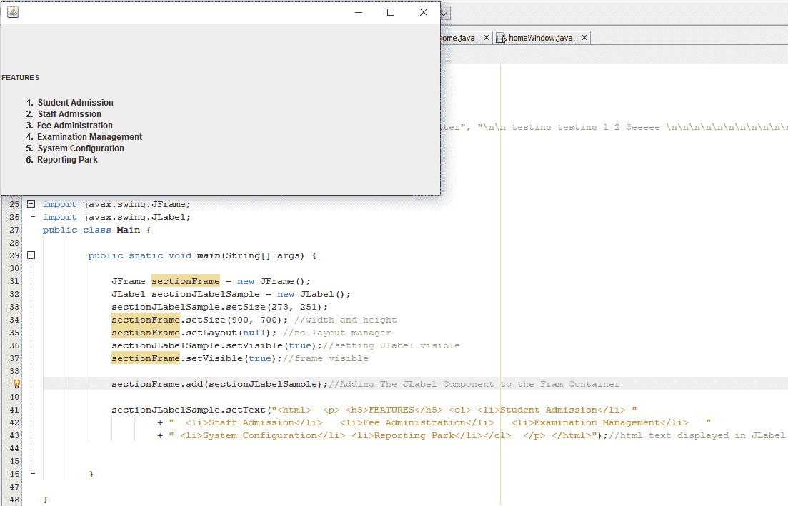

### jtextfield(jtextfield)

JTextField 是一个 swing 元素，允许用户输入单行文本。JTextField 是 javax.swing 库的 JTextComponent 类的后代。

#### 例如:

```
JTextField sectionTextField = new JTextField(20);
```

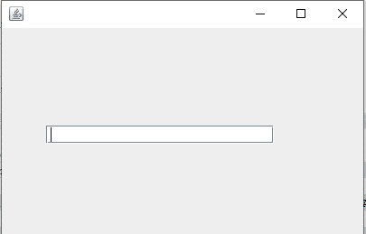

要使 JTextField 可用且可编辑，enable 属性必须设置为 true。可以通过给 JTextField 构造函数一个整型参数来初始化 JTextField。

用户可以在文本字段中键入的字符数不受构造函数中给定的整数参数的限制。但是，它提供了文本框的宽度，即分配给它的列数。

### JButton

Swing 的平台独立性是由 swing 组件之一 JButton 提供的。该组件为程序的用户界面添加了点击效果。任何类构造函数都可以用来在应用程序中实现它。

通过单击或双击它，来自数据库的数据被检索并显示在 UI 上，或者用户数据被收集在 UI 上并存储/保存在数据库中。

在大多数应用程序中，JButton 都有文字或图片来告诉用户按钮的功能。

#### 例如:

```
JButton submitButton = new JButton("Submit");
```

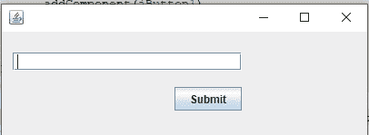

### 使用 NetBeans 创建 Java Swing 桌面应用程序

NetBeans 是一个集成开发环境(IDE ),用于开发各种语言的应用程序。NetBeans 支持多种编程语言，包括 Java。

因为 NetBeans 为规划和编写 UI 提供了一个用户友好的界面，所以它是使用 swing 构建桌面应用程序的理想 IDE。它有内置的 swing 库，可以自动填充代码。

当在 NetBeans 中构建 swing 应用程序时，内置库在 IDE 中提供了一个调色板区域。创建应用程序时，这使得拖放组件变得更加容易。

让我们创建一个简单的 Swing 应用程序，演示前面讨论的组件。这是一个收集客户个人信息的简单应用程序。

1.打开 NetBeans IDE，然后转到“文件”->“新建项目”。

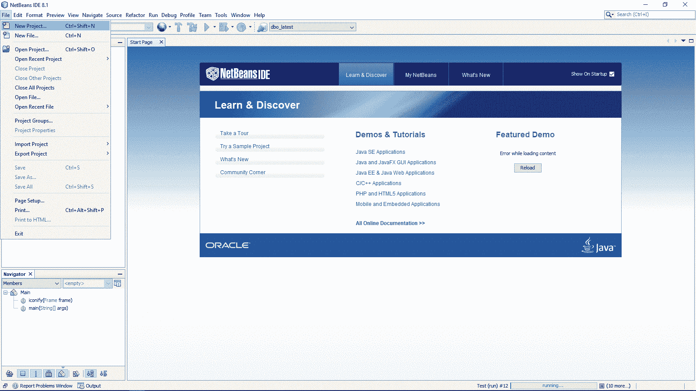

2.在项目窗口中，选择 Java 和 Java 应用程序，然后单击下一步。

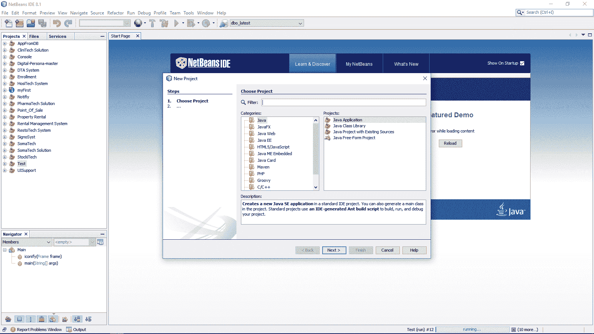

3.保留 sectionSampleSwingGUI 作为项目名称，并将其保存在默认目录中。如果需要创建主类，请选中创建主类复选框和使用专用文件夹存储库复选框，以创建专用库文件夹。在我们的场景中，这两个复选框都将被选中。请等待项目完成，然后单击“完成”。

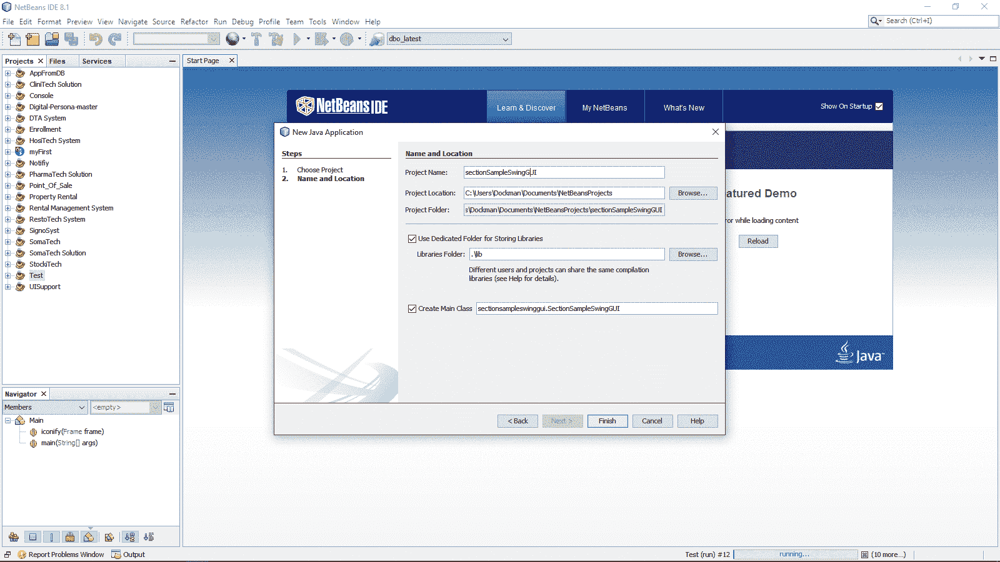

4.从项目的右键菜单中选择“新建”，然后选择“JFrame 表单”。这将是主窗口，也是我们的主类。

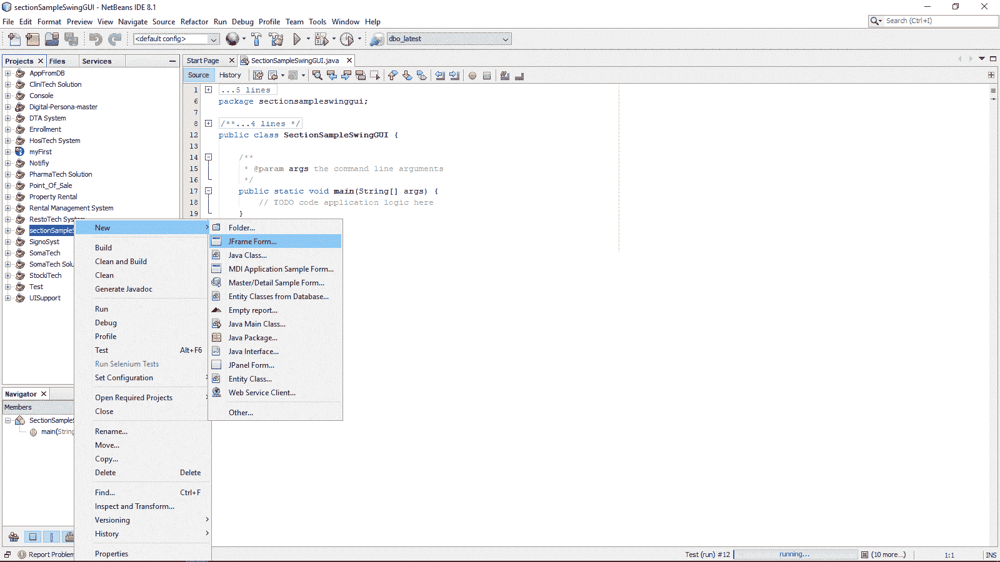

5.接下来，给类 sectionHomeWindow 命名。选择在创建项目时创建的包，即 sectionsampleswinggui，然后单击 Finish

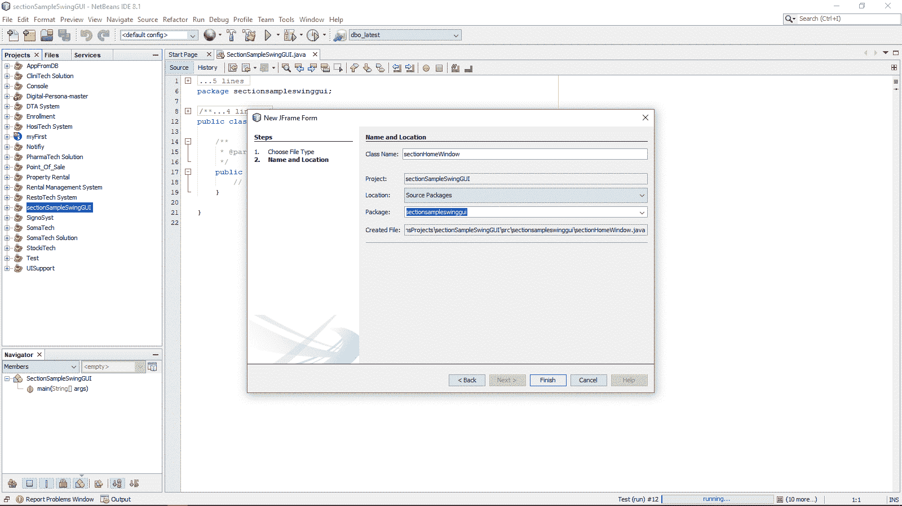

我们的窗口现在创建好了。这是容纳其他回转元件的主要元件。

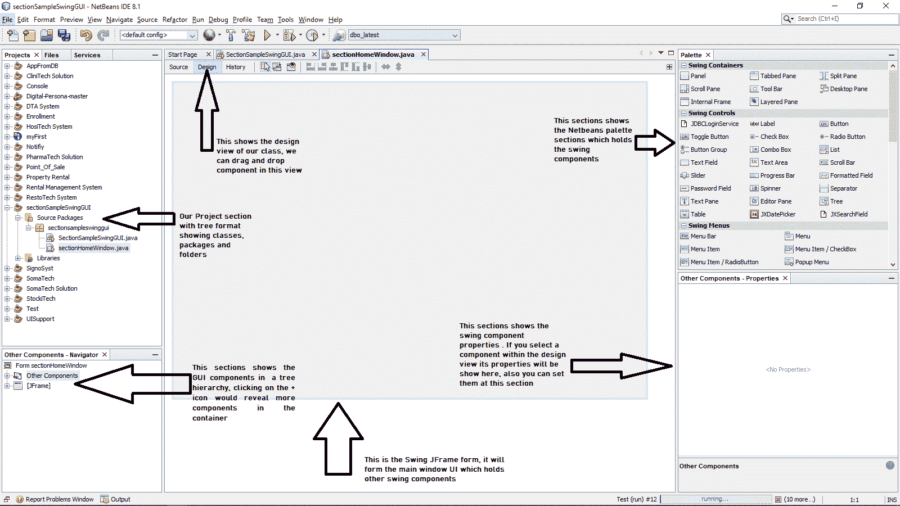

### Java 摆动时间选择器

1.我们现在将本文前面提到的元素拖放到 JFrame 中。之后，我们将运行我们的程序来检查它看起来如何。要执行应用程序，请转到 IDE 的“运行”按钮，并从菜单栏中选择“运行项目”。

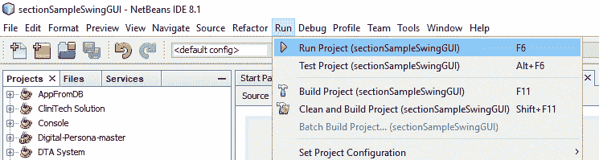

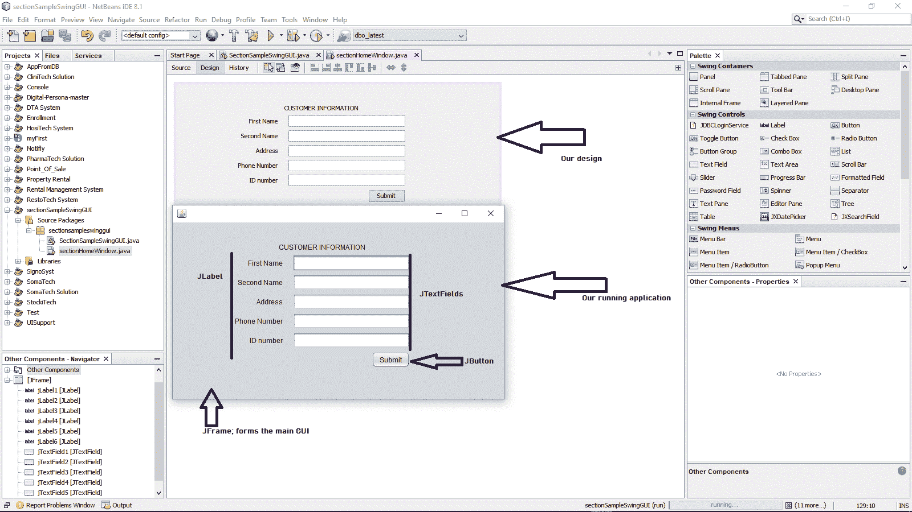

### 结论

Java Swing 是一个相当简单的框架。它的应用程序要快得多，也更可靠，因为它们是独立于平台的和轻量级的。

NetBeans IDE 为拖放 Swing 组件提供了一个简单而有吸引力的 GUI，使应用程序的构建变得轻而易举。

### 摇摆时间选择器

可选参数允许您修改时间选择器。语言(地区)、下拉菜单默认时间、字体和颜色、显示/菜单/解析格式、12 或 24 小时制、秒或纳秒精度等等，这些只是选项中的一部分。

该库中还包括 DatePicker 和 DateTimePicker 组件。这三个组件都很容易使用。(每一个都可以只用一行代码创建。)

下面是组件和示例应用程序的屏幕截图。

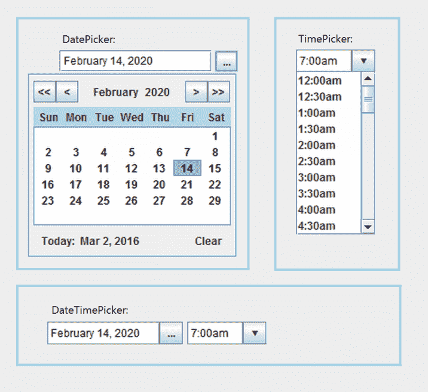

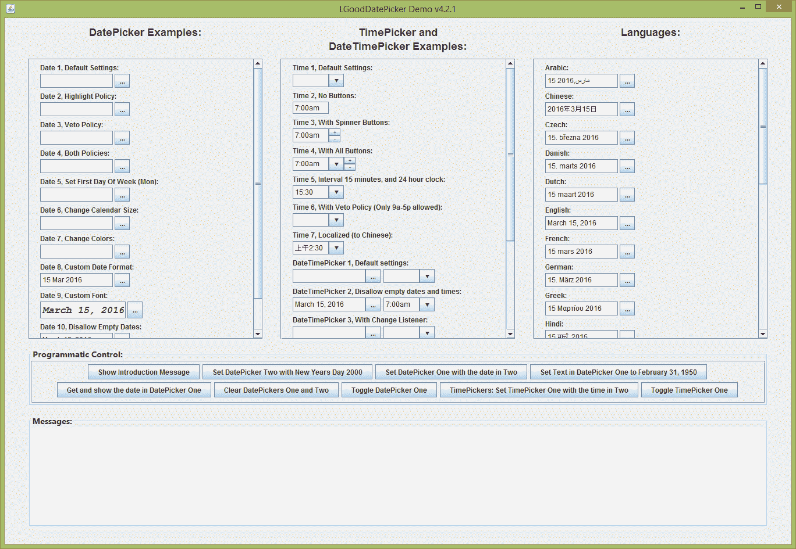