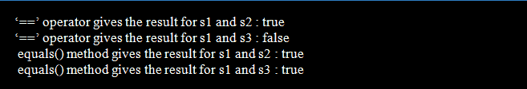

# 在 Java 中使用字符串类的最佳实践

> 原文：<https://www.tutorialandexample.com/best-practices-to-use-string-class-in-java>

1.  使用字符串生成器或字符串缓冲区代替+运算符进行字符串连接。
2.  用 **equals(** )方法代替==运算符比较两个字符串。
3.  **呼唤。equals( )** 方法对一个已知的字符串常量而不是未知的变量(" str.equal(variable))。
4.  将字符串创建为文本(" ")，而不是使用“new”创建 string 对象。
5.  首选 switch()语句代替多个 if else-if。
6.  使用 String.valueof()代替 toString()
7.  使用知名第三方库中的字符串实用程序类。

### 使用 StringBuilder 或 StringBuffer 进行字符串连接，而不是+运算符

如果经常连接字符串，StringBuilder 对象比+运算符更好。

由于它具有与 StringBuilder 相似的方法，但执行是同步的， **StringBuffer** 的行为也相似。这意味着多线程情况需要使用 StringBuffer。

让我们创建一个简单的应用程序来展示 **String** 、 **StringBuilder** 和 **StringBuffer** 的性能。

```
public class PerformanceTest¬¬{

     public static void main(String []args){
        String str = "";
        long startTime = System.microTime();
        for(int i=0 ; i < 10 ; i++) {
           str = str + i;
        }
       long endTime = System.microTime();
       System.out.println(String.format("String operation with 
                + operator took [%d] micro seconds",(endTime-startTime)));

       StringBuilder builder = new StringBuilder();
       startTime = System.microTime();
       for(int i=0;i<10;i++) {
           builder.append(i);
       }
       endTime = System.microTime();
       System.out.println(String.format("String operation with 
                StringBuilder took [%d] micro seconds",(endTime-startTime)));

       StringBuffer strBuffer = new StringBuffer();
       startTime = System.microTime();
       for(int i=0;i<10;i++) {
           strBuffer.append(i);
       }
       endTime = System.microTime();
       System.out.println(String.format("String operation with 
            StringBuffer took [%d] micro seconds",(endTime-startTime)));

   }
} 
```

**输出:**


从结果中可以看出，使用 **StringBuilder** 和 **StringBuffer** 方法的字符串连接比使用 **+** **操作符**更快。

> **注意:**您是否知道在 Eclipse 中'+'字符串连接可能会自动转换为 StringBuilder append()s？此外，它为每种类型选择适当的 add()。Ctrl+1 还是挺有用的。

### 用 equals()方法代替“==”运算符比较两个字符串

当我们比较字符串内容和字符串引用时，请记住以下注意事项:

*   在比较 Java 中的原语时，比如 booleans、int 和 chars，使用==而不是 equals()。
*   当两次引用同一个对象时，“==”返回 true。修改后的实现决定了 equals()方法的输出。
*   使用 equals()代替==相等运算符来比较两个字符串的内容。

```
public class StringEqualsTest{
     public static void main(String []args){
        String s1 = "stringjava"; 
        String s2 = "stringjava"; 
        String s3 = new String("stringjava");
        System.out.println(" ‘==’ operator gives the result for s1 and s2 : " + (s1 == s2));
        System.out.println(" ‘==’ operator gives the result for s1 and s3 : " + (s1 == s3));
        System.out.println(" equals() method gives the result for s1 and s2 : " + s1.equals(s2));
        System.out.println(" equals() method gives the result for s1 and s3 : " + s1.equals(s3));  
}
} 
```

**输出**:



### 打电话。对已知的字符串常量而不是未知的变量(" str.equal(variable))使用 equals()方法。

如果你知道一些常数是固定的，那么对已知的常数而不是未知的变量使用 equals 技术。变量有时可能包含 null，对其中一个变量使用 equals 函数将导致 null 指针错误。

```
public class ConstantEqualsTest{
    private static final String CONSTANT = "constant value";

     public static void main(String []args){
           processString("constant value");

     }
     private static void processString(String str){
         if(CONSTANT.equals(str)){
            System.out.println("CONSTANT.equals(string): " 
            + CONSTANT.equals(str));
         }
     }
} 
```

**输出:**


### 首选 switch()语句代替多个 if else-if。

字符串的 switch 语句是 Java 1.7 中的新功能。当比较许多字符串时，使用开关而不是大量的 if-else-if 表达式。

### 使用 String.valueOf()代替 toString()

当对象必须转换为字符串时，obj.toString()和 String.valueOf(obj)的结果是相同的，但是 String.valueOf()是空安全的，并且从不引发 NullPointerException。

### 使用字符串实用程序类

从许多著名的库中选择 **StringUtility** 类，而不要选择其他类，因为这些库已经被验证是正确的。

### 避免重复文字

通常，将字符串声明为常量字段比使用冗余的字符串更好。

```
private void bar() {
     String canja= "Canja"
     buz(canja);
     buz(canja);
 }

 private void buz(String x) {}

// Better
private static final String CANJA = "Canja";
private void bar() {
     buz(CANJA);
     buz(CANJA);
 }
 private void buz(String x) {} 
```