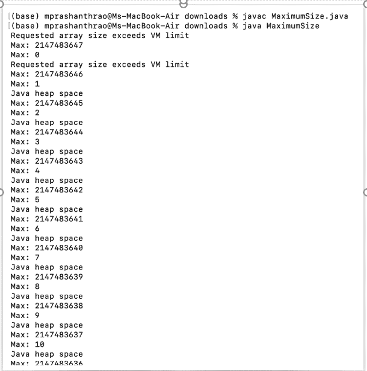
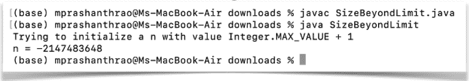

# java 中字符串的最大长度

> 原文：<https://www.tutorialandexample.com/maximum-length-of-string-in-java>

在 **java** 中，String 可以充当数据类型和类。字符串可以定义为用双引号(" ")括起来的字符的集合。字符串类由字符组成。字符串一旦创建就不能更改。字符串的对象不能被改变，因为它们是不可变的。

**举例:**

String s = " Increase

字符串 s 可以转换为字符数组，如下所示

char ch[]={'I '，' n '，' c '，' r '，' e '，' a '，' s '，' e ' }；

String s =新字符串(ch)；

在上面的例子中，String 类有一个 **length()方法**，用于查找字符串的长度。为了找到字符串的长度，有一个 length()方法。

length()方法返回字符串的长度，它是一个整数数据类型。此方法计算字符串中的字符数。

Java 使用 UTF-16 来表示字符。每个字符占用两个字节。

int 的大小是 4 个字节。整数的范围是从-2^31 到 2^31-1.这意味着(-2147483648 到 2147483647)接受这个范围；我们无法存储第 2147483647 个字符。因此，最大长度应该是从 0 到 2147483647。

我们可以使用 java 程序找到最大长度。

**例子**

```
import java.util.Arrays;  
public class MaximumSize   
{  
public static void main(String args[])   
{  
for (int i = 0; i < 1000; i++)   
{  
try   
{  
//Integer.max value stores maximum value of the string 
char[] array = new char[Integer.MAX_VALUE - i];  
//specific value is arranged to each datatype  
Arrays.fill(array, 'a');  
//Constructor is created for String class ang passing array as an argument
String str = new String(array);  
//prints the string length  
System.out.println(str.length());  
}   
catch (Throwable e)   
{  
// throws a message  
System.out.println(e.getMessage());  
//returns the maximum value of string
System.out.println("Max: " + (Integer.MAX_VALUE - i));  
System.out.println("Max: " + i);  
}  
}  
}  
} 
```

**输出**



例如，作为输出，用户可以运行 1000 次。在异常发生块中

整数数组。MAX_VAlue-i .之后我们用 fill 方法使用了 Array 类。

fill 方法为每个数组元素分配一个特定的数据类型值。

在该示例中，程序 catch 块用于引发 try 块中捕获的异常。catch 块中的 **getMessage** **()** **方法**抛出异常。

Java 中的每个字符存储两个字节的内存，因为字符串可以存储为 UTF-16 代码。为了添加字符串，我们需要两倍的内存来存储新旧字符串。

如果我们插入的字符串超过了它们的大小，内存就会溢出，我们会得到一个负的结果。考虑一个将字符串扩展到极限之外的例子。

**//超出尺寸的程序**

```
public class SizeBeyondLimit  
{   
public static void main(String[] arg)   
{   
try   
{   
System.out.println( "Trying to initialize" + " a n with value" + " Integer.MAX_VALUE + 1");   
// to store maximum integer value  
int n = Integer.MAX_VALUE + 1;   
 // preturn the result as negative num as size exceeded 
System.out.println("n = " + n);   
}   
catch(Exception e)   //used for handling the exception
{   
System.out.println(e);   
}   
}   
} 
```

**输出**



从上面程序的输出中，我们可以看到它被打印为负整数。

因为超出了字符串的实际大小。