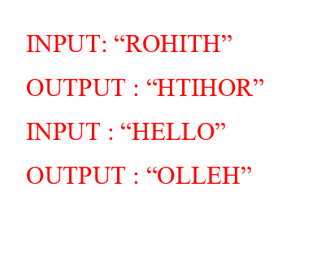
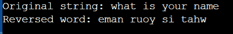
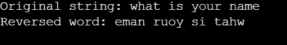
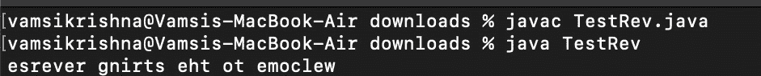
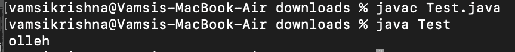
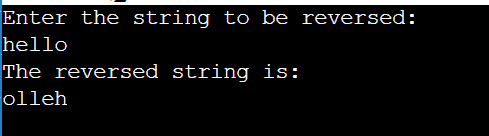
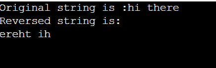

# 在 Java 中反转字符串

> 原文：<https://www.tutorialandexample.com/reverse-a-string-in-java>

反转字符串意味着，如果我们有一个名为“你叫什么名字”的字符串，那么反转后的格式就是“eman ruoy si tahw”。反转字符串包括完全颠倒字符的顺序，或者换句话说，向后阅读文本。

  

**串反转程序**

```
//stringReverse.java — file name
import java.io.*;
import java.util.Scanner;
class rev {
    public static void main (String[] args) {
        String s= "what is your name", sb="";
        char c;
      System.out.print("Original string: ");
      System.out.println("what is your name"); //sample string       
      for (int i=0; i<s.length(); i++)
      {
        c= s.charAt(i); 
        sb= c+sb; 
      }
      System.out.print("Reversed word: "+ sb);
    }
} 
```

**输出**

  

**解释**

在上面的程序中，“你叫什么名字”是输入字符串。使用 for 循环遍历字符串，遍历每个字符，并将其添加到输出字符串变量 sb 中。

**反转琴弦的不同方式如下**

1.  使用 StringBuilder
2.  使用字符串缓冲区
3.  通过反向迭代
4.  字符串到字节
5.  字符串转换为字符数组。

通常，String 类不包含 reverse()方法。其他技术用于反转字符串。

### 1)通过 StringBuilder

StringBuilder 是一个 Java 类，用于构造可变的字符序列。Java Strings 类提供了一个不可变的字符串；类似地，对于 StringBuffer，StringBuilder 类提供了另一种选择。

**程序使用 StringBuilder 反转一个字符串**

```
import java. lang.*;
import java.io.*;
import java.util.*;
class reversestr {
    public static void main(String[] args)
    {
        String s = "welcome to the string reverse program";
        StringBuilder sb = new StringBuilder();
        sb.append(s);`
        sb.reverse();
        System.out.println(sb);
    } //main
}//Main 
```

**输出**

  

### 2)字符串缓冲区

string 类没有内置的反向方法。我们必须使用 StringBuffer 来使用反向方法。字符串缓冲区总是包含一个特定的字符序列，但是通过调用特定的方法，可以改变该序列的长度和内容。许多线程使用字符串缓冲区是安全的。

**例 1。使用 StringBuffer** 反转字符串的程序

```
public class rev {  
public static String reverseString(String str){  
    StringBuilder sb=new StringBuilder(str);  
    sb.reverse();  
    return sb.toString();  
}  
}
public class TestRev {  
public static void main(String[] args) {  
    System.out.println(rev.reverseString("welcome to the string reverse"));     
    }  
} 
```

**输出**



**例二。使用 StringBuffer** 反转字符串的程序

```
//second example
import java.lang.*;
import java.io.*;
import java.util.*;

public class Test {
    public static void main(String[] args)
    {
        String s = "hello";
        StringBuffer sb = new StringBuffer(s);
        sb.reverse();
        System.out.println(sb);
    }
} 
```

**输出**



### 3)通过反向迭代

给定一个要反转的字符串。创建一个空字符串变量。使用 for 循环以逆序获取要反转的字符串的字符。在 for 循环中，将每个字符追加到您作为空字符串给出的名称中。打印结果。

**使用迭代**对字符串进行反向编程

```
//reverseString.java — file name
import java.io.*;
import java.util.*;
class Main {
    public static void main (String[] args) {
        Scanner sc = new Scanner (System.in);
        System.out.println("Enter the string to be reversed:");
        String s = sc.nextLine();
        char[] a = s.toCharArray();       
        String reverse = "";
 for(int i = s.length() - 1; i >= 0; i--)
 {
 reverse = reverse + s.charAt(i);
 }
 System.out.println("The reversed string is:");
 System.out.print(reverse);
    }
} 
```

**输出**

  

### 4)将字符串转换成字节

创建一个与输入字符串大小相同的临时字节[]。将字节以相反的顺序放入临时字节[]。要存储结果，用 byte[]创建一个新的 String 对象。

**程序使用字节函数反转一个字符串**

```
import java. lang.*;
import java.io.*;
import java.util.*;
class Main {
    public static void main(String[] args)
    {
        String s = "hi there";
        byte[] sb = s.getBytes();
        byte[] r = new byte[sb.length];
        for (int i = 0; i < sb.length; i++)
{
            r[i] = sb[sb.length - i - 1];
	}
	     System.out.println("Original string is :"+s);
	      System.out.println("Reversed string is:");
        System.out.println(new String(r));
    }
} 
```

**输出**

  

### 5)将字符串转换为字符数组

在 Java 中，使用 toCharArray()函数将该字符串转换为字符数组。它产生一个新形成的字符数组，长度与该字符串相同，内容与该字符串相同。

**使用 toCharArray 函数编程反转字符串**

```
import java.lang.*;
import java.io.*;
import java.util.*;
class reverseString {
    public static void main(String[] s)
    {
        String r = "hello everyone, good to see you";
        char[] t = r.toCharArray();
        for (int i = t.length - 1; i >= 0; i--)
            System.out.print(t[i]);
    }
} 
```

**输出**

