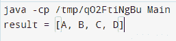

# 在 Java 中将字符串拆分成字符串数组

> 原文：<https://www.tutorialandexample.com/split-string-into-string-array-in-java>

String **split()** 技术在策略将给定的字符串分割成包含分隔符的给定正常发音的匹配项之后，返回各种分割的字符串。普通的发音应该是一个合法的例子，如果是基本的，一定要避免使用独特的字符。

### Java 数组

集群通常是具有相同内存空间的类似组件的集合。Java 数组是由相同的数据类型组件组成的数据结构。此外，数组组件存储在相邻的内存空间中。它是一种存储可比组件的数据结构。一个 Java 数组只能容纳合理数量的组件。Java 中的数组是基于列表的；数组的主要组件存储在第 0 个文件中，第二个组件存储在第一条记录中，依此类推。与 C/C++不同，我们可以使用长度组件来检索数组的长度。我们想在 C/C++中使用 sizeof administrator。

数组是在 Java 中逐步构造的类对象。Java 集群接收对象类并实现可序列化和可克隆的连接点。在 Java 中，我们可以在一个数组中存储一些基本的特征或物品。在 Java 中，我们可以像在 C/C++中一样创建一维或多维数组。此外，Java 有奇怪数组的元素，这是 C/C++没有的。

**Java 中声明数组的语法:**

```
•	dataType[] arr; 
•	dataType []arr; 
•	dataType arr[]; 
```

### Java 字符串

通常，字符串是一组字符。然而，在 Java 中，字符串是一个处理一连串字符的项目。利用 **Java.lang.String** 类来创建一个字符串对象。

**语法**

 **```
<String_Type> <string_variable> = "<sequence_of_string>";
```

**举例:**

```
String str = "Hello!";
```

有两种方法可以制作字符串对象:

1.  按字符串文字
2.  按新关键字

**1。String Literal:**Java String Literal 是利用两重语句构成的。

 **```
For Example:     String s = "Victory"; 
```

**2。New 关键字:**这里，new 关键字用于创建字符串。

```
String s=new String("Victory");
```

String split()技术在策略将给定字符串分割成包含分隔符的给定正常发音的匹配项之后，返回各种分割的字符串。普通的发音应该是一个合法的例子，如果是基本的，一定要避免使用独特的字符。

**举例:**

```
String s= "A-B-C-D"
String[] strArray = s.split("-"); 
```

**字符串 split()API:**split()策略负担过重。

 ****Regex -** 普通定界发音。

**Limit -** 控制应用示例的次数，从而影响后续数组的长度。

如果断裂点是正的，这个例子将适用于所有被认为是极限的事情——多次。结果串的长度不会比限制更明显，并且该簇的最后一部分将包含超过最后一个匹配定界符的所有承诺。如果截止值为零，生成的数组可以是任意大小。下面的空字符串将被删除。如果截止值为负，返回数组可以是任意大小。

**语法:**

*   public String[]split(String regex)；
*   public String[]split(String regex，int limit)；

### 抛出 PatternSyntaxException:

Split()抛出 PatternSyntaxException，以防正常发音的语言结构无效。在给定的模型中，“[”是无效的习惯发音。

例子

```
Invalid regex example
public class StringEx
{
    public static void main(String[] args)
    {
        String[] str = "hello world…!".split("[");
    }
}
```

**输出**

  

### 不允许“null”

该技术不承认“无效”争用。它将抛出 NullPointerException，以防技术争用无效。当无效的发音传递给技巧时。

*   字符串“primary”中的豁免 java.lang.NullPointerException
*   当 Java . lang . string . split(string . Java:2324)
*   当 com。string example . main(string example . Java:11)

**用给定的分隔符**将一个字符串拆分成一个数组

Java 程序根据给定的标记分割字符串。在给定的模型中，我们将字符串分隔为分隔符破折号**“-”。**

**例子**

```
public class StringEx
{
    public static void main(String[] args)
    {
        String s= "how to do-in-java-provides-java-tutorials";

        String[] strArray = s.split("-");

        System.out.println(Arrays.toString(strArray));
    }
}
```

**输出:**

  

### 用空格分割字符串

Java 程序，利用分隔符“\\s”按空格分隔字符串。要分隔所有空白区域字符(空格、制表符等)，请使用分隔符“\\s+”。

**例子**

```
public class Strix
{
    public static void main(String[] args)
    {
        String s = " how to do in java provides java tutorials";

        String[] strArray = s.split("\\s");

        System.out.println(Arrays.toString(strArray));
    }
}
```

**输出**

  

### 用逗号分割字符串

```
import java.util.Arrays;
class Main {
  public static void main(String[] args) {
    String s = "A,B,C,D";
    String[] result = s.split(",");
    // converting array to string and printing it
    System.out.println("result = " + Arrays.toString(result));
  }
}
```

**输出**

  

### 用多个分隔符分割字符串

一个 Java 程序，用许多分隔符分隔一个字符串。在不同的分隔符之间使用 regex 或 administrator“|”图像。在给定的模型中，我用两个分隔符——破折号和斑点——分隔字符串。

**例子**

```
class Main {
  public static void main(String[] args) {
    String s = " how-to-do-in-java. provides-java-tutorials.”;
    String[] result = s.split("-|\\");
    // converting array to string and printing it
    System.out.println("result = " + Arrays.toString(result));
  }
} 
```

**输出:**

  

### 字符串拆分(正则表达式，限制)

这种技术的变体还会将字符串分开。但是，令牌的最大数量不能超过争用限制。在跟踪策略之后，给定标记的数量，未点化的字符串的剩余部分作为最后一个标记返回，不管它是否包含分隔符。在 given 下面是一个 Java 程序，用空格分割字符串，例如，最大令牌数不能超过 5。

**例子**

```
class Main {
  public static void main(String[] args) {
    String s = " how to do in java provides java tutorials.”;
    String[] result = s.split("\\s",5);
    System.out.println(result.length);
    System.out.println("\n");
    // converting array to string and printing it
    System.out.println("result = " + Arrays.toString(result));
  }
}
```

**输出**

******