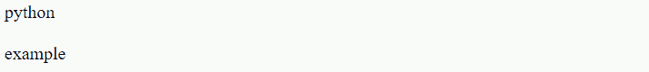
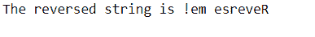

# 在 Java 中使用集合反转字符串

> 原文：<https://www.tutorialandexample.com/reverse-a-string-using-collections-in-java>

通常，字符串是一组字符。然而，在 Java 中，字符串是对一系列字符进行寻址的项目。利用 **Java.lang.String** 类来创建一个字符串对象。

**语法**

```
<String_Type> <string_variable> = "<sequence_of_string>";
```

**例**

```
String str = "Hello!";
```

有两种方法可以制作字符串对象:

1.  字符串文字
2.  新关键字

**1**T2。String Literal:**Java String Literal 是利用两重语句构成的。**

 **```
For Example: String s = "Victory"; 
```

**2。New 关键字:**new 关键字用于创建字符串。

```
For Example: String s=new String("Victory");
```

**Java 程序**

```
public class StringExample{    
public static void main(String args[]){    
	String v1="python";// making string by Java string literal
	char ch[]={'v','i','c','t','o','r','y'};    
	String v2=new String();//changing over char to string
	String v3=new String("example");// making Java string by new keyword
	System.out.println(v1);    
	System.out.println(v2);    
	System.out.println(v3);    
	}	
} 
```

**输出**

  

### Java 中的集合

Java 中的集合是一个框架，它给出了存储和控制事物集合的计划。Java 集合可以完成您对一条信息执行的每一项操作，例如，查找、整理、连接、控制和删除。

Java 集合意味着一个单独的项目单元。Java 集合结构给出了不同的隶属中心(Set，List，Queue，Deque)和类(ArrayList，Vector，LinkedList，PriorityQueue，HashSet，LinkedHashSet，TreeSet)。集合接口(Java.util.Collection)和映射接口(Java.util.Map)是 Java 分类类交互的两个主要“根”点。

要创建一个 string 对象，您确实需要 Java.lang.String 类。Java 编程利用 UTF - 16 来寻址字符串。字符串是不变的，目标是在文章完成后它们的内部状态保持稳定。string 对象执行不同的任务，但 Java 中的转向字符串是最常用的功能。

### 结构

框架是一堆类和交互点，它们给出了一个即时的设计。为了实现另一个元素或类，需要有一个令人信服的理由来表征一个结构。尽管如此，一个理想的项目定位计划通常包含一个由类组成的结构，以至于每个类都执行类似的任务。

### 集合中的类

集合中有各种类。几个类给出完整的执行，而其余的给出一个框架计划。下面检查了不同的类别:

*   **AbstractCollection:** 这个类执行分类中的大部分连接点。
*   **AbstractList:** 这个类获取 AbstractCollection 类，并执行列表接口中的大部分连接点。
*   **AbstractQueue:** 该类获取了 **AbstractCollection** 类，并实现了队列接口中的大部分连接点。
*   **abstractsequentialist:**这个类获取 **AbstractList** 类，用于采用顺序访问的记录。当每个字被单独迭代时，就发生了顺序存取。
*   **LinkedList:** 该类获取 **AbstractSequentialList** 类并执行连接的记录。
*   **ArrayList:** 这个类获取了 **AbstractList** 类并执行了一个独特的 exhibit。一个独特的展示是在运行时显示大小。
*   **ArrayDeque:** 该类获取 **AbstractCollection** 类并执行出列接口。它执行双重完成线动态的性质。
*   **AbstractSet:** 这个类获取了 **AbstractCollection** 类，并执行了这个 rundown 接口中的大部分连接点。
*   **EnumSet:** 这个类扩展了 **AbstractSet** 类并使用了 enum 组件。
*   **HashSet:** 这个类保护 **AbstractSet** 类，并与哈希表一起使用。
*   LinkedHashSet :这个类获取 HashSet 类并允许扩展请求中的循环。
*   **PriorityQueue** **:** 该类获得了 **AbstractQueue** 类，并将其用于*需求行的创建。*
*   **TreeSet** **:** 这个类获得了 **AbstractSet** 类，并使用它在树中构造一个协调集。

### Java 中的 Collections.reverse()方法

顾名思义，Collections 类的 **reverse()策略**用于将文章中的组件放回原处。它切换作为争用传递的概要中的组件请求。

附带的模型展示了如何利用集合。Reverse()调转 Java 的字符串。以下是已完成的进展:

创建一个空的字符数组列表，并使用 String.toCharArray()引入给定字符串的字符。

利用 Java . util . collections turn around()技术进行切换。

最后，利用 StringBuilder 将数组列表转换成字符串，并返回构造好的字符串。

**例:1**

```
import java.util.ArrayList;
import java.util.Collections;
import java.util.List;
import java.util.stream.Collectors;
 class Main
{

    public static String reverse(String str)
    {
          if (str == null || str.equals("")) {
            return str;
        }

           List<Character> list = new ArrayList<Character>();
         for (char c: str.toCharArray()) {
            list.add(c);
        }

               Collections.reverse(list);
        return list.stream().map(String::valueOf).collect(Collectors.joining());
    }

    public static void main(String[] args)
    {
        String str = "Reverse me!";
         str = reverse(str);
         System.out.println("The reversed string is " + str);
    }
}
```

**输出**

  

上面的排列最初将 ArrayList 转换成 StringBuilder，然后将 StringBuilder 转换成 string。我们可以直接把 ArrayList 转换成一个字符串，去掉它的方形部分、逗号和单个空格。附带的代码利用 String.replaceAll()来实现这一点。不管怎样，这种方法效率非常低，无论如何都应该避免。

**例:2**

```
import java.util.List;
import java.util.ArrayList;
import java.util.Collections;

class Main
{
    // Method to reverse a string in Java using `Collections.reverse()`
    public static String reverse(String str)
    {
        if (str == null || str.equals("")) {
            return str;
        }

        List<Character> list = new ArrayList<Character>();
        for (char c: str.toCharArray()) {
            list.add(c);
        }

        Collections.reverse(list);
         return list.toString()
            .replaceAll("[,\\[\\]]", "")    // t h g i l e D   e i h c e T
            .replaceAll("  ", "@")          // t h g i l e D@ e i h c e T
            .replaceAll(" ", "")            // thgileD@eihceT
            .replaceAll("@", " ");          // !em esreveR
    }

    public static void main(String[] args)
    {
        String str = "Reverse me!";
         str = reverse(str);
         System.out.println("The reversed string is " + str);
    } 
```

**输出**

  

这与利用 Java Collections Framework 的 converse()策略来切换字符串密切相关。**