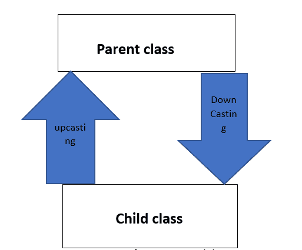
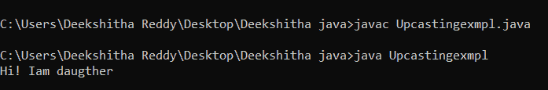
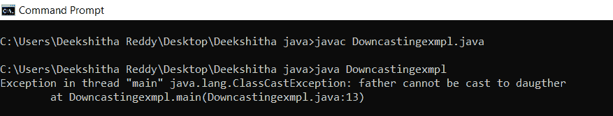
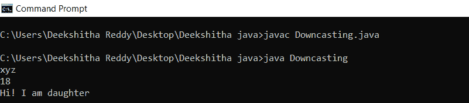
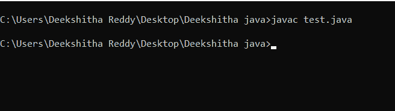
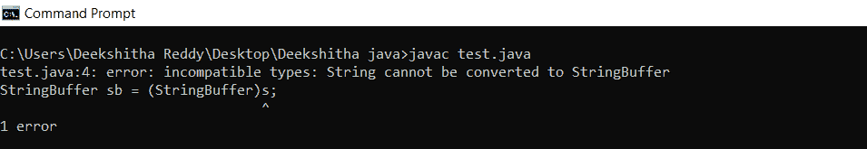
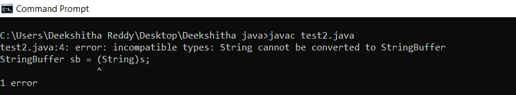
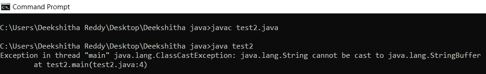
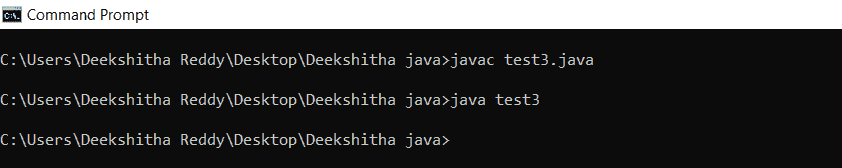
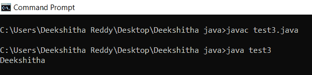

# Java 中的向上转换和向下转换

> 原文：<https://www.tutorialandexample.com/upcasting-and-downcasting-in-java>

Java 中的类型转换是一个重要且非常有趣的话题。但是这里的向上转换和向下转换与类型转换有些关系。在普通类型转换中，我们隐式或显式地将一种数据类型转换为另一种数据类型。这里我们对对象进行类型转换。是的，就像数据类型一样，对象也可以进行类型转换。

这个话题完全和“传承”有关。我们只有父对象和子对象。类型转换有两种类型，即从父到子或从子到父。

子对象到父对象的转换称为向上转换。与此相反的是向下转换。

  

(Java 中向上转换和向下转换的图示)

## 向上投射:

它是一种对象类型转换。这里，子对象被类型转换为父对象。子类对象被分配给父类引用变量。也被称为“泛化”或“加宽”。

例如:

//Upcastingexmpl.java

```
class father{ // parent class
void says(){System.out.println("Hi ! I am a father");
}
}
class daughter extends father{ // child class
void says(){ // method overriding 
System.out.println("Hi ! I am daughter");
}
}
class Upcastingexmpl{
public static void main(String args[]){
father f = (father) new daughter(); // implicit upcasting
f.says();
}
} 
```

**输出:**



## 向下铸造

这是另一种类型的对象类型转换。也被称为“专业化”和“窄化”。它与向上抛掷相反。应该将父对象赋给子引用变量，即父对象被定型为子对象。

例如:

**Downcastingexmpl.java**

```
class father{ // parent class
void says(){
System.out.println("Hi ! I am father");
}
}
class daughter extends father{ // child class
void says(){ // method overriding
System.out.println("Hi ! I am daughter");
}
}
class Downcastingexmpl{
public static void main(String args[]){ // explicitly doing downcasting
daughter d = (daughter) new father(); // compile time error
d.says();
}
} 
```

**输出:**



这里我们得到一个运行时错误。java 不支持向下转换吗？这个问题出现在你的脑海里了吗？答案是肯定的。Java 支持向下转换，但是通过一些其他的方法。向下转换是通过将子类对象分配给子类来执行的。

例如:

**Downcasting.java**

```
class father { // parent class 
 String name;   // local variable
void says()   
    {   
        System.out.println("Hi ! I am father");   
    }   
}   
class daughter extends father {   // Child class
    int age;    // local variable
    void says()   
    {   
        System.out.println("Hi ! I am daughter");   
    }   
}   
public class Downcasting{  
 public static void main(String[] args)   
    {   
        father f = new daughter();  
        f.name = "xyz";  
daughter d = (daughter) f;   // downcasting explicitily
         d.age = 18;   
        System.out.println(d.name);   
        System.out.println(d.age);   
        d.says();   
}
 } 
```

**输出:**



“向上转换可以隐式完成。而向下转换不能隐式完成。

让我们考虑一个现实世界的例子，父母有许多孩子。让我们考虑目前的一个孩子。子对象继承父对象的所有属性。因此，子对象可以隐式向上转换为父对象。但是，父级不能继承子级的属性。但是父母可以强制继承孩子的财产，这就是所谓的显性向下转换，即非隐性向下转换。

## 对象类型转换的规则

类型转换的语法是

```
A b = ( C ) d
```

这里我们将 d 类型的对象转换成 C 类型。现在 d 型会变成 C 型。现在我们把这个 C 类型的对象赋给一个类型引用变量。在这个类型转换中，编译器将检查两个规则，而 JVM (Java 虚拟机)将检查一个规则。

### 什么编译器要检查？

**编译时检查 1 或规则 1:**“d”类型转换为“C”类型是否合法？

编译器如何检查,“d”和“C”的类型必须有某种关系，即父到子或子到父或两者都是同一类型。

如果没有关系，那么我们将会得到“编译时错误”,比如不兼容的类型，等等…

检查规则 1 的示例:

//Test.java

```
class Test{
public static void main(String args[]){
Object o =  new String("Deekshitha");
StringBuffer sb = (StringBuffer)o; // downcasting explicitly
// we have a relationship between object and string buffer
}
} 
```

为了检查规则 1 是否满足，我们应该编译它。

**输出:**



**例 2:**

**Test.java**

```
class Test{
public static void main(String args[]){
String s =  new String("Deekshitha");
StringBuffer sb = (StringBuffer)s; // compile time error as there is no relation between string and string buffer
}
} 
```

**输出:**



这里我们得到了编译时错误，即不兼容的类型。

一旦规则 1 有效，编译器就检查规则 2。

**编译时检查 2 或规则 2:** 将“C”类型赋给“A”引用变量是否合法？

编译器如何检查，“C”必须与“A”或“A”的子类型相同。如果这个条件得到满足，那么代码就可以编译了。

为了检查规则 2 是否令人满意，让我们只考虑上面的代码。这里满足规则 1。“o”被转换成字符串缓冲类型。并且字符串缓冲区类型仅被分配给字符串缓冲区引用变量。因此，我们可以注意到这种关系，从而满足规则 2。

另一个例子:

```
String s = new String(“Deekshitha”) ;
StringBuffer sb = (String)s;
```

这里 s 是字符串类型的。并且 s 被分配给字符串缓冲引用变量。字符串和字符串缓冲区之间没有关系。因此，我们将得到编译时错误。

示例:

**Test2.java**

```
class Test2{ 
public static void main(String args[]){
String s = new String("Deekshitha");
StringBuffer sb = (String)s; // compile time error as there is no relation between string and string buffer.
}
}
```

**输出:**



### 要查什么 JVM ( Java 虚拟机)？

### JVM 规则:

“d”的内部运行时对象类型必须与“C”相同，或者与其子类型相同。否则，我们将得到一个运行时异常。

你可能想知道什么是运行时对象。我们用一个例子来理解。

Object 0 =新字符串(" Deekshitha ")；

string buffer sb =(string buffer)o；

这里“o”是对象类型。但是在内部，这个对象类型指向一个字符串对象。因此，最初的运行时对象是一个字符串对象。

因此，原始运行时对象“String”必须是“C”的相同类型或派生类型，即这里的 StringBuffer。这里的字符串不同于字符串缓冲区，或者不是字符串缓冲区的派生类。因此，我们将立即得到一个运行时异常，表示类强制转换异常。

示例:

**Test2.java**

```
class Test2{ 
public static void main(String args[]){
Object o = new String("Deekshitha"); // instance reference variable of object
StringBuffer sb = (StringBuffer)o; // run time error as instance reference variable and string buffer have no relation.
}
} 
```

**输出:**



**例 2:**

**Test3.java**

```
class Test3{
public static void main(String args[]){
Object o = new String("Deekshitha"); // instance reference variable
String s = (String)o; // assigning instance reference variable to string reference variable
}
} 
```

**输出:**



**例 3:**

Test3.java

```
class Test3{
public static void main(String args[]){
Object o = new String("Deekshitha");
String s = (String)o; // downcasting explicitily
System.out.println(s); // getting s value 
}
 } 
```

**输出:**



## 向上转换与向下转换


| **向上抛掷** | **向下投射** |
| 在这里，子对象是一个转换为父对象的类型。 | 在这里，父对象是一个被转换为子对象的类型。 |
| 这是隐式或显式完成的。 | 这是显式完成的。 |
| 它也被称为泛化或扩展。 | 它也被称为专业化或狭窄化。 |
| 在子类中，一些专门的方法可以通过向上转换来访问。 | 通过向下转换，我们可以访问这两个类的所有方法和变量。 |
| 语法:Parent p = new child()； | 语法:Parent p = new Child()Child c =(Child)p； |

