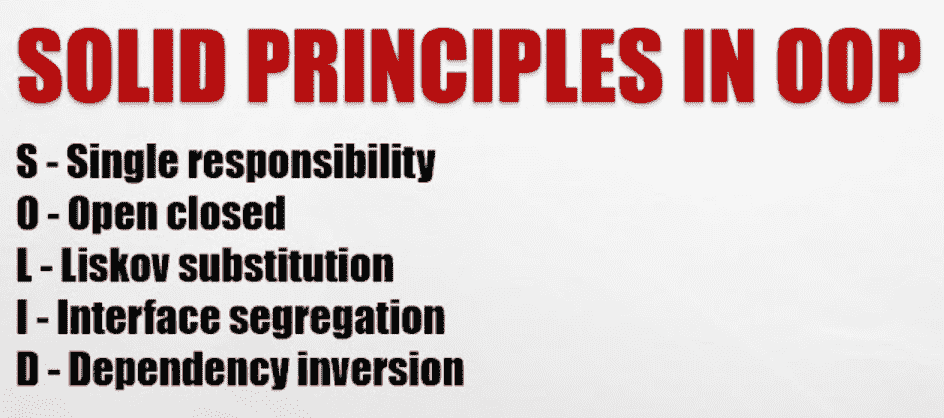

# Java 坚实的原则

> 原文：<https://www.tutorialandexample.com/java-solid-principles>

Java 实现了面向对象的软件架构设计的坚实原则。



## 坚实的原则

Java 实现了面向对象的软件架构设计的坚实原则。五个指导原则改变了面向对象编程的原则和创建软件的过程。它确保了软件的可重构性、可调试性和模块化。

**S:单一责任原则**

**O:开闭原理**

**L:利斯科夫替代原理**

**I:界面分离原理**

**D:依存倒置原则**

## 坚实原则的优势

*   代码标准化且简单
*   **易于维护**
*   ****代码很容易测试****
*   ******代码独立且可重用******
*   ******代码**中没有冗余********

 ******## 单一责任原则

单一责任原则认为一个类应该只执行一个方法或功能。这并不意味着该类不应该有更多的功能，但建议执行一个功能。

### 单一责任原则示例

如果您有一个名为 Film 的类，它包含三个方法，如拍摄()、编辑()和发布()。

**程序没有使用** **单责任原则**

**Film.java**

```
class Film
{
public void Shooting()
{
System.out.println(“Shooting method”);
// shotting action
}
public void Editing()
{
// Editing action
System.out.println(“Editing method”);
}
public void Release()
{
// release
System.out.println(“Release method”);
}
Public static void main(String s[])
{
//Main function
}
} 
```

**解释**

在上面的示例代码中，有一个包含 3 个动作的类 Film，它执行 3 个不同的动作。将所有函数放在一个类中会使代码变得复杂。因此，根据单一责任原则，我们将把每个功能分成单独的类。

### 使用单一责任原则的程序

**Film.java**

```
class Film
{
public void Shooting()
{
// shotting action
}
public static void main(String s[])
{
    // main method
}
} 
```

**Edit.java**

```
class Main
{
public void Editing()
{
// Editing action
}
public static void main(String s[])
{
    // main method
}
} 
```

**Release.java**

```
class Release
{
public void Release()
{
// release function
}
public static void main(String s[])
{
    // main method
}
} 
```

**解释**

在上面的示例代码中，根据单一责任原则，所有三个函数都有三个独立的类。

**优势**

*   易于测试和编译
*   **更少的依赖性**
*   ****代码组织****

 ******## 开闭原理

一个类应该用这个理论来设计，这样它就可以成功地完成它的目的，而不需要将来的修改。因此，扩展这个类应该是可行的，但是不能修改。

**做开闭原理的方法有**

1.使用继承
2。扩展类行为

### 使用开闭原理的程序

**MultiInherit.java**

```
interface Father
{
float ht=6.2f;
void height();
}
interface Mother
{
float ht=5.8f; // public static final variable
void height(); //public abstract method
}
class Child implements Father, Mother
{
public void height()
{
//child got average height of  parents
float ht=(father.ht+mother.ht)/2;
System.out.println("child's height: " +ht);
}
}
class MultiInherit
{
public static void main(String args[])
{
Child c1 = new Child();
c1.height();
}//main
}
```

## 利斯科夫替代原理

当涉及继承时，派生类必须与它们的源类完全可互换。换句话说，如果类 A 是类 B 的一个子类型，我们应该能够用 A 代替 B，而不会使程序有不同的行为。

### 利斯科夫替代原理程序

```
public class Student   
{  
 int height;  
 int weight;  
public void setHeight(double h)   
    {   
        height = h;   
    }  
public void setWeight(double w)   
    {   
        weight= w;   
    }  
}  
public class StudentBMI extends Student  
{  
public void setHeight(double h)   
    {  
super.setHeight(h);  
super.setWeight(w);  
    }  
public void setWeight(double h)   
    {  
super.setHeight(h);  
super.setWeight(w);  
    }  
} 
```

## 界面分离原理

根据这个想法，较大的接口分解成较小的接口。因为实现类只使用必要的方法。这个原理类似于单流行原理。

**例子**

**语法:**

```
public interface Vehicle  
{  
public void car();  
public void bus();  
public void train();  
} 
```

在上面的例子中，所有三种方法都存储在一个接口中。通过使用接口分离原则，我们可以分离接口方法。

**语法:**

```
public interface Converion1
{  
public void car();  
}   
public interface Conversion2
{  
public void bus();  
}  
public interface Conversion3   
{  
public void train();  
} 
```

### 界面分离原理程序

```
public class Conversion implements IntToDouble,CharToString   
{  
public void intToDouble()  
{  
    // method 
   // integer to double
}  
public void charToString()  
{  
    //conversion logic  
    // character to string function
}  
} 
```

## 从属倒置原则

它指出代码应该依赖抽象的细节来代替具体的细节。我们可以用这样一种方式来设计软件，即通过使用一个抽象层将不同的包或模块绑定在一起，使它们相互分离。这个原则可以作为 spring 框架的经典用法，所有的 spring 框架都有独立的组件，这些组件可以通过注入依赖来工作。

在这里，注入只不过是将依赖项传递给依赖对象的过程。

**依赖注入:**

它是一种设计模式，实现了依赖关系的反转控制。

它允许程序员删除硬编码的依赖关系，从而使应用程序具有可扩展性。

**例子**

**语法**

```
public class Employee
{
  private Details details
 public class Employee ()
{
      details = new Details ();
}
}
```

在上面的代码中，Employee 需要 Details 对象，初始化 Details 对象很有用。如果 Details 类在任何时候被更改，那么我们也可以在 Employee 类中进行更改。这使得 Details 类和 Employee 类紧密耦合。这个问题可以通过依赖倒置原则来解决，即细节对象将被独立实现，并被提供给雇员类。************