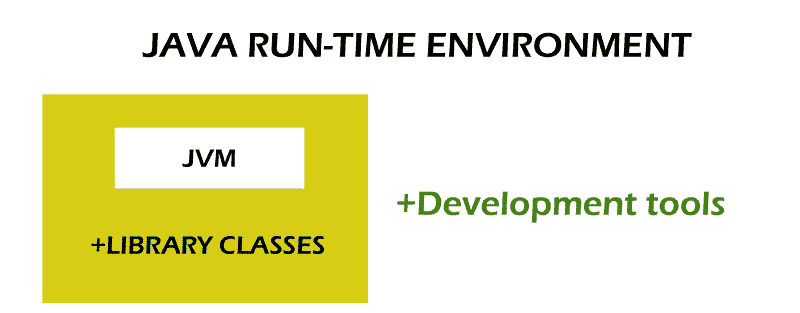

# Java 架构

> 原文：<https://www.tutorialandexample.com/java-architecture>

Java 架构由三部分组成，分别是 JVM、JRE 和 JDK。这些组件将有助于 java 程序的运行。代码解释和编译的过程可以用这些组件来完成。Java 架构描述了 java compJava 编译器对代码的分步执行和编译。


以下步骤可以描述 Java 架构:

*   Java 既有编译过程也有解释过程。
*   java 中的编译器会将编写的 java 代码转换成字节码。
*   转换成字节码后，组件(JVM)会将其转换成机器码。
*   之后，使用机器执行转换后的机器代码。

现在让我们详细讨论一下组件。

## Java 架构的组件

*   Java 虚拟机(JVM)
*   Java 运行时环境
*   Java 开发工具包(JDK)


### Java 虚拟机

Java 虚拟机的主要特性 WORA。一次编写，随处运行。这个特性描述了你一次写完代码，就可以在任何平台上使用这个程序。由于 java 虚拟机的存在，什么可以在任何平台上运行用 Java 编写的程序？java 虚拟机将充当执行 Java 程序的平台。这台机器的首要任务是将字节码转换成机器码。首先，它将加载代码并在内存中验证它。在将代码加载到内存中并执行代码之后。JVM 可以用于任何平台，因为它是独立于平台的。

1.它将指定 JVM 的工作方式。Oracle 和许多其他公司可以提供实现。

2.实现可以通过 JRE (Java 运行时环境)来完成

3.这段代码中的运行时实例是在命令提示符下编写的，用于运行 java 代码。

JVM 执行的操作有:

*   加载类
*   验证代码
*   执行代码
*   提供了运行时环境

JVM 包含:

*   记忆
*   类别文件
*   注册器械包
*   垃圾收集堆

它包含类加载器、内存区域和执行引擎。

**1)类装入器**T2

该系统是 JVM 的一个加载文件的子系统。当 java 程序运行时，它在类装入器中装入。java 中有三个类装入器。

->Bootstrap ClassLoader:这是扩展的超类。在这个类 rt.jar 中

文件位于 java.lang 包、java.io 和 java.sql 包中。

->扩展类加载器:这是 Bootstrap 的类加载器的基类，也是系统类加载器的父类。jar 文件加载在＄JAVA _ HOME/中。

JRE/lib/ext 目录。

->应用程序类加载器:它是扩展类加载器的基类加载器。类路径中加载的文件。Classloader 将在类路径中设置它。可以使用命令"-cp "来更改该类。因为它将切换应用程序，所以它被称为应用程序类加载器。

//程序

```
//Example, for printing the class loader 
public class loader 
{  
    public static void main(String[] args)  
    {  
        // printing the class loader for the current class    
        //classloader will load the class   
        Class c=CLoader.class;  
        System.out.println(c.getClassLoader());  
        //the result will be printed as null because it is a builtin class it can be founded in
        // rt.jar

        System.out.println(String.class.getClassLoader());  
    }  
}     
```

**输出**:

  

**2)类地区**

 **该方法将存储用于存储运行时池的每个类的结构以及用于存储方法的代码。

**3)堆**

 **堆区域用于存储对象。

**4)栈**

 **堆栈区域用于存储帧。堆栈区域将存储局部变量和方法。每次创建新线程时，都会在堆栈区域创建线程。当方法调用时，它将破坏框架。

**5) PC 寄存器**

 **它是一个程序计数器寄存器，包含当前正在执行的 JVM 的地址。

**6)原生方法栈**

 **可以将应用程序中使用的本机方法存储在本机方法堆栈中。

**7)执行引擎**T2】

执行引擎将作为虚拟处理器工作。它包含一个解释器，用于读取字节码，然后执行指令。JIT 是一个用于提高性能的实时编译器。该编译器将编译具有类似功能的代码，并减少编译时间。编译器会将指令从 JVM 转换成 CPU 指令集。

**8) Java 本地接口**

这个接口是一个框架，它提供了一个将不同语言(C，C++)的程序与它们的应用程序联系起来的平台。它用于获取控制台输出并与操作系统库交互。

### Java 运行时环境

它将为程序的执行创造一个环境。流程有效；代码首先被加载并与所需的库集成，在这个过程开始后，JVM 运行代码。Java 运行时环境是 Java 开发工具包(JDK)的子组。它包含类库和独立的 JVM。它是执行 java 程序最有效环境之一。使用 JRE，编写的代码被转换成字节码，用于执行任何平台中所需的字节码 JRE。JRE 将位于大多数操作系统之上。

它包含:

*   Java web start 可以使用 JRE 来完成
*   接口工具包例如:java 2D
*   它包含用于连接数据库(JDBC)的库。
*   预定义的库，如 lang 和 util。
*   它还包括一些库，如 java 管理扩展(JMX)和 Java 处理库。

### JRE 包含什么？

JRE 的组件包括:

*   **部署技术**技术有部署、插件等。
*   **界面工具包**用于设计应用程序界面，如抽象窗口工具包(AWT)、Swings、Applet、声音和输入法。
*   **库** Java 数据库连接(JDBC)、Java 命名和目录接口(JNDI)、远程方法调用(RMI)。
*   **其他库包括** I/O 输入输出、扩展机制、Net Beans、java 原生接口(JNI)、数学模块、覆盖机制、序列化方法和 Java 中的 XML 处理。
*   **基础库**包括 lang、util、Zip 文件、Java Archive (JAR)文件、集合、API 性能和 Re 表达式(正则表达式)。
*   **Java 虚拟机**将像服务器一样将服务器连接到虚拟机和客户端。

### JRE 与 JVM 一起工作



JRE 内部包含 Java 虚拟机、库类和开发工具。

借助下面的程序，我们可以理解 JRE 的工作原理。

//程序

```
import java.util.*  
public static void main(String[] args){  
System. out.println(?Hi Everyone?);  
} 
```

完成程序编写后，可以用。java 扩展。用 java 扩展保存程序后，将使用 javac filename.java 编译它。结果是字节码，独立于平台，所以它可以在任何 JRE 软件中运行。JRE 的工作由此开始。下图描述了字节代码的流程:


运行时采取的步骤:

*   **类加载器**
    在这一步中，类加载器将加载运行代码所需的类。它将从 JVM 动态加载。使用的类装入器有:

1.引导类加载器
2。扩展类加载器
3。系统类装入器

*   字节码验证器
    它将对字节码进行安全检查，以减少对解释器的干扰。只能解释一次代码。

*   **解释** r
    一个解释器会按照函数来逐行读取代码:

    执行字节码。
    调用硬件。

在上面的过程中，can exe 可以执行 JRE 中的程序。

### Java 开发工具包(JDK)

Java 开发工具包是一个开发软件应用程序和动态网页(Applet)的环境。JDK 包含 JRE 和开发工具。以下任何 java 平台都可以实现 Oracle 公司的 JDK:

*   标准版
*   企业版
*   微型版

JDK 包含虚拟机和其他用于开发 java 应用程序的工具，如解释器 java、编译器 javac 和归档器 jar。在 JDK 有不同种类的组件可供选择:


| 小程序查看器: | 在没有任何网络浏览器的情况下，小程序的运行和调试可以通过这个来完成。 |
| Apt: | 它用于加工。 |
| 下一次检查: | 它用于检测冲突。 |
| Java: | 开发和部署过程可以用单个启动器来完成。Java 用于加载应用程序。它是一个生成类文件的解释器。 |
| 联合军委会: | 这是任务控制器 |
| 太平绅士: | 这是一个 java 虚拟机进程状态工具，用于检测虚拟机的热点。 |
| 政策工具: | 它将创建一个策略管理工具，用于确定运行时间和其他来源。 |
| Wsimport: | 它用于调用 web 服务。 |
| 键盘工具: | 该工具用于密钥库操作 |
| 副本 | 这是一个命令行脚本 |
| Javainfo | 这个组件的功能是从 java 机器上获取信息。 |

**********