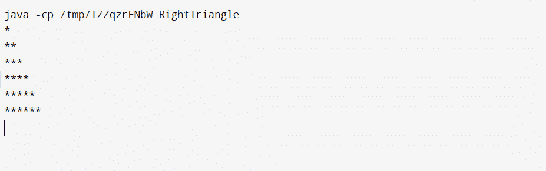
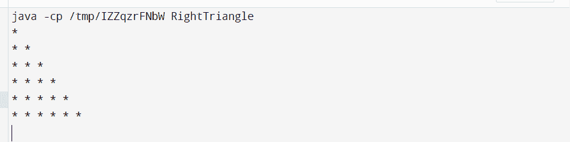
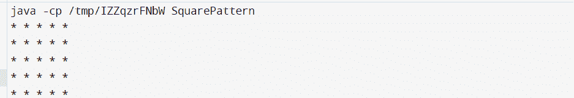
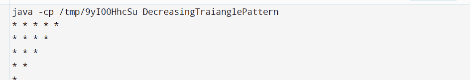
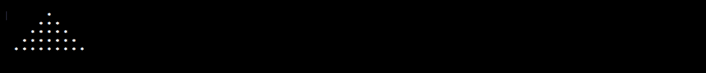
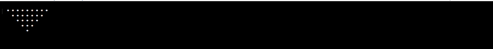
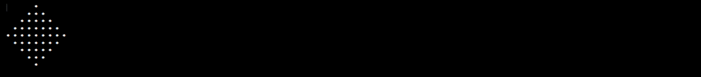
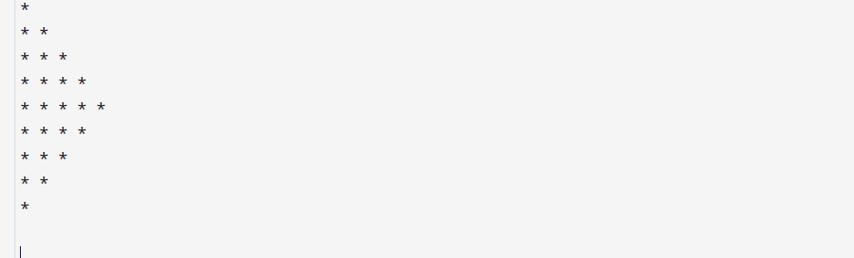
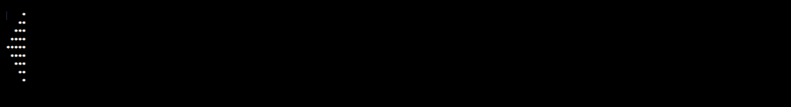
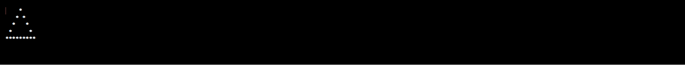

# Java 中的 Star 程序

> 原文：<https://www.tutorialandexample.com/star-program-in-java>

通过解决模式，我们可以发展我们的编码技能和逻辑思维。大多数情况下，每个模式程序使用两个或多个循环。循环的数量取决于逻辑的复杂程度。在这些循环中，第一个循环用于行，第二个循环用于列。

让我们看看 java 中的一些星型模式。

## 1.星星之间没有空间的直角三角形图案

```
public class RightTriangle{
    public static void main(String args[]){
        // i works for rows
        // j works for columns 
        int i, j, m = 6; // m = number of rows to be printed
        for(i = 1;i <= m;i++){
            for(j = 1;j <= i;j++){
       // for not getting space between stars, we do not use any space after a   star
                System.out.print("*");
            }
            System.out.println();
        }
    }
} 
```

**输出:**



## 2.星形之间有空间的直角三角形图案

```
public class RightTriangle{
    public static void main(String args[]){
         // i works for rows
        // j works for columns 
        int i, j, m = 6; // m = number of rows to be printed
        for( i = 1;i <= m;i++){
            for(j = 1;j <= i;j++){
                // for getting space between stars, we used a space after a star
                System.out.print("* ");
            }
            System.out.println();
        }
    }
} 
```

**输出:**



## 3.使用星形的方形图案

```
public class SquarePattern{
    public static void main(String args[]){
        for(int i = 1;i <= 5;i++){
            for(int j = 1;j <= 5;j++){
                System.out.print("* "); // Give space
            }
            System.out.println();
        }
    }
}
```

**输出:**



## 4.使用星形减少三角形模式

```
public class DecreasingTraianglePattern{
    public static void main(String args[]){
        for(int i = 1;i <= 5;i++){
            for(int j = i;j <= 5;j++){
                System.out.print("* ");
            }
            System.out.println();
        }
    }
} 
```

**输出:**



## 5.使用星星的山丘模式

```
public class HillPattern{
    public static void main(String args[]){
        int n = 5;
        for(int i = 1;i <= n;i++){
            for(int j = i;j <= n;j++){
                System.out.print("  ");
            }
            for(int j = 1;j < i;j++){
                System.out.print("* ");
            }
            for(int j = 1;j <= i;j++){
                System.out.print("* ");
            }
            System.out.println();
        }
    }
} 
```

**输出:**



## 6.使用星星反转山丘模式

```
public class ReverseHillPattern{
    public static void main(String args[]){
        int n = 5;
        for(int i = 1;i <= n;i++){
            for(int j = 1;j <= i;j++){
                System.out.print("  ");
            }
            for(int j = i;j < n;j++){
                System.out.print("* ");
            }
            for(int j = i;j <= n;j++){
                System.out.print("* ");
            }
            System.out.println();
        }
    }
} 
```

**输出:**



## 7.使用星星反转山丘模式

```
public class ReverseHillPattern {
  public static void main(String[] args) {
    int size = 5;
    for (int i = 1; i <= size; i++) {
      for (int j = size; j > i; j--) {
        System.out.print("  ");
      }
      for (int k = 0; k < i * 2 - 1; k++) {
        System.out.print("* ");
      }
      System.out.println();
    }
    for (int i = 1; i <= size - 1; i++) {
      for (int j = 0; j < i; j++) {
        System.out.print("  ");
      }
      for (int k = (size - i) * 2 - 1; k > 0; k--) {
        System.out.print("* ");
      }
      System.out.println();
    }
  }
} 
```

**输出:**



## 8.使用星形的右帕斯卡三角形图案

```
public class RightPascalTriangle  
{  
public static void main(String[] args)  
{  
int i, j, rows = 5;  
for (i= 0; i<= rows-1; i++)  
{  
for (j=0; j<=i; j++)   
{  
System.out.print("*"+ " ");  
}   
System.out.println("");   
}   
for (i=rows-1; i>=0; i--)  
{  
for(j=0; j <= i-1;j++)  
{  
System.out.print("*"+ " ");  
}  
System.out.println(" ");  
}  
}  
} 
```

**输出:**



## 9.使用星形的右帕斯卡三角形图案

```
public class LeftPascalTriangle 
{  
public static void main(String[] args)  
{  
int i, j, k, rows = 5;
for (i= 1; i<= rows ; i++)  
{  
for (j=i; j <rows ;j++)              
{  
System.out.print(" ");  
}  
for (k=1; k<=i;k++)   
{  
System.out.print("*");   
}   
System.out.println("");   
}   
for (i=rows; i>=1; i--)  
{  
for(j=i; j<=rows;j++)  
{  
System.out.print(" ");  
}  
for(k=1; k<i ;k++)   
{  
System.out.print("*");  
}  
System.out.println("");  
}  
}  
} 
```

**输出:**



## 10.空心三角形图案

```
public class HallowTraianglePattern  
{  
public static void main(String[] args)  
{  
int i, j, k, m=5;  
for (i=1; i<= m ; i++)  
{  
for (j = i; j < m ; j++)   
{  
System.out.print(" ");  
}     
for (k = 1; k <= (2*i -1) ;k++)   
{  
if(k==1 || i == m || k==(2*i-1))   
{  
System.out.print("*");  
}  
else   
{  
System.out.print(" ");  
}  
}  
System.out.println("");  
}  
}  
} 
```

**输出:**

