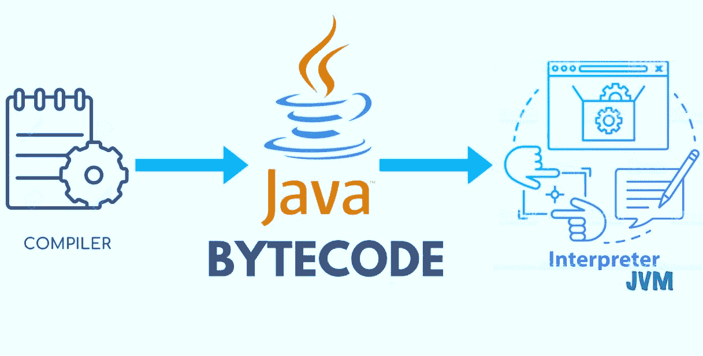

# Java 字节码

> 原文：<https://www.tutorialandexample.com/java-byte-code>

Java 字节码确实是一种强大的机制，它使 Java 成为一种可移植的和平台无关的编程语言。有两个软件组件使这个字节码成为一个神奇的代码。两个软件组件是编译器和解释器。第一个是编译器，它基本上生成我们的 Java 程序的字节码或机器码，第二个是解释器，它实际上在系统上执行字节码。而这个解释器也叫 JVM 或者 Java 虚拟机。因此，简而言之，基本上，字节码是创建它的编译器和实际运行它的解释器或 Java 虚拟机之间的公共部分。

让我们对这个字节码有更多的了解。

让我们知道 Java 的中间代码为什么叫字节码。

通过上面的信息，我们知道了这两个软件与字节码一起工作，我们可以说字节码是一个高度优化的指令集，设计用于由 Java 运行时系统执行。它也可以被称为 Java 程序的中间表示。这是一个不可运行的代码。它被称为字节码，因为每个指令都是一个或两个字节。另一件事是 JVM 是字节码的解释器。所以如上所述，Java 编译器先把我们的 Java 代码编译成字节码，然后 JVM 再把字节码转换成机器码；Java 编程语言是独立的，因为有字节码和 Java 虚拟机。Java 可移植的主要原因是，我们可以在任何平台上使用 Java 字节码，而无需做任何支持 Java 编程语言的修改。我们可以说这个 Java 字节码是可移植的。我们可以在任何其他主流平台上使用这些 Java 字节码。

让我们知道这个 Java 是如何提供高性能的。

Java 提供高性能的原因是 Java 编程语言使用了 Just in Time (JIT)。这种 JIT 实现了高性能。这个 JIT 是一个程序。这个程序把 Java 字节码转换成机器码。

## JVM 是开销吗？

JVM 是一个额外的层，将字节码翻译成机器码。

让我们来理解 C++编译器和 Java 编译器工作方式的区别。

1.  C++编译器–源代码+机器码
2.  Java 编译器–源代码à [javac]字节码à JVM 字节码à [JIT]机器码

如果观察第一种，可以观察到 C++中的源代码直接转化为机器码。

如果我们观察第二个，我们可以发现在 Java 中，我们有中间层，在那里我们可以生成字节码，然后由即时编译器生成。虽然这看起来像是一个开销，但这是一个额外的转换，允许 Java 在任何平台上运行应用程序。而机器代码的翻译是底层操作系统加载程序。

## 这个类装入器是什么？

当我们编译一个 Java 类时，它将它转换成字节码的形式，这是一个独立于平台和机器的编译程序，并将它存储为一个. class 文件。之后，当我们试图使用一个类时，Java 类加载器将该类加载到内存中。

## 字节码的重要性

基于一次编写，随处部署(达沃)的原则，Java 得以建立。因此，如果我们想将 Java 源代码部署到另一个操作系统中，就没有必要修改它，因为我们知道最终 Java 程序需要一个 Java 虚拟机来运行。另一件事是 JVM 是特定于机器语言的，不可能是平台中立的。

因此，我们有了源代码的中间编译——称为字节码。字节码是编译一个. Java 文件和创建一个. class 文件的结果。字节码是可移植的和平台不可知的。如果想在另一台机器上运行 Java 程序，只需将字节码发送到那台机器上。因此，我们有了源代码的中间编译——称为字节码。字节码是编译一个. Java 文件和创建一个. class 文件的结果。字节码是可移植的和平台不可知的。如果想在另一台机器上运行 Java 程序，只需将字节码发送到那台机器上。