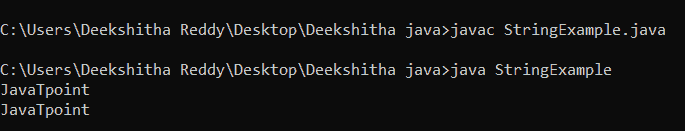

# Java 子串

> 原文：<https://www.tutorialandexample.com/java-substring>

## Java 中的子串是什么？

这里通过名称“子串”本身，我们可以很容易地知道它是一个字符串的一部分或一个字符串的子集。例如，如果“JavaTpoint”是一个字符串，那么 Java、T 等...是子字符串。它是 string 的内置方法。

在知道子串之前。让我们大致回忆一下琴弦。

## Java 中的字符串

字符串可以分成单独的字符。举个例子，

```
String name = "JavaTpoint";
```

或者

```
String name = new String("JavaTpoint");
```

它可以表示为，


| J | a | v | a | T | p | o | 我 | n | t |


0                   1             2             3             4            5             6              7                8        9

JavaTpoint 是一个被分成单个字符的字符串，我们可以通过索引号来访问这些字符。每个字符都有一个与之相关的索引。字符串中的索引从 0 开始，到(n-1)结束，其中 n 是字符串的长度。所以，如果我们想找 J，我们应该找 0，而不是 1。一个字符串有很多操作，比如长度、连接、比较等等…还有很多方法，比如 replace()、contain()、substring()等等…

让我们用一个简单的程序来理解字符串，

**StringExample.java**

```
public class StringExample
{
public static void main(String args[])
{
String name = "JavaTpoint"; // creating a string without new keyword
String name1 = new String("JavaTpoint"); // creating a string with new keyword
System.out.println(name); // displaying the string
System.out.println(name1); // displaying the string
}
} 
```

**输出:**

  

现在让我们来看一下子串这个主题，

## Java 中的 substring()方法

substring()方法返回的字符串是原始字符串的一部分。所以，如果我有“HelloProgrammers”作为一个字符串，那么程序员可以是其中的一个子字符串。

为了从给定的字符串中获取子串，Java 为我们提供了两种方法。这两种方法是:

1.子串(整数起始索引)

2.子字符串(整数开始索引，整数结束索引)

我们可以选择上面的任何一种方法来获取一个字符串的子串。这里要注意的重要一点是，开始索引是包含性的，结束索引是排他性的。

举个例子，

让我们考虑字符串“JavaTpoint”。如果我们希望只打印 Java，那么我们应该将参数作为 substring(0，4)提供给 substring 方法。

这里子串中的字符串不大写。Java 中的大多数方法都是“Camel case ”,即第二个单词是大写的。但是在 substring 方法中，所有的都是小写的。

子字符串(整数起始索引) :

Java 中的这个方法从给定的起始索引开始返回子串，直到结束。

当给定的起始索引大于字符串长度时，此方法将引发“IndexOutOfBound”异常。

让我们用程序来理解这个方法。

**StringExample1.java**

```
public class StringExample1
{
public static void main(String args[])
{
String s = new String("JavaTpoint is my favourite website"); // declaring a string using // new keyword 
String ss = s.substring(5); // using substring method 
System.out.println(" The substring is " +ss); // displays the substring
}
}
```

**输出:**


这里，我们将起始索引设为 5。因为 p 在第 5 个索引处，子串从 p 开始。

```
public class StringExample2
{
public static void main(String args[])
{
String s = new String("JavaTpoint is my favourite website"); // declaring a string using // new keyword
String ss = s.substring(40); // using substring method
// run time error start index is larger than the length of the string
System.out.println(" The substring is " +ss); 
}
} 
```

**输出:**


这里我们给的起始索引是 40，字符串的长度是 34。因为给定的起始索引大于字符串的长度，所以 40 大于 34，我们得到了“IndexOutOfBound”异常。

### 子字符串(整数开始索引，整数结束索引)

Java 中的这个方法用于获取所需长度的子串。如果起始索引小于 0 或大于结束索引，或者结束索引大于字符串长度，此方法也会引发异常“IndexOutOfBound”。

让我们用一个示例程序来理解这个方法

**StringExample3.java**

```
public class StringExample3
{
public static void main(String args[])
{
String s = new String("JavaTpoint is my favourite website"); // declaring string using // new keyword
String ss = s.substring(0,20); // using substring method
System.out.println(" The string is " +s); // displaying entire string
System.out.println(" The substring is " +ss); // displaying substring from 0 to 19th //index
}
} 
```

**输出:**

  

这里我们想得到一个长度为 0 到 19 的子串。由于结束索引是排他的，所以我们给了 20 作为结束索引。

**StringExample4.java**

```
public class StringExample4
{
public static void main(String args[])
{
String s = new String("JavaTpoint is my favourite website"); // declaring a string using // new keyword
String ss = s.substring(0,40); // using substring method
System.out.println(" The string is " +s); // displaying entire string
System.out.println(" The substring is " +ss); // runtime error
}
}
```

**输出:**


这里 end index 大于字符串的长度，所以我们得到了一个运行时错误。

所以，这都是关于 substring()方法的。