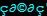
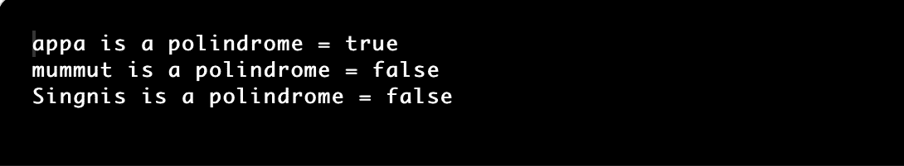
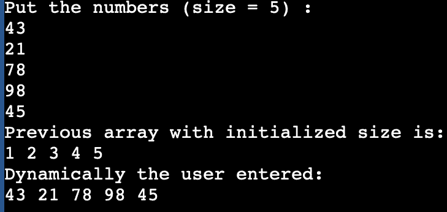

# Java 中的非原始数据类型

> 原文：<https://www.tutorialandexample.com/non-primitive-data-types-in-java>

存储在变量中的数据类型由其类型决定。类型描述数据类别(不同的大小和值)。

这些还没有内置到设备中。这些是由用户根据用户的要求创建的。非原始数据类型用于在单个变量中存储不同的值。例如，一个数组可以用于存储多个值。因此，这些被称为存储值的高级版本。

每当创建非基元数据类型时，都会引用堆内存中保存数据的内存地址或创建对象的存储地址。非原始数据类型变量也称为对象引用变量或被引用数据类型。

对象引用变量位于堆栈存储器中，而它所引用的对象始终驻留在辅助存储器中。对堆中对象的引用存储在堆栈中。

Java 中的所有非原始数据类型都被称为“对象”，它们是通过创建一个类来产生的。

## 关键点:

1.对于存储任何值，它将 null 指定为默认值。

2.每当我们向一个方法提供非原始数据类型时，我们也提供包含数据的对象的地址。

非原始数据类型的类型:

在 java 中，非原始数据类型分为五种类型。

1.  班级
2.  目标
3.  线
4.  排列
5.  连接

### 类别和对象:

类是用户在 java 中创建的数据类型；因此，它被称为用户定义的数据类型。它被用作成员变量和基于方法的数据的模板。

对象是类的实例，可用于访问类元素和方法。

下面的例子将描述创建类的方法和变量。在这个例子中，创建了一个由方法(加法( )和减法( ) )组成的类。可以使用对象 ob 从类中访问这些方法。

**Datatypes.java**

```
class Datatypes {  
       // declaring the variables of the class Datatypes 
        int num1 = 20;  
        int num2 = 10;  
        int num3;    
        // the methods of Datatypes class  
        public void addition() {  
            int num3 = num1  + num2;  
            System.out.println("The sum of the two numbers is: " + num3);  
        }  
        public void subtraction() {  
            int num3 = num1 - num2;  
            System.out.println("The difference between two numbers: " + num3);  
        }  
    // main section  
    public static void main (String[] args) {  
        // object ob is created
        Datatypes ob = new Datatypes();    
        //calling the methods of Datatypes class  
        ob.addition();  
        ob.subtraction();  
    }  
} 
```

**输出:**

### 连接

接口和类是相似的，但是接口只由抽象方法组成，而类包含不同的方法。

> **注意:**如果一个特定的类实现了接口，那么所有的接口方法都要实现。否则我们可以声明它是抽象的。

在下面的例子中创建了一个接口 Calculate，由接口中的两个抽象方法(add()和 multiply())组成。类示例实现接口，可以通过在示例类中创建对象来访问接口的方法。

**Example.java**

```
interface Calculate {  
    void add();  
    void multiply();  
}  
public class Example implements Calculate {  

        // defining the variables of class  
        int num1 = 10;  
        int num2 = 20;  
        int num3;  

        // the methods of the interface are implemented  
        public void multiply() {  
            int num3 = num2 * num1;  
            System.out.println("The product of two numbers: " + num3);  
        }  
        public void add() {  
            int num3 = num2 + num1;  
            System.out.println("The sum of two numbers is: " + num3);  
        }  
    // main section 
    public static void main (String[] args) throws IOException {  
        Example obj = new Example();  
        // calling the methods using the interface  
        obj.multiply();  
        obj.add();  
    }  
} 
```

**输出:**


### 线

字符串是一组字符，如“Java”、“Programming”等。在 java 中，字符串被定义为类和数据类型。在 java 中创建字符串的示例:

```
String str= " Java";
```

**例一**

 ****StringEx.java**

```
public class StringEx {  
    public static void main(String[] args) {  

        // a String Str is created and initialised it 
        String str = "Welcome! An Example of string";  

        // substring method is used  
        String subString = str.subString(0,14);  

        // result of substring  
        System.out.println(subString);  
    }  
} 
```

**例二**

 ****Palindrome.java**

```
public class Palindrome{

	public static void main(String[] args) {

		isPalindrome("abc");
		isPalindrome("abcba");
		isPalindrome("");
	}

	private static void isPalindrome(String input) {
		boolean res = true;
		int len = input.length();
		for(int j=0; j < length/2; i++) {
			if(input.charAt(i) != input.charAt(length-i-1)) {
				res= false;
				break;
			}
		}
		System.out.println(input + " is palindrome = "+res);

	}
} 
```

**输出:**



### 排列

称为数组的数据类型允许顺序存储许多同质变量或相同类型的变量。它们以索引格式保存，索引为零。元素的数据类型可以是基本的，也可以是非基本的。

用原始数据类型 int 声明数组:

```
int age [ ];
```

下面的示例描述了数组的初始化，以及如何使用 for 循环检索数组元素。

ArrayEx.java

```
import java.io. * ;  
import java.util. * ;  
public class ArrayEx {  
  public static void main(String[] args) throws IOException {  
    int i;  
    Scanner sc = new Scanner(System. in );  
    // array was declared, and it was initialised  
    int array[] = {1, 2, 3, 4, 5};  
    // Another array array1 is declared 
    int array1[] = new int[5];  
    // user is requested to enter the values  
    System.out.println("Put the numbers (size = 5) :");  
    for (i = 0; i < 5; i++) {  
      array1[i] = sc.nextInt();  
    }  
    System.out.println("Previous array with initialized size is: ");  
    for (i = 0; i < 5; i++) {  
      System.out.print(array[i] + " ");  
    }  
    System.out.println("\nDynamically the user entered:");  
    for (i = 0; i < 5; i++) {  
      System.out.print(array1[i] + " ");  
    }  
  }
} 
```

**输出:**

****