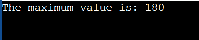
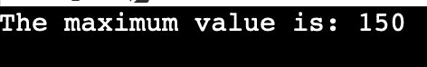

# Java 中的背包问题

> 原文：<https://www.tutorialandexample.com/knapsack-problem-in-java>

我们在背包问题中有一个项目集合。每个物体都有重量和价值。这些东西应该放在背包里。但是有体重限制。因此，我们必须选择组合重量不超过允许限制且组合价值尽可能高的物体。

背包难题有多种解决方案。

**0/1 背包问题**

提供了 n 个不同事物的权重和值。为了获得最大价值，这些东西必须放在一个容量为 k 的背包里。此外，背包的容量 k 不能超过里面所有货物的总重量。

## 穷举搜索方法

在穷举搜索中使用强力方法。每组项目都用这种方法进行测试，并计算每组项目的值。解决方案是产生最高价值的集合。

 **## 0/1 背包问题的 Java 程序设计

**Knapsack.java**

```
//  Exhaustive search approach for  0 - 1 Knapsack problem   
// A exhaustive search approach for the 0 - 1 Knapsack problem   
public class Knapsack 
{  
  // a method with name max is declared to find the maximum value between 2 numbers x and y
public int max(int x, int y)  
{  
// returns the maximum value
return (x > y ) ? x : y;  
}  
// Selecting the object to get maximum profit and  to fit in the bag of capacity k
public int knapSackVal(int k, int w[], int v[], int l)  
{  
// Checking whether the bag is empty 
if (l == 0 || k == 0)  
{  
    return 0;  
}  
if (w[l - 1] > k)  
{  
// usinf recursion to get maximum value
return knapSackVal(k, w, v, l - 1);  
}  
else  
{  
int v1 = knapSackVal(k - w[l - 1], w, v, l - 1);  
int v2 = knapSackVal(k, w, v, l - 1);  
return max(v[l - 1] + v1, v2);  
}  
}  
// Main method at which point of execution starts 
public static void main( String args [ ] )  
{  
 // Declaring the values of objects
int values_of_objects[] = new int [ ] { 150 , 20 , 30 } ;  
// Declaring the weights of objects
int weights_of_objects[] = new int [ ] { 30 , 20 , 40 } ;  

int k = 70;  
int l = values_of_objects . length ;  
Knapsack o1 = new Knapsack ( ) ;  
int ans = o1.knapSackVal ( k , weights_of_objects ,  values_of_objects , l ) ;  
System . out . println ( " The maximum value is :  "  +  ans ) ;  
}  
} 
```

**输出**

  

## 使用动态编程

由于上述方法需要很长时间才能产生预期的结果，所以动态规划成为必要。上述方法随着时间的推移会失效。用动态规划法求解 0/1 背包问题

KnapsackExample.java

```
public class KnapsackExample 
{  
// A maximum method, which returns  the maximum of two integers num1 and num2  
public int max(int num1, int num2)  
{  
    return (num1 > num2) ? num1 : num2;  
}  
public int max_value_knapsack(int C1, int w1[], int value[], int l1)  
{  
int j1, wt1;  
int dp1[][] = new int[l1 + 1][C1 + 1];  
for (j1 = 0; j1 <= l1; j1++)  
{  
for (wt1 = 0; wt1 <= C1; wt1++)  
{  
if (j1 == 0 || wt1 == 0)  
{  
    // base case  
    dp1[j1][wt1] = 0;  
}  
else if (w1[j1 - 1] <= wt1)  
{  
    dp1[j1][wt1] = max(value[j1 - 1] + dp1[j1 - 1][wt1 - w1[j1 - 1]], dp1[j1 - 1][wt1]);  
}  
else  
{  
    dp1[j1][wt1] = dp1[j1 - 1][wt1];  
}  
}  
}  
return dp1[j1 - 1][C1];  
}  
//  Main method  
public static void main(String argvs[])  
{  
// input arrays  
// Declaring the values of objects
int ValuesOfObjects[] = new int [ ] { 200 , 150 , 100 } ;  
// Declaring the weights of objects
int WeightsOfObjects[] = new int [ ] { 130 , 20 , 40 } ;  

int C1 = 50;  
// length of the input arrays  
int l1 = ValuesOfObjects.length;  
// instantiating the class KnapsackExample  
KnapsackExample o2 = new KnapsackExample();  
// invoking the method maxValueKnapsack()  
int max_value = o2.max_value_knapsack(C1, WeightsOfObjects, ValuesOfObjects, l1);  
// displaying the final result  
System.out.println("The maximum value is: " + max_value);  
}  
}
```

**输出**

**