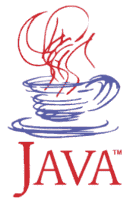
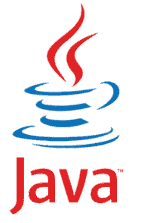

# Java 徽标

> 原文：<https://www.tutorialandexample.com/java-logo>

Java 是一种突出的、广泛使用的面向对象编程语言。1995 年，太阳微系统公司创造了它。2009 年晚些时候，甲骨文公司收购了 Java。

## Java 徽标的历史

以咖啡闻名的岛名叫爪哇。根据这种语言的创造者詹姆斯·高斯林、亚瑟·范·霍夫和安迪·贝克托尔斯海姆的说法，当时 Sun 公司把这种语言的名字从“OAK”改成了“Java”。詹姆斯·高斯林选择了杯子、碟子和蒸汽的形象，因为他当时在一家咖啡店里。所选的名字代表了咖啡。一杯热咖啡被选为爪哇的象征是有目的的。蓝红相间的咖啡杯从一开始就是这个品牌的一部分，只在 2003 年升级过一次，保持了原来的含义和颜色范围。

## 为什么一杯咖啡是 Java 的标志？

一个名叫爪哇的印度尼西亚岛屿。它的咖啡豆很出名。李丁丁的咖啡是用 Java 咖啡豆制成的，以前是 Java 开发者的首选饮料。因此，咖啡杯上上升的蒸汽标志象征着爪哇。

## 颜色和字体

主要 Java 徽章的标题字体强大而优雅。它采用自信的无衬线字体，类似 Sun SemiBold，并融合了 Cast Medium 和 Taz Text Regular Grade100 的元素。

Java visual identity 的蓝色和红色配色方案是在白色背景下设置的，给徽章一个轻快、清新的外观，同时传达质量和专业性，并展示 Java 是一种可靠和安全的语言。

## Java 徽标的演变

第一个 Java 徽标创建于 1996 年，就在该语言发布之后。Java 标志的原型有一个蓝色的咖啡杯，红色的蒸汽从上面升起。在创造 Java 编程语言的时候喝了很多咖啡的 Java 工程师们被这个标志认出来了。爪哇咖啡豆被用来制作他们喝的咖啡。它属于咖啡种类。爪哇咖啡豆是生长在印度尼西亚爪哇岛的湿加工咖啡。Java 编程语言的发明者 James Arthur Gosling 选择了 Java 咖啡豆作为语言的名字和外观。

  

这个标志是用平滑的弯曲线条设计的。好像是素描。蓝色调的杯子代表一些热咖啡，杯子上方光滑的红色弯曲线代表蒸汽。简而言之，它解决了一些热咖啡。

用大写字母写的编程语言的名字(JAVA)被简单地密封起来。主字母 J 在不同字母的对比中展开。

这个标志和编程语言一起持续了一段时间，例如，从 1996 年到 2003 年。

## 从 2003 年至今

  

现在的 Java logo，是 2003 年开发的，完全是基于以前的设计。红色的文字标记和红色的蒸汽咖啡杯仍然存在，但轮廓已经改变，变得更加大胆。

现在更准确地说，杯子只有三条粗而平滑的线，但是蒸汽有两条垂直的曲线。

碑文出现了最显著的变化，传统的衬线字体被一种时髦的现代无衬线字体取代，这种字体具有棱角分明的切割和柔和的线条。另一个显著的变化是，编程语言的名称现在用大写字母“J”来表示。

2004 年，对 Java 徽标进行了修订。红色的文字标记和热气腾腾的咖啡杯仍然存在，但曲线已被改变和加强。现在它更精确了，杯子只有三条粗而平滑的线，而蒸汽有两条垂直的曲线。

雕刻(弯曲)经历了最重大的修改，传统的无衬线字体风格被当代平滑的无衬线字体所取代，线条略有变化，切割独特。

另一个值得注意的变化是，编程语言的名称现在是大写的，字母“J”似乎被提升了。主字母的尾部被压缩了很多，非常适合又长又尖的红色蒸汽线。

立即识别和经典，Java 标志。尽管与公司的使命没有多大关系，但咖啡杯已经成为行业标准，完美地说明了看似不相关的元素如何能够走到一起，形成一个强大的品牌。