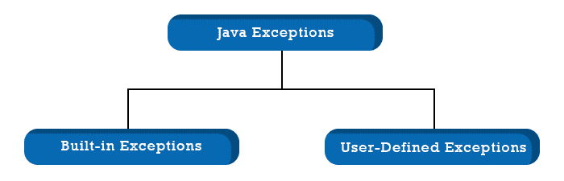
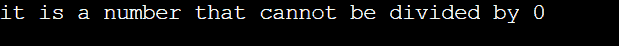
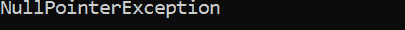
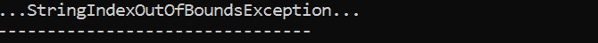

# Java 例外列表

> 原文：<https://www.tutorialandexample.com/java-exception-list>

像大多数当代编程语言一样，Java 使用异常来处理错误和“非常事件”当程序内部出现异常时，它会打乱指令的常规逻辑，并突然结束进程。

幸运的是，通过一点规划和编码，您可以经常优雅地处理这些异常，使您的代码保持运行，并为您提供识别意外结果原因的信息。

## 异常是如何处理的

遇到异常的类或函数会生成异常对象，并将数据传递给同一个运行时系统(JVM)。

然后，运行时系统遍历调用堆栈，以确定哪一层可以管理引发或抛出的异常。搜索从创建异常的方法开始，逐步搜索所有调用堆栈，直到找到异常处理程序。当异常的类型与异常处理程序可以处理的类型匹配时，它会检测到匹配。

## java 异常列表及示例

Java 定义了连接到不同类库的异常种类。Java 还为用户提供了创建自定义异常的选项。



## 内置异常:

内置异常是 Java 库中存在的异常。这些异常可以用来解释几种不同的故障场景。重要的内置 Java 异常列表如下所示。

1.  **ArithmeticException:** 每当算术运算中出现异常情况时抛出。
2.  **ArrayIndexOutOfBoundsException:**必须抛出，让用户知道使用了不正确的索引访问了数组。它的索引要么大于或等于数组大小，要么为负。
3.  **ClassNotFoundException:**Java 中的 ClassNotFoundException 是在 JVM (Java 虚拟机)试图加载一个特定的类，但是在你给的类路径中找不到想要的类时出现的，顾名思义。结果是您的类路径被破坏了(这在 Java 世界中是一个很常见的问题)。Java 初学者可能会发现这个问题特别令人困惑。它必须被捕获或抛出给调用方，因为 ClassNotFoundException 确实是一个检查过的异常。
4.  **FileNotFoundException:**Java . io 包还包含一个异常类，称为 FileNotFoundException。当我们试图访问一个没有安装在系统上的文件时，问题就出现了。它出现在运行时而不是编译时，使它成为一个检查异常。
5.  **IOException:** 当执行输入或输出操作时，如读取文件或访问文件，可能会出现 IOException 或输入输出异常。例如，如果我们试图使用不正确的路径读取文件，我们会收到一个 FileNotFound 异常。在已检查的异常的标题下，会出现 IOExceptions。Java 程序编译期间发生的异常是那些已经被检查的异常。FileNotFoundException、SSLException 和 IOException 的其他子类只是几个例子。
6.  **InterruptedException:** 任何正在打瞌睡或者等待什么的线程的执行都可以通过调用 interrupt()方法来中断，该方法会显示 InterruptedException 消息。Thread 类的 interrupt()函数可以用来停止一个正在打瞌睡或者等待的线程。
7.  **NoSuchFieldException:** 当类中缺少请求的字段(或变量)时，它会被抛出。
8.  **NoSuchMethodException:** 试图访问找不到的方法时，抛出。
9.  **NullPointerException:** 引用空对象的元素会触发异常。Null 是一个无意义的符号。
10.  **NumberFormatException:** 当一个方法试图将一个字符串转换成数值表示但失败时，就会抛出这个异常。
11.  **RuntimeException:** 显示实时发生的异常。
12.  **StringIndexOutOfBoundsException:**当这样的值似乎是负数或者大于字符串的长度时，由 String 类的方法抛出。
13.  **IllegalArgumentException:**当程序无法达到特定操作的方法时，会产生错误或错误消息的异常。未检查的异常适用于它。

## 内置异常的图示

*   **算术异常**

```
// The ArithmeticException in Java application
class ArithmeticException _Sahithi 
{
    public static void main(String args[])
    {
        try {
            int s = 40, h = 0;
            int r = s/h;  // it cannot be divide by the zero
            System.out.println ("Answer = " + r);
        }
        catch(ArithmeticException e) {
            System.out.println (" it is a number tha cannot be divided by 0 ");
        }
    }
} 
```

**输出:**

  

*   **NullPointer 异常**

```
// NullPointerException example programme in Java 
class NullPointer_Sahithi
{
    public static void main(String args[])
    {
        try {
            String  h= null; //the value that is null
            System.out.println(h.charAt(0));
        } catch(NullPointerException e) {
            System.out.println("NullPointerException");
        }
    }
} 
```

**输出:**

  

*   **StringIndexOutOfBound 异常**

 **```
// An example StringIndexOutOfBoundsException Java programme
class StringIndexOutOfBound_Sahithi
{
    public static void main(String args[])
    {
        try {
            String h = "The way she is smiling is very attractive "; // length is 42
            char s = h.charAt(44); // here we are accessing the 45th element
            System.out.println(s);
        }
        catch(StringIndexOutOfBoundsException e) {
            System.out.println("…StringIndexOutOfBoundsException…");
        }
    }
} 
```

**输出:**

  

*   **档案发现异常**

 **```
// Java example programme for the FileNotFoundException exception
import java.io.File;
import java.io.FileNotFoundException;
import java.io.FileReader;
 class Sahithi {

    public static void main(String args[])  {
        try {

            // the file which is in the following does not exist
            File file = new File("E://file.txt");

            FileReader sr = new FileReader(file);
        } catch (FileNotFoundException e) {
           System.out.println("No such file exists");
        }
    }
} 
```

**输出:**

  

*   **IllegalArgumentException:**一个人的投票资格由这个程序决定。如果年龄大于或等于 18 岁，则不会抛出任何错误。如果年龄小于 18 岁，将会生成一个带有错误语句的错误。

此外，可以指定“throw new IllegalArgumentException()”而不显示错误信息。在 IllegalArgumentException()函数中，我们可以选择指定 Integer.toString(变量名)，它将打印不符合指定标准的参数的名称。

```
/*whatever may be the package// exclude the package name from this text */

import java.io.*;

class Sahithi {
   public static void print(int a)
    {
         if(s>=18){
          System.out.println("Voting Rights Eligible");
          }
          else{

          throw new IllegalArgumentException("Unqualified to Vote");                        
          }
    }
    public static void main(String[] args) {
         Kamal.print(15);
    }
}
```

**输出:**

```
Exception in thread "main" java.lang.IllegalArgumentException: Unqualified to Vote at Kamal.print(File.java:14)
at Kamal.main(File.java:20) 
```

## 用户定义的异常

Java 的内置异常有时可能无法充分解释特定的情况。在某些情况下，用户也可能产生所谓的“用户定义的异常”

创建用户定义的异常的步骤如下。

*   一个异常类，它是一个异常类的子类，应该由用户创建。假设每个异常都是该异常的子类，那么用户应该对他的类做同样的事情。这通过以下方式实现:

```
class OwnException extends Exception
```

*   可以为异常类创建一个默认的构造函数。

```
OwnException(){}
```

*   另一种选择是创建一个带有参数的构造函数，该构造函数接受一个字符串。

这可用于存储异常信息。我们可以用它来调用超类(异常)构造函数并传递字符串。

```
OwnException(String sr)
{
   super(sr);
} 
```

*   有必要生成一个属于用户定义的异常类的对象，并通过 throw 子句抛出该对象，以便调用该类型的异常，如下所示:

```
OwnException sr = new OwnException(“details of the exception”);
throw sr; 
```

*   如何构造自己的异常类 MyException，如下面的应用程序所示。
*   三个数组用于存储关于账号、客户名称和余额的信息。
*   在 main()方法中使用 for 循环来显示细节。此时，检查任何账户中的余额是否低于所需的最小余额。
*   如果是这种情况，则显示“余额较少”并引发 MyException。

让我们看一下下面的例子

```
// Programming in Java to display a user-defined exception

// When balance is violated, this software throws an exception.
// the below given amount is Rs 20000
class OwnException extends Exception
{
    //account information is stored
    private static int acc[] = {2002, 2003, 2004, 2005};

    private static String iden[] =
                 {"Hymavathi", "Janardhan", "Swetha", "Archana", "Sahithi"};

    private static double mon[] =
         {20000.00, 22000.00, 3600.0, 899.00, 4100.55};

    // it is the default constructor
    OwnException() {    }

    // it is the parameterized constructor
    OwnException(String sr) { super(sr); }

    // the main() is written here
    public static void main(String[] args)
    {
        try  {
            // display the table's heading
            System.out.println("ACC" + "\t" + "CUST" +
                                           "\t" + "MON");

            // show the exact account details
            for (int k = 0; k < 5 ; k++)
            {
                System.out.println(acc[k] + "\t" + iden[k] +
                                               "\t" + mon[k]);

                // show your own exception in case of balance < 20000
                if (mon[k] < 20000)
                {
                    OwnException sh =
                       New OwnException("Balance falls short of 20000");
                    throw sh;
                }
            }
        } //it is the end of try

        catch (OwnException e) {
            e.printStackTrace();
        }
    }
}
```

**这里的运行时错误是**

所有者异常:余额不足 20000

位于 own exception . main(file property . Java:36)

**输出:**

```
ACC    CUST    MON
2002    Hymavathi    20000.0
2003    Janardhan    22000.0
2004    Swetha    3600.0
2005    Archana    899.0 
```****