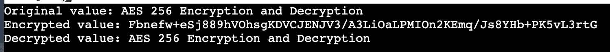

# Java 中的 AES 256 加密

> 原文：<https://www.tutorialandexample.com/aes-256-encryption-in-java>

如今，安全变得越来越重要。Java 编程支持多种加密和散列方法，这为不同节点之间的数据传输和通信提供了安全性。在这一部分中，我们将讨论 AES 256 加密技术，并展示如何在 Java 程序中使用该逻辑。

## AES 是什么意思？

AES 被称为高级加密标准算法。它是块密码的一种对称加密和解密算法。它的密钥大小为 128、192 和 256 位。它使用合法的密钥进行加密和解密。

AES 中使用分组密码。这意味着必须加密的数据被分成块。为了加密原始数据值，使用不同的填充位，例如 128、192 或 256 位。

## AES 算法

AES 技术使用迭代的对称密钥块密码，让 128、192 和 256 位的密钥(秘密密钥)加密和解码 128 位块中的数据。如果未达到 128 位数据块大小的要求，必须对需要加密的数据进行填充。填充是通过在最终块中包含 128 位来完成的。

Java 的 Java 加密扩展(JCE)架构支持消息和字符串的加密和解密。

对于加密和解密，Java 加密扩展框架提供了各种包。

1.java。安全

2.java.security.cert

3.java.security.spec

4.java .安全性.接口

5.javax.crypto

6.javax。crypto .规范

7.javax。加密接口

Java 的密码类用于加密和解码。解密通信时使用的是相反的加密过程。为了获得原始消息，它需要密钥的值。来自指定转换类型的公钥用于使用 Cipher 类的 init()函数初始化密码。

## AES 算法操作模式

1.英国板球理事会

2.加拿大广播公司

3.中心纤维体

4.属于…的

5.CTR

6.最大公测度

### 电子代码簿

这是最基本的选择。明文消息被分成大小为 128 位的块。然后使用相同的技术和密钥来加密这些块。因此，它始终为同一个块生成相同的密码文本。建议不要使用 ECB 进行加密，因为它被认为是一个漏洞。

### 密码分组链接

CBC 使用初始化向量(IV)来增强加密。使用 CBC 时，明文和 IV 进行异或运算来加密数据。然后生成加密文本。然后，明文和加密结果进行异或运算，直到最后一个块。

### 密码反馈

可以使用 CFB 创建流密码。密码文本是通过加密初始化向量(IV)然后将其与明文进行异或运算而创建的。然后，下一个明文块用于加密密码文本。在这种模式下，解密和加密可以同时进行，但不能反过来。

### 输出反馈

OFB 也可以用作流密码。不需要填充信息。通过首先加密 IV，然后将加密结果与明文进行 xor 运算来创建密码文本。在这种情况下，不能同时对 IV 进行加密或解密。

### CTR

除了加密计数器值而不是 IV 之外，CTR 模式下的加密过程与 OFB 模式下的相同。它有两个好处:加密和解密可以同时进行，一个模块的噪声不会影响另一个模块的噪声。

### 伽罗瓦/计数器模式

CTR 模式的一个扩展变体是 GCM 模式。NIST 首先介绍了它。在加密过程之后，GCM 模式提供密码文本和认证标签。

## 用 java 编写 AES-256 加密和解密程序

AESEncryptionDecryption.java

```
import javax.crypto.Cipher; 
import javax.crypto.SecretKey; 
import javax.crypto.SecretKeyFactory; 
import javax.crypto.spec.IvParameterSpec; 
import javax.crypto.spec.PBEKeySpec; 
import javax.crypto.spec.SecretKeySpec; 
import java.nio.charset.StandardCharsets; 
import java.security.InvalidAlgorithmParameterException; 
import java.security.InvalidKeyException; 
import java.security.NoSuchAlgorithmException; 
import java.security.spec.InvalidKeySpecException; 
import java.security.spec.KeySpec; 
import java.util.Base64; 
import javax.crypto.BadPaddingException; 
import javax.crypto.IllegalBlockSizeException; 
import javax.crypto.NoSuchPaddingException; 
public class AESEncryptionDecryption 
{ 
/* Private variable declaration */ 
private static final String secret_key = "R12346789"; 
private static final String Value_Salt = "!@#$%^&*()"; 
/* Method for Encryption */ 
public static String encrypt(String strToEncrypt) 
{ 
try 
{ 
/* Establish a byte array. */ 
byte[] iv = {0, 0, 0, 0, 0, 0, 0, 0, 0, 0, 0, 0, 0, 0, 0, 0}; 
IvParameterSpec is = new IvParameterSpec(iv); 
/* Making a hidden key factory. */ 
SecretKeyFactory f = SecretKeyFactory.getInstance("PBKDF2WithHmacSHA256"); 
/* The PBEKeySpec class implements the KeySpec interface. */ 
KeySpec s1 = new PBEKeySpec(secret_key.toCharArray(), Value_Salt.getBytes(), 65536, 256); 
SecretKey t1 = f.generateSecret(s1); 
SecretKeySpec SK = new SecretKeySpec(t1.getEncoded(), "AES"); 
Cipher cipher = Cipher.getInstance("AES/CBC/PKCS5Padding"); 
cipher.init(Cipher.ENCRYPT_MODE, sk, is); 
/* the encrypted value is returned */ 
return Base64.getEncoder() 
.encodeToString(cipher.doFinal(strToEncrypt.getBytes(StandardCharsets.UTF_8))); 
} 
catch (InvalidAlgorithmParameterException | InvalidKeyException | NoSuchAlgorithmException | InvalidKeySpecException | BadPaddingException | IllegalBlockSizeException | NoSuchPaddingException e) 
{ 
System.out.println("Error while encryption: " + e.toString()); 
} 
return null; 
} 
/* Method for Decryption */ 
public static String decrypt(String strToDecrypt) 
{ 
try 
{ 
/* Establish a byte array. */ 
byte[] iv = {0, 0, 0, 0, 0, 0, 0, 0, 0, 0, 0, 0, 0, 0, 0, 0}; 
IvParameterSpec is = new IvParameterSpec(iv); 
/* Making a hidden key factory. */ 
SecretKeyFactory f = SecretKeyFactory.getInstance("PBKDF2WithHmacSHA256"); 
/* The PBEKeySpec class implements the KeySpec interface. */ 
KeySpec s1 = new PBEKeySpec(secret_key.toCharArray(), Value_Salt.getBytes(), 65536, 256); 
SecretKey t1 = f.generateSecret(s1); 
SecretKeySpec SK = new SecretKeySpec(t1.getEncoded(), "AES"); 
Cipher cipher = Cipher.getInstance("AES/CBC/PKCS5PADDING"); 
cipher.init(Cipher.DECRYPT_MODE, sk, is); 
/* the encrypted value is returned */ 
return new String(cipher.doFinal(Base64.getDecoder().decode(strToDecrypt))); 
} 
catch (InvalidAlgorithmParameterException | InvalidKeyException | NoSuchAlgorithmException | InvalidKeySpecException | BadPaddingException | IllegalBlockSizeException | NoSuchPaddingException e) 
{ 
System.out.println("Error while decryption: " + e.toString()); 
} 
return null; 
} 
public static void main(String[] args) 
{ 
/* Encrypting the message.*/ 
String original_value = "AES 256 Encryption and Decryption"; 
/* Invoke the encrypt() function, then save the result. */ 
String encrypted_value = encrypt(original_value); 
/* Use the decrypt() function and then save the decryption results. */ 
String decrypted_value = decrypt(encrypted_value); 
System.out.println("Original value: " + original_value); 
System.out.println("Encrypted value: " + encrypted_value); 
System.out.println("Decrypted value: " + decrypted_value); 
} 
} 
```

**输出**

