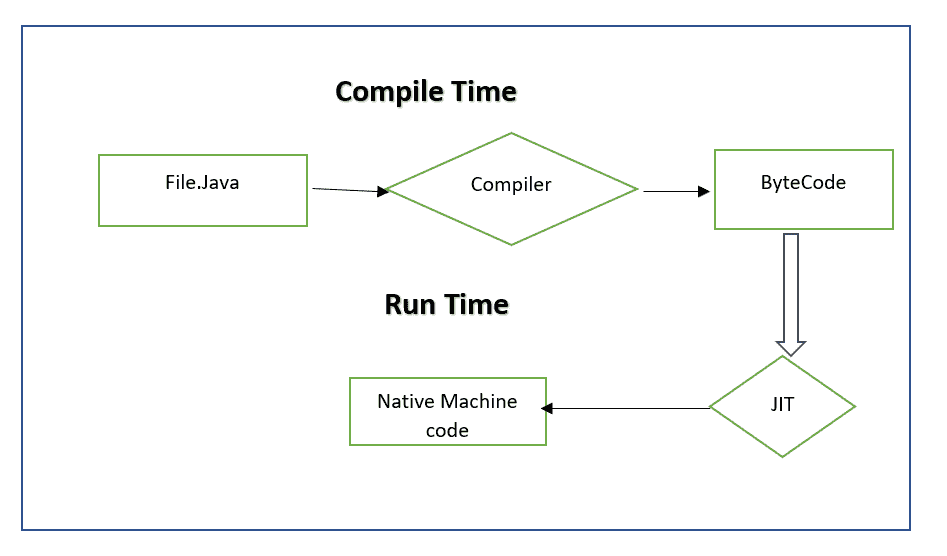
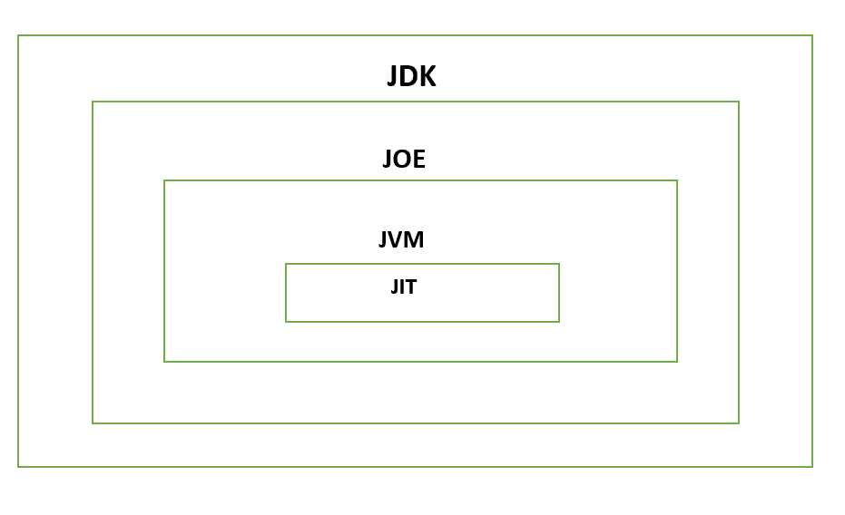

# Java 中 JIT 和 JVM 的区别

> 原文：<https://www.tutorialandexample.com/difference-between-jit-and-jvm-in-java>

在本教程中，我们将讨论 Java 中 JIT(实时编译器)和 JVM (Java 虚拟机)的区别。在讨论区别之前，让我们先了解一下 JIT 和 JVM 是什么。

## 及时(JIT):

Java 并没有阻止将字节码动态编译成本机代码，即使它是作为一种解释语言来提高性能的。正因为如此，HotSpot JVM 在 Java 最初发布后很快就可以使用了。HotSpot 附带了一个实时(JIT)字节码编译器。使用作为 JVM 组件的即时(JIT)编译器，将字节码的选定块实时编译成可执行代码。换句话说，JIT 编译器编译执行所需的代码。

此外，只有将从编译中获益的字节码序列才这样做；其他人不是。然而，准时制方法仍然会导致低效率的显著增加。尽管字节码可以进行动态编译，但可移植性和安全性功能仍然存在，因为 JVM 控制着执行环境。

让我们通过演示 JIT 是如何工作的来将这些差异分解成几个部分，以便更好地理解它们。

传统的 JVM 实现通过解释字节码来降低程序的执行速度。为了提高效率并将相关的字节码序列翻译成本机代码，JIT 编译器在运行时与 JVM 通信。

代替 JVM，硬件解释代码(Java 虚拟机)。这可以带来执行速度方面的性能优势。代码经常在即将执行时被编译(因此称为“实时”)，然后被缓存并在以后重用，无需重新编译。JIT 可以对每个文件、每个函数，或者可能对任何任意代码片段这样做。进行了大量的优化，包括数据分析，从堆栈切换到注册表操作，通过注册表分配减少内存访问，以及摆脱频繁的子表达式。

## Java 虚拟机(JVM):

Java 运行时环境利用了 JVM (JRE)。最初，JVM 旨在成为一个字节码解释器。由于性能问题，这可能会让您有点吃惊。许多当代语言被设计成可被编译成可执行的、CPU 专用的代码。但是 JVM 执行 Java 程序的事实有助于解决基于 web 的应用程序的主要问题。

JVM 稳定性的另一个因素是它运行 Java 程序。JVM 控制程序的执行，因为它是负责人。因此，JVM 可以创建一个沙箱，这是一个受约束的执行区域，用于存放软件并防止系统进行不受限制的访问。Java 语言中的一些限制也增加了保护。执行引擎、内存字段和类加载器都是 Java 的 JVM 架构组件。

让我们通过展示 JVM 是如何并行工作的来分析其组成部分之间的差异。

*   **类加载器:**类加载器加载类文件。它有助于完成加载、初始化和链接这三项关键任务。

*   **JVM 语言栈:**局部变量和未完成的计算结果存储在 Java 内存中。每个线程都有一个在线程创建时构建的单独的 JVM 堆栈。当调用方法时，会生成一个新的帧，然后将其移除。

*   **方法区:**JVM 方法区专门用于存储 Java 应用程序元数据和代码隐藏文件。

*   **PC 寄存器:** PC 寄存器存储当前正在执行的 Java 虚拟机指令地址。在 Java 中，每个线程都有一个唯一的 PC 寄存器。堆:在堆中保存了所有的对象、数组和实例变量。这个内存由几个线程共享。

*   **执行引擎:**该软件测试硬件、软件或整个系统。测试执行引擎从不包含任何关于被测试产品的数据。

*   本机方法库，这是执行引擎所必需的。本机方法接口是一个与本机库(C，C++)一起工作的编程框架。这使得在 JVM 内部执行的 Java 代码能够调用本地程序和库。此外，本机库确定本机方法堆栈的本机代码命令。它采用任何形式的堆栈或将存储分配给本机堆。

根据上述信息，我们得出了它们之间的明确区别，如下表所示:

## JIT 和 JVM 的区别:

| **JIT** | JVM |
| 实时编译被称为 JIT。 | Java 虚拟机简称 JVM。 |
| 在最初发布几年后，JIT 被开发来增强 JVM 的性能。 | 创建 JVM 是为了控制系统内存，并为基于 Java 的程序提供一个可移植的执行环境。 |
| JVM 的一个要素是 JIT。 | 除了这些，JVM 还包括堆和栈区域。 |
| 只有可重用的字节码被 JIT 转换成机器码。 | 完整的字节码被 JVM 转换成机器码。 |
| JIT 增强了 JVM 的性能。 | JVM 提供了跨平台的功能。 |

## 建筑:

