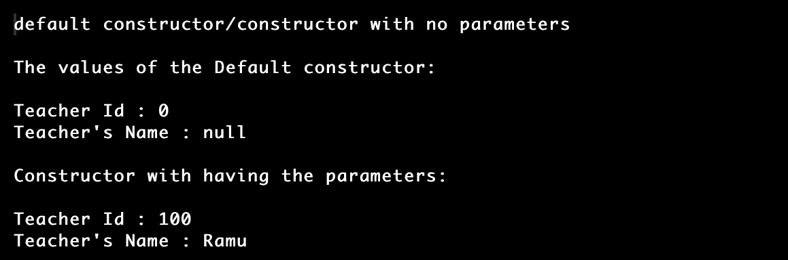
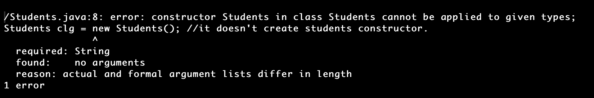
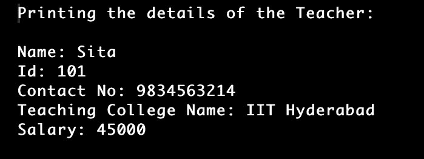

# Java 中的构造函数重载

> 原文：<https://www.tutorialandexample.com/constructor-overloading-in-java>

在 Java 中，构造函数可以像方法一样被重载。拥有多个带有各种参数集的构造函数以便每个函数对象()可以执行特定任务的想法被称为函数对象()重载。

下面的程序将描述构造函数重载。

**例题**

 ****Teacher.java**

```
import java.io.*;
import java.util.*;
//this program is for constructor overloading
public class Teacher {  
//declaring the instance variables of the class 
int tid;  
String tname;  

Teacher() //constructor without parameters
{  
System.out.println("default constructor/constructor with no parameters");  
}  

Teacher(int i, String n1) // constructor with having the parameters
{  
tid = i;  //assigning values
tname = n1;  
}  
 //main section 
public static void main(String[] args) {  
//creation of object for the Teacher class 
Teacher t = new Teacher();  
System.out.println("\nThe values of the Default constructor: \n");  
System.out.println("Teacher Id : "+t.tid + "\nTeacher's Name : "+t.tname);  //printing the values of the default constructor

System.out.println("\nConstructor with having the parameters: \n");  //printing the values of the parameterised constructor
Teacher t1= new Teacher(100, "Ramu");  //creating object for passing the parameters
System.out.println("Teacher Id : "+t1.tid + "\nTeacher Name : "+t1.tname);  
}  
} 
```

**输出:**



在前面的例子中，有两个额外的构造函数——默认的和参数化的教师类。

这里我们必须理解 function Object()重载的基本原理。在某些情况下，使用几个构造函数来初始化类的不同值是必要的。

此外，我们需要注意，当类中没有使用构造函数时，Java 编译器会调用默认的构造函数。然而，如果我们在类中使用了一些方法，默认的方法不会被调用——默认的或参数化的。根据 java 编译器引发的异常，函数 Object()在这种情况下是无效的。

考虑下面的例子，其中对象不是使用默认构造函数创建的。

Students.java

```
public class Students {  
String StudentsId;  
Students(String StudentsId){  
this.StudentsId = "Ravi " + StudentsId;   
}  
public static void main(String[] args) {  
// calling the default constructor
Students clg = new Students(); //it doesn't create students constructor.  
}  
} 
```

**输出**



## 通过在构造函数重载中使用 this()方法

这个()方法也可以用在构造函数中。通过使用该关键字，可以通过在 this()方法中传递参数来访问参数化构造函数的元素。

下面的例子将描述这个关键字的用法。

**Teacher.java**

```
import java.io.*;
import java.util.*;
public class Teacher //creating the Teacher class
{  
//declaring the instance variables of the class
int tid,tsalary;  
String tname,contactNo,teachingCollegeName;  

Teacher(String contactNo, String teachingCollegeName, int tsalary){  
this.contactNo = contactNo;  
this.teachingCollegeName = teachingCollegeName;  
this.tsalary = tsalary;  
}  

Teacher(int tid, String tname) //parameterised constructor
{  
this("9834563214", "IIT Hyderabad", 45000);  
this.tid = tid;  
this.tname = tname;  
}  
//main section 
public static void main(String[] args) {  
//creation of object for the Teacher class 
Teacher t = new Teacher(101, "Sita");  
System.out.println("Printing the details of the Teacher: \n");  
System.out.println("Name: "+t.tname+"\nId: "+t.tid+"\nContact No: "+t.contactNo+"\nTeaching College Name: "+t.teachingCollegeName+"\nSalary: "+t.tsalary);  
}  
} 
```

**输出**



在构造函数重载中，有一些重要的步骤需要遵循:

*   当我们要调用构造函数时，应该在构造函数的第一行。
*   当没有创建参数化的构造函数时，编译器将首先使用默认的构造函数。
*   在递归过程中不能调用构造函数。**