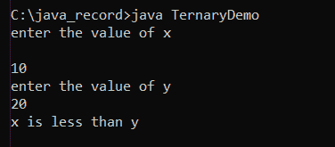
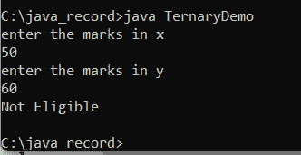

# Java 中的条件运算符

> 原文：<https://www.tutorialandexample.com/conditional-operator-in-java>

在 Java 中，大约有八个运算符，其中三个运算符用于计算条件，并根据计算条件的结果决定结果。

下面描述了三个条件运算符。

*   条件与
*   条件或
*   三元运算符

### 条件与符号(&&)

通过使用 AND，通过比较在**"&"&"**之前和之后指定的两个布尔表达式来完成评估。只有当两个表达式的返回值都为真时，结果才会为真。否则将返回 false。

让我们看看&&将如何比较的真值表。

真&&假=假

假&&假=假

假&&真=假

True && true = true。

**和示例语法:**

对上述四种情况的解释:

```
int a=5, b=5, c=2;
if (a==b && b>c) 
{
//logic to be executed
} 
```

在上面的例子中，a==b 为真，因为 a=5，b=5，b>c 为真，因为 5>2 为真。

因此，true && true 的组合将返回 true，然后将执行块内的代码。

```
int a=5, b=4, c=2;
if (a==b && b>c)
{
//logic to be executed
}
```

在上面的例子中，a==b 为假，因为 a=5，b=4，b>c 为真，因为 4>2 为真。

因此，false && true 的组合将返回 false，并从代码块中退出，而不进入代码块。

### 条件或符号(||)。

或与和完全相反。与 AND 不同，如果两个表达式之一的结果为真，那么结果也将为真。只有当两个结果都为假时，OR 才会返回假。

来看看||会如何比较的真值表。

真&&假=真

假&&假=假

假&&真=真

True && true = true。

**或示例语法:**

对上述四种情况的解释:

```
int a=5, b=5, c=2;
if (a==b && b<c)
{
//logic to be executed
} 
```

在上面的例子中，a==b 为真，因为 a=5，b=5，b

所以，true || false 的组合将返回 true，然后执行块内的代码。

错误条件示例

```
int a=5, b=4, c=2;
if (a==b && b<c)
{
//logic to be executed
} 
```

在上面的例子中，a==b 是假的，因为 a=5，b=4，b

因此，false || false 的组合将返回 false，并从代码块中退出，而不进入代码块。

### 三元运算符:

**三元运算符**是一种条件运算符。这个运算符被称为三元运算符，因为它使用了三个操作数:一个可以为真或假的布尔表达式；布尔表达式为真时的结果；当结果为假时。

**三元运算符的语法:**

**结果值=条件语句？值 1:值 2；**

Result_value =该变量在计算工作后获得赋值。

Conditional_ Statement =三元运算符的这一部分执行执行条件并返回布尔值。

Value1 =这可以是当 conditional_ Statement 返回实际布尔值时执行的输出语句或分配给 Result _Value 的值。

Value2 =这可以是另一个输出语句或赋值给 Result _Value 的值，当 conditional_ Statement 返回一个假布尔值时执行。

例如:

```
String resvalue = (20 > 12) ? “ True ” : “ False ”;  
```

****三元运算符的好处:****

 **if-then-else 语句可以使用三元运算符作为快捷方式来表达。因此，代码更容易阅读。

让我们看看后面的示例程序的用法。

例 1: **单条件三元运算符**

**三元演示。java**

```
import java.io.*;
import java.util.*;

public class TernaryDemo
{
  public static void main (String [] args)
 {
	  Scanner scan = new Scanner (System.in);
	  System.out.println (" enter the value of x ");
                               int x = scan.nextInt ();
	  System.out.println(" enter the value of y ");
                               int y = scan.nextInt ();
        String resultValue = (x >= y)?" x is greater than or equal to y ":" x is less than y ";
       System.out.println (resultValue); 
	 // it finds outs the greatest of two numbers
  }
} 
```

**输出:**

  

例 2: **多条件三元运算符**

**三元组 1.java**

```
import java.io.*;
import java.util.*;
public class TernaryDemo
{
  public static void main (String [] args)
 {
	  Scanner scan = new Scanner (System.in);
	  System.out.println (" enter the marks in x ");
                               int x = scan.nextInt ();
	  System.out.println (" enter the marks in y ");
                               int y = scan.nextInt ();
        String resultValue = (x >= 80 && y>= 80)?" A grade ":(x >= 60 && y >= 60)?" B Grade ":" Not Eligible ");
       System.out.println (resultValue); 
	 // it finds outs the greatest of two numbers
  }
} 
```

**输出:**

**