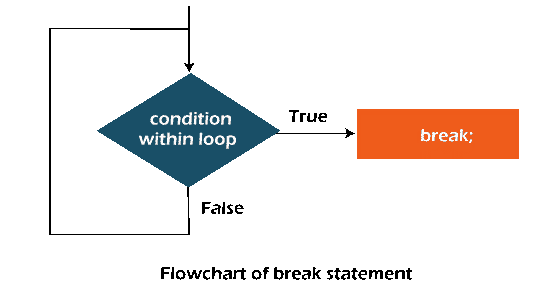

# Java Break 关键字

> 原文：<https://www.tutorialandexample.com/java-break-keyword>

**突破:**

*   单词 Break 是 java 编程语言中的关键字或语句。
*   该关键字 break 用于停止执行循环或 switch 语句等。
*   循环由 break 语句停止，因此必须结束循环。
*   当 break 语句接近一个循环时，该循环的信誉终止，并从该循环向后开始到开始循环的语句。
*   当我们不确定循环的信誉时，我们基本上使用 break 语句。
*   Break 关键字控制循环中的结构和 switch 语句。java 中的循环和 switch 语句是使用 break 关键字终止的
*   当循环遇到循环中的中断词时，循环终止，程序的控制转移到循环后面的下一条语句
*   内部循环将停止执行或结束程序或仅终止循环。当 break 关键字在嵌套循环中实现时，内部循环将停止执行。
*   当满足很少的规则时，它用于停止语句。
*   在 switch 语句中，break 关键字有特定的作用。
*   Break 语句用于中断 switch 语句中的 case，以停止在 case 处的执行，如果程序的控制转移到另一个 case，则不会继续执行下一个 case。
*   通过执行 break 语句，程序的控制权转移到程序的下一部分。
*   break 语句将程序控制转移给程序的下一个语句，它可以被称为程序执行控制器。

**语法**

对于 Java 中的 break 语句，语法是:

```
Break;
```

### 中断语句流程图



### 在循环中中断语句

**举例:**

```
BreakExample.java
//to understand the implementation of break keyword in java programming language
//usage of break keyword in for loop.  
public class BreakEx {  
public static void main (String [] s) {  
    //for loop in usage
for (int a=1; a<=10; a++) {
        if(a==10) {
            //loop is breaked
break.
        }  
        System.out.println(a).
    }  
}  
} 
```

**输出:**

```
1
2
3
4
5
6
7
8
9
```

### java 程序内部循环中 Break 语句的使用

只有在给定循环中使用了 break 语句或 keywprd 时，内部循环才会被中断或停止执行。

**举例:**

```
BreakEx2.java   
public class BreakEx2 {  
public static void main (String [] args) {  
            //outer loop   
for (int m=1;m<=3;m++){    
                    //using inner loop  
for (int n=1;n<=4;n++){    
                        if(m==2&&n==2) {
                            //inside the inner loop break statements is used.
break.
                        }    
                        System.out.println(m+" "+n);
                    }    
            }    
}  
} 
```

**输出:**

```
11
1 2
1 3
14
2 1
3 1
3 2
3 4
4 4 
```

### 带有标记 for 循环的 Java Break 语句

break 语句与标签一起使用，用于终止标签创建的程序。该功能是从 JDK 1.5 版本开始开发的。所以，我们可以终止 Java 中的任何循环，无论是外部循环还是内部循环。

**举例:**

```
BreakEx3.java
//to implement the use of continue statementby implementing the break
//with label inside an inner loop to break outer loop  
public class BreakEx3 {  
public static void main (String [] s) {  
cc:  
for (int m=1;m<=3;m++) {
dd:  
for (int n=1; n<=3;n++) {
                        if(m==2&&n==2) {
                            //using break statement with label  
                            break cc.
                        }    
                        System.out.println(m+" "+n);
                    }    
            }    
}  
} 
```

**输出:**

```
1 1
1 2
1 3
2 1
```

### while 循环中的 Java Break 语句

**举例:**

```
BreakWhileEx.java
//Java Program to illustrate the use of break statement  
//uesd in while loop.  
public class BreakWhileEx {
public static void main (String [] s) {  
    //while loop  
    int p=1;
    while(p<=20) {
        if(p==5) {
            //using break statement  
p++;
            break;//it will break the loop  
        }  
        System.out.println(p);
p++;
    }  
}  
} 
```

**输出:**

```
5
6
7
8
```

### Java Break 语句中的 Do-while 循环

**举例:**

```
BreakDoWhileEx.java
//to develop or illustrate the use of break statement through java program
// Java do-while loop inside loop
public class BreakDoWhileEx {
public static void main (String [] s) {  
    //variable declaration
    int q=5;
    //do-while loop  
do {
        if(q==10) {
           //using break statement  
q++;
           break;//it will break the loop  
        }  
        System.out.println(q);
q++;
} while(q<=20);
}  
} 
```

**输出:**

```
5
6
7
8
9
10
```