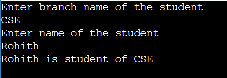
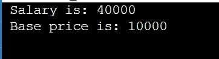
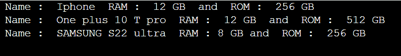

# Java 中的关联

> 原文：<https://www.tutorialandexample.com/association-in-java>

在 Java 中，关联是指由对象建立的两个类之间的链接。一对一、一对多和多对多连接通过关联来管理。关联定义了 Java 中对象之间的多重性。它演示了对象如何通过通信进行交互，以及它们如何利用其他项目提供的功能和服务。一对一、一对多、多对一和多对多连接都是通过关联来管理的。

## Java 中的关联示例

### 一对一

一个学生将只有一个代表一对一关系的 id。

### 一对多

一个学生可以有代表一对多关系的多个爱好。

### 多对一

所有分支的学生都与一个学院相关，这代表了多对一的关系。

### 多对多

一个学生可以访问不同的教师，一个教师可以指导不同的学生，这是一种多对多的关系。

## Java 中的关联程序

Association.java

```
// Java example Program to explain the concept of Association
// Import required libraries
import java . io . * ;
import java .util . *;
// class with name branch is created
class Branch {
	// instance variables of class 
	private String name ;
	// parameterized Constructor of this class
	Branch ( String name )
	{
		// keyword this is used to refer to the current  class
		this . name = name ;
	}
	// Method for the class
	public String getBranchName ( )
	{
		return this . name ;
	}
}
// class with name Student is created
class Student {
	// instance variables of employee
	private String name ;

	Student ( String name )
	{
		// keyword this is used to refer to the current  class
		this . name = name ;
	}
	// Method of Employee class
	public String getStudentName ( )
	{
		// returning the name of employee
		return this . name ;
	}
}
class Main {
	// Main  method
	public static void main ( String [ ]  args )
	{
	    // using scanner class to read inputs from the user
	    // Creating object for the scanner class
	    Scanner sc = new Scanner ( System.in );
	    // Asking the user to enter the branch name
	    System.out.println("Enter branch name of the student ");
	    // Storing the the string in variable s
	    String s=sc.nextLine();
	    // Asking the user to enter name of the student
	    System.out.println("Enter name of the student ");
	    	    // Storing the the string in variable s2
	    String s2=sc.nextLine();
	    // Object creation for classes 
		Branch b = new Branch ( s ) ;
		Student std = new Student ( s2 ) ;

        // Accessing methods of class using objects created for the class 

		System . out . println ( std . getStudentName ( ) + " is student of "+ b . getBranchName ( ) ) ;
	}
} 
```

**输出**

  

## 不同类型的关联

*   是一个协会
*   有-有关联
    1.  聚合
    2.  作文

## 是–一个协会

继承代表的是一种关系，也称为父子关系。

### IS-A 关系的程序

IsARelation.java

```
// A example program to demonstrate IS – A relation
// importing necessary libraries
import java . io . *
// class with name student is created
class student{  
// instance variables are created inside the class 
// integer variable  is created with name  sal  and initialized to value 40000
 int sal = 40000;  
}  
// A class with the name IsARelation is created and using inheritance extending the properties of the parent class i.e ., student
class IsARelation extends student{  
// instance variable is created with name base and initialized to value 10000
 int base = 10000;  
 public static void main ( String args [ ] ) 
 {  
  IsARelation m = new IsARelation ();  
   System.out.println ( " Salary is: " + m . sal ) ;  
   System.out.println(" Base price is: " + m . base ) ;  
}  
} 
```

**输出**

  

## 有–一个关联

HAS–关联进一步分为两种类型。它们是聚合和合成。

## 聚合

HAS-A 连接是通过聚合关联在 Java 中定义的。一对一或单向连接之后是聚合。当聚合组合中包含两个实体，并且其中一个实体有错误时，另一个实体不受影响。

Aggregation.java

```
import java . util . * ;   
import java . io . * ;
class Student    
{   
    String name;   
    int year ;   
    String course;   

    Student(String name, int year, String course )    
    {   

        this . name = name ;   
        this . year = year ;   
        this . course = course ;    
    }   
}   
class Subject   
{   

    String name ;   
    private List < Student > students ;   
    Subject ( String name , List < Student > students )    
    {   

        this . name = name ;   
        this . students = students ;   

    }  

}   

class College  
{   

    String Nameofcollege ;   
    private List < Subject > sub ;   

    College(String Nameofcollege, List<Subject> sub)   
    {   
        this.Nameofcollege = Nameofcollege;   
        this . sub = sub ;   
    }   
}    
// main method   
class Aggregation
{   
    public static void main ( String [ ] args )    
    {   
        Student s1 = new Student ( " Rohith ", 2002, " CSE " ) ;   
        Student s2 = new Student ( " Ram " , 2002, " ECE " ) ;   
        Student s3 = new Student ( " SAI ", 2003, " ECE " ) ;   
        Student s4 = new Student ( "Ravi " , 2000 , " CSE " ) ;   
        Student s5 = new Student ( " OM ",2002, " Mech " ) ;  
        //Constructing list of CSE Students. 
        List <Student> cse_students = new ArrayList < Student > ( ) ;   
        cse_students . add ( s1 ) ;   
        cse_students . add ( s4 ) ;   
        //Constructing list of ECE Students.   
        List < Student > ece_students = new ArrayList < Student > ( ) ;   
        ece_students . add ( s2 ) ;   
        ece_students . add ( s3 ) ;
        //Constructing list of Mech Students.   
        List <Student> mech_students = new ArrayList < Student > ( ) ;   
        mech_students . add ( s5 ) ;   
        Subject CSE = new Subject ( " CSE " , cse_students ) ;   
        Subject ECE = new Subject ( " ECe " , ece_students ) ;  
        Subject Mech = new Subject ( " Mech ", mech_students ) ;   
        List < Subject > sub = new ArrayList < Subject > ( ) ;   
        sub . add ( CSE ) ;   
        sub . add ( ECE ) ;  
        sub . add ( Mech ) ;   
        // creating object of College.   
        College college = new College("BVRIT", sub);   
        System . out . print ( " Number of students of 2nd year in the college "+ college . Nameofcollege +" are 1500" ) ;  
    }   
} 
```

**输出**


## 作文

组合是集合的受限版本，其中的组成部分高度相互依赖。与聚合相反，组合代表连接的一部分。当两个实体组合时，组合的对象可以在没有另一个实体的情况下存在，但是当两个实体通过合成而组合时，合成的对象不能存在。

Composition.java

```
import java . util . * ;  
class Mobiles 
{  
  public String name ;  
  public String ram ;  
  public String rom ;  
  Mobiles ( String Name , String ram , String rom )
  {  
    this . name = Name ;    
    this . ram = ram ;  
    this . rom = rom ;  
  }  
}  
class MobileShop  
{  
  private final List < Mobiles > mobiles ;  
  MobileShop ( List < Mobiles > mobiles )  
  {  
    this . mobiles = mobiles ;  
  }  
  public List < Mobiles > TotalMobileInShop ( ) {  
    return mobiles ;  
  }  
}  
public class Composition {  
  public static void main ( String [ ] args )  
  {  
    Mobiles m1 = new Mobiles ( " Iphone "," 12 GB ", " 256 GB " ) ;  
    Mobiles m2 = new Mobiles ( " One plus 10 T pro " , " 12 GB " , " 512 GB " ) ;  
    Mobiles m3 = new Mobiles ( " SAMSUNG S22 ultra " , "8 GB" , " 256 GB " ) ;  
    List < Mobiles > m = new ArrayList < Mobiles > ( ) ;  
    m . add ( m1 ) ;  
    m . add ( m2 ) ;  
    m . add ( m3 ) ;  
    MobileShop shop = new MobileShop ( m ) ;  
    List < Mobiles > mob = shop . TotalMobileInShop ( ) ;  
    for ( Mobiles mb : mob ) {  
      System . out . println ( " Name : " + mb . name + " RAM : " + mb . ram + " and "  + " ROM : " + mb . rom ) ;  
    }  
  }  
} 
```

**输出**

