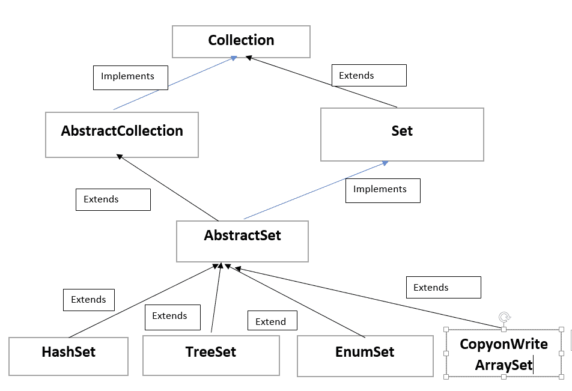

# Java 中的 AbstractSet 类

> 原文：<https://www.tutorialandexample.com/abstractset-class-in-java>

AbstractSet 类用于实现抽象集合类和接口。它是集合框架的一部分。

在 AbstractSet 中，实现与通过扩展 AbstractCollection 实现集合是一样的。

AbstractSet 类的层次结构。



AbstractSet 的子类有 HashSet、TreeSet、EnumSet、CopyonWriteArraSet。声明抽象集的语法是

```
public abstract class Abstractset<E> extends AbstractCollection<E> implements Set<E>
```

## 构造者:

*   **Protected AbstractSet():**
    它是带有受保护访问说明符的 abstract set 的默认构造函数。受保护的访问说明符不允许创建 AbstractSet 对象。

## AbstractSet 类中的方法:

*   **equals(对象 o):**
    equals()用于将特定对象与该集合进行比较

*   **remove all():**
    remove all()用于删除集合中的所有元素。

*   **hashcode():**
    hashcode()用于返回集合的哈希码。

## AbstractCollection 类中的方法:

*   **add(E E):**
    add()用于添加集合中的特定元素。

*   **addAll(集合<扩展 E>c):**
    addAll()将指定集合中的所有元素相加。

*   **clear():**
    clear()从集合中删除所有元素。

*   **containsAll(集合<扩展 E > c):**
    如果集合包含指定集合的所有元素，containsAll()返回 true。

*   **contains(Object o):**
    如果集合包含特定元素，则 Conatins()返回 true。

*   **isEmpty():**
*   isEmpty()用于在集合中没有任何元素时返回 true。

*   **iterator():**
    iterator 方法用于从集合中返回迭代器

*   **remove(Object o):**
    remove()用于从集合中移除特定的元素。

*   **retianAll(收藏<？>c):**
    retail all()保留特定集合中的元素。

*   **toArray():**
    该方法用于返回包含集合中所有元素的数组。

*   **toString():**
    toString()返回集合的字符串表示。

## 收集接口的方法:

*   **parallel stream():**
    parallel stream()返回集合的并行流。

*   **removeIf(谓词<？超级 E >过滤器:**
    remove if()从集合中移除满足谓词的元素。

*   **stream():**
    stream()返回集合的顺序流。

*   **to array(int function<T[]generator>):**
    to array()用于使用 generator 函数返回包含集合中所有元素的数组。

## 设置接口的方法:

*   **add(E E):**
    add()方法在集合中添加一个不存在的元素。

*   **addAll(集合<扩展 E>c):**
    addAll()方法添加指定集合中的所有元素，如果它还不存在的话。

*   clear():
    clear()方法从集合中删除所有的元素。

*   **containsAll(集合<扩展 E > c):**
    如果集合包含指定集合的所有元素，containsAll()用于返回 true。

*   **contains(Object o):**
    如果集合包含特定元素，contains()返回 true。

*   **isEmpty():**
    isEmpty()用于在集合中没有任何元素时返回 true。

*   **iterator():**
    iterator()用于从集合中返回迭代器。

*   **remove(Object o):**
    remove()方法从集合中删除特定的元素。

*   **retianAll(收藏<？>c):**
    retail all()用于保留特定集合中的元素。

*   **to array():**
    to array()用于返回包含集合中所有元素的数组。

*   **size():**
    size()方法返回集合中元素的个数。

*   **spliterator():**
    spliterator()方法在集合中的元素上创建一个 spliterator。

**举例:**

```
import java.io.*;
import java.util.*;
public class Main
{
	public static void main(String args[])
	{
		try
		{
			/*Creating an empty treeset of int datatype using AbstractSet*/
			AbstractSet<Integer> a = new TreeSet<Integer>();
			/*adding elements into the tree set*/
			a.add(10);
			a.add(20);
			a.add(30);
			a.add(40);
			a.add(50);
		/*Printing the elemnts in the Tree set*/
		System.out.println(“AbstractSet elements:”+a);
		}
		catch (Exception e)
		{
			System.out.println(e);
		}
	}
} 
```

**输出:**

```
AbstractSet Elements: [10,20,30,40,50]
```

**例 2:**

```
import java.io.*;
import java.util.*;
public class Main
{
	public static void main(String args[])
	{
		try
		{
			/*Creating an empty treeset of int datatype using AbstractSet*/
			AbstractSet<Integer> a = new TreeSet<Integer>();
			/*adding elements into the tree set*/
			a.add(10);
			a.add(20);
			a.add(30);
			a.add(40);
			a.add(50);
		/*Printing the elemnts in the Tree set*/
		System.out.println(“AbstractSet elements:”+a);

		/*Creating a arraylist of int type*/
		Collection<Integer> ar = new ArrayList<Integer>();
		ar.add(1);
		ar.add(2);
		ar.add(3);
	/*Printing the elements form the arraylist*/
		System.out.println(“Collection Elements:”+ar);
		}
		catch (Exception e)
		{
			System.out.println(e);
		}
	}
} 
```