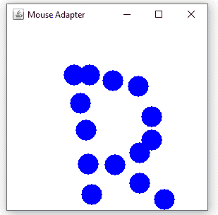
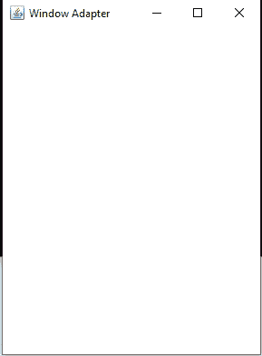
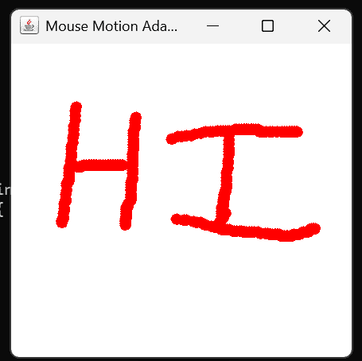
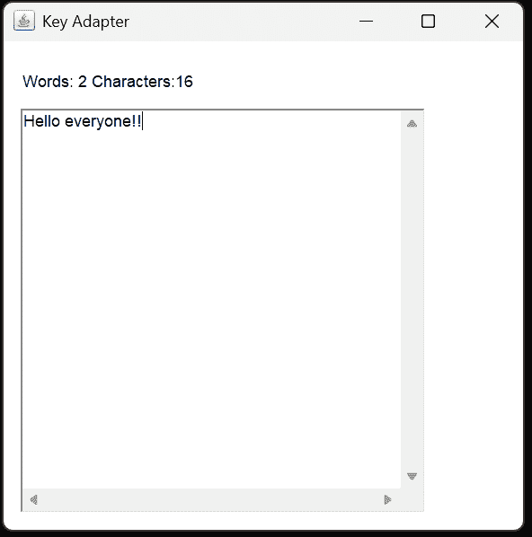

# Java 中的适配器类

> 原文：<https://www.tutorialandexample.com/adapter-class-in-java>

通过使用适配器类，我们可以实现侦听器接口。在适配器类的帮助下，我们可以节省代码，因为它提供了侦听器接口的所有实现方法

## 适配器类的优势

*   适配器类提供了一种将相似模式合并到类中的方法。
*   它为应用程序提供了一个可插拔的开发工具包。
*   通过使用适配器类，它使该类更加通用。
*   适配器类使得不相关的类更容易协作。
*   它提供了使用类的不同方法。
*   它使课程更加透明。

要使用适配器类，必须导入以下包

*   java.awt .事件
*   java.awt.dnd
*   javax.swing.event

## **java.awt.event 适配器类**


| **适配器类别** | **监听器接口** |
| 鼠标适配器 | 鼠标监听器 |
| 密钥适配器 | 关键听众 |
| 窗口适配器 | 窗口监听器 |
| 鼠标移动适配器 | MouseMotionListener |
| 集装箱适配器 | 集装箱监听器 |
| 组件适配器 | 组件监听器 |


## java.awt.dnd 适配器类


| **适配器类别** | **监听器接口** |
| DragSourceAdapter | DragSource 监听器 |
| DragTargetAdapter | DragTarget 侦听器 |


## java.swing.event 适配器类


| **适配器类别** | **监听器接口** |
| 鼠标输入适配器 | 鼠标输入监听器 |
| 内部框架适配器 | 内部帧监听器 |


## Java 鼠标适配器程序

MouseAdapter1.java

```
import java.awt.*;  
import java.awt.event.*;  
public class MouseAdapter1 extends MouseAdapter{  
    Frame f1;  // Creating a frame
    // Default constructor
    MouseAdapter1(){  
        f1=new Frame("Mouse Adapter");  // Setting the name of the frame as MouseAdapter
        f1.addMouseListener(this); 
        f1.setSize(400,400);  // Setting the size of frame 
        f1.setLayout(null);  
        f1.setVisible(true);  // Giving visibility to the frame
     // This inner class is used to close the window
        f1.addWindowListener (new WindowAdapter() 
	{    
            	public void windowClosing (WindowEvent e1) {    
               	 f1.dispose();    
            	}    
        });   
    }  
    public void mouseClicked(MouseEvent e) {  
        Graphics g1=f1.getGraphics();  
        g1.setColor(Color.BLACK);  
        g1.fillOval (e.getX(), e.getY(), 20, 15);    
    }   
public static void main(String[] args) {  
    new MouseAdapter1();  
}  
}
```

**输出**

  

## Java 窗口适配器程序

这个程序用于使用 awt 包创建窗口

Adapter.java

```
// Necessary  packages are imported
import java.awt.*;    
import java.awt.event.*;    
public class Adapter {  
// Creating a Frame  f1  
    Frame f1;    
// default class constructor  
    Adapter() {    
// creating a frame with the title  
        f1 = new Frame ("Adapter Windows");    
// overriding the window closing() method   
        f1.addWindowListener (new WindowAdapter() {    
            public void windowClosing (WindowEvent e1) {    
                f1.dispose();    
            }    
        });    
         // setting the size of the frame
        f1.setSize (350, 450);    
        // setting the size of the frame
        f1.setLayout (null);    
        f1.setVisible (true);    
    }    
// main method  
public static void main(String[] args) {    
    new Adapter();    
	// Default constructor 
	// Name of the constructor should be same as class name
}    // main method for the program
}  //Adapter 
```

**输出**

  

## Java 鼠标移动适配器程序

MouseMotionAdapter1.java

```
import java.awt.*;    
import java.awt.event.*;     
public class MouseMotionAdapter1 extends MouseMotionAdapter {     
// Creating a frame f1    
Frame f1;    
    MouseMotionAdapter1() {    
        f1 = new Frame ("Adapter Program for mouse motion");    
        f1.addMouseMotionListener (this);    
	// Setting the size to 300 X 300 for the frame
        f1.setSize (300, 300);    
        f1.setLayout (null);    
        f1.setVisible (true);       
        f1.addWindowListener (new WindowAdapter() {    
            public void windowClosing (WindowEvent e1) {    
                f1.dispose();    
            }    
        });    
    }    
public void mouseDragged (MouseEvent e1) {    
// Creating object for Graphics class to draw in the frame
Graphics g1 = f1.getGraphics();    
// Setting the color to red
    g1.setColor (Color.RED);    
// Drawing oval shaped to draw the described message
g1.fillOval (e1.getX(), e1.getY(), 10, 10);    
}    
// Main method for the program
public static void main(String[] args) {    
    new MouseMotionAdapter1();    
	// Default constructor
//Constructor name  should be same as class name i.e., MouseMotionAdapter1 
}    
} 
```

**输出**



## Java 密钥适配器程序

KeyAdapter1.java

```
//Importing the required packages
import java.awt.*;    
import java.awt.event.*;    
public class KeyAdapter1 extends KeyAdapter {    
// Creating label and textarea  component variables
    Label l1;    
    TextArea area1;    
    Frame f1;    
// class constructor  
    KeyAdapter1() {    
// creating the Frame with the title  
        f1 = new Frame ("Adapter for Key ");    
// creating the Label  
        l1 = new Label();    
// setting the location of the label   
        l1.setBounds (20, 50, 200, 20);    
// creating the text area  
        area1 = new TextArea();  
        area1.setBounds (20, 80, 300, 300);    
        area1.addKeyListener(this);    
// Adding the label and text area to the frame by using the add  method
        f1.add(l1);  
       f1.add(area1);    
// setting the size  
        f1.setSize (400, 400);  
//layout of the frame  
        f1.setLayout (null);
//visibility of the frame    
        f1.setVisible (true);
	        f1.addWindowListener (new WindowAdapter() {    
            public void windowClosing (WindowEvent e) {    
                f1.dispose();    
            }    
        });    
    }    
    public void keyReleased (KeyEvent e) {    
        String text1 = area1.getText();    
// splitting the given String
        String words1[] = text1.split ("\\s");    
        l1.setText ("Words: " + words1.length + " Characters:" + text1.length());    
    }    
  // main method for the program 
    public static void main(String[] args) {    
        new KeyAdapter1();    
    }    
} 
```

**输出**

