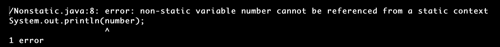

# Java 中的 Static()函数

> 原文：<https://www.tutorialandexample.com/static-function-in-java>

Java 中的 static 关键字适用于变量、常量和函数。static 关键字主要用于控制存储，以便正确使用。我们现在将讨论 Java 的静态方法。

## Java 中的静态函数

如果函数名以 static 关键字开头，那么这个函数就是静态的。方法是变量和语句的集合。Java 中的方法不包含 void。返回类型可以作为引用。我们可以在方法中看到许多参数作为自变量。当一个进程是静态的时，它实际上属于类，而不是任何特定的类对象。它表明静态函数在任何事物被创建之前就已经存在了。

main()方法是主方法。

## 静态函数的性质

*   只能访问该类的静态成员。
*   不使用实例，我们可以调用静态方法。
*   静态函数与对象无关。
*   除了静态方法不能被访问。

## 声明静态函数

静态函数声明类似于 Java 中的方法声明。静电干扰

该函数有两个部分:原型和主体。

函数原型由函数签名、返回数据类型、访问修饰符和参数列表组成。函数体描述了程序的逻辑。

**语法:**

```
[access specifiers] static [return data type] [name of the function] (parameter list)  
{  
//function body  
} 
```

函数原型可能包含也可能不包含语法中的参数。E

示例:

```
Public static int add(int n1, int n2)  
{  
int sum=n1+n2;  
return sum;  
} 
```

## 调用静态函数

在 Java 中，静态方法可以没有对象。通过使用类名，可以调用静态方法。

```
[class name].[name of the method]
```

调用方法的示例:

```
Math.sqrt(num);
```

静态函数的示例如下:

```
class Demo  
{  
//without using the static method  
void show()  
{  
System.out.println("Calling the non-static methods.");  
}  
//the Function using the static keyword  
static void display()  
{  
System.out.println("Calling the static method:");      
}  
}  
public class StaticExample
{  
public static void main(String args[])  
{  
//An object ob is created for class Demo
Demo object= new Demo();  
//a non-static method is called with the use of an object of the class  
object.show();  
// a static method is called by using the class name 
Demo.display();  
}  
} 
```

**输出**


让我们在不创建对象的情况下对此进行检查。

**CalculateSquare.java**

```
public class CalculateSquare 
{  
//the static method declaration  
static void square()  
{  
int num=2*2;  
System.out.println("Square of the number 2: "+num);    
}  
public static void main(String args[])  
{  
//a static method is called without using the object for the main class 
square();    
}  
} 
```

**输出**


## 使用静态方法的限制

使用静态方法有两个必要条件。它们是:

*   静态方法不能访问非静态数据成员，也不能访问非静态方法。
*   关键字 this 和 super 不能在静态模式下使用。

**Nonstatic.java**

```
class Nonstatic 
{    
int number=1020;    // the dynamic variable   
//the method containing the static keyword  
public static void main(String args[])  
{    
// accessing the data values of the non-static variables  
System.out.println(number);    
}    
}
```

**输出**

