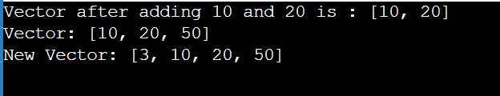
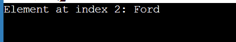
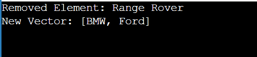
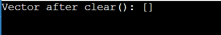
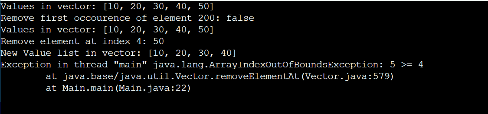

# Java 中的向量

> 原文：<https://www.tutorialandexample.com/vectors-in-java>

## 向量类

我们可以使用 Vector 类使可调整大小的数组与 ArrayList 类相当，Vector 类实现了 List 接口。vector 类似于一个可以修改大小的动态集合，我们可以在 vector 中使用 List 接口的所有方法。

Vectors 和 ArrayList 是可以比较的。但是，有两个不同之处:

*   向量是协调的。
*   Java Vector 中有几个遗留方法不是集合框架的一部分。

## 向量类的语法

```
public class Vector<E>  extends Object<E>  implements List<E>, Cloneable, Serializable 
```

**创建向量的语法**

```
Vector<Type> vector = new Vector<>();
```

## 向量创建示例

Vectorcreation.java

```
import java.io.*;
import java.util.*;
public class Vectorcreation
{
	public static void main(String[] args) {
	    // Integer type vector is created
        Vector<Integer> vector= new Vector<>();

        // String type vector is created
        Vector<String> vector1= new Vector<>();

	}
} 
```

**输出**


## Vector 类中使用的构造函数

1.  **vector()**
    创建一个默认大小为十的向量
2.  **vector(int initial capacity)**
    创建一个空的 vector，指定容量和增量，大小为零。
3.  **向量(int initialCapacity，int capacityincrement)**
    用指定的容量和增量值创建一个空向量。
4.  **矢量(收藏<？扩展了 E > c)**
    创建了一个包含 c 元素的向量

## 向量中的方法

### 1.向向量添加元素

*   **add()**
    它将一个元素添加到给定向量的末尾

*   **add(index，element)**
    在首选位置添加描述的元素

*   **addAll(vector)**
    它把一个向量加到一个向量上

### 向向量添加元素的程序

Vectorsadd.java

```
import java.util.Vector;
import java.io.*;

class Vectorsadd {
    public static void main(String[] args) {
        // Integer vector with name numbers is defined
        Vector<Integer> numbers= new Vector<>();

        //Use the add() method to add numbers 10 and 20 to the vector 
        numbers.add(10);
        numbers.add(20);
        System.out.println("Vector after adding 10 and 20 is : " +numbers);
        // Using index number
        numbers.add(2,50);
        System.out.println("Vector: " +numbers);

        // Using addAll()
        // adding one vector number to the vector primes
        Vector<Integer> primes = new Vector<>();
        primes.add(3);

        primes.addAll(numbers);
        System.out.println("New Vector: " + primes);
    }
} 
```

**输出**



### 2.访问向量中的元素

为了访问 vector 的元素，我们使用了 vector 类的预定义方法，比如 get(index)和 iterator 方法。

### 1.get(索引)

返回给定索引指定的元素

### 使用 get(index)方法访问向量元素的程序

AccessEle.java

```
import java.util.Vector;
class AccessEle {
    public static void main(String[] args) {
        Vector<String> cars= new Vector<>();
        cars.add("BMW");
        cars.add("Range Rover");
        cars.add("Ford");

        // Using get()
        String element = cars.get(2);
        System.out.println("Element at index 2: " + element);
    }
} 
```

**输出**



### 2 .迭代器()

用于顺序访问向量的元素

### 使用迭代器方法访问向量元素的程序

**AccessEle.java**

```
import java.util.Vector;
import java.util.Iterator;
class AccessEle {
    public static void main(String[] args) {
        Vector<String> cars= new Vector<>();
        cars.add("BMW");
        cars.add("Range Rover");
        cars.add("Ford");
         // Using iterator()
        Iterator<String> iterate = cars.iterator();
        System.out.print("Vector: ");
        while(iterate.hasNext()) {
            System.out.print(iterate.next());
            System.out.print(", ");
    }
    }
} 
```

**输出**


### 3.移除向量中的元素

从向量中移除一些方面

### 1.移除(索引)

我们可以使用这种方法从向量中删除特定的索引元素。

**使用移除(索引)方法移除矢量元素的程序**

Remove.java

```
import java.util.Vector;
import java.util.Iterator;
class Remove {
    public static void main(String[] args) {
        Vector<String> cars= new Vector<>();
        cars.add("BMW");
        cars.add("Range Rover");
        cars.add("Ford");
        // Using remove(index) to remove element at index 1
        String element = cars.remove(1);
        System.out.println("Removed Element: " + element);
        System.out.println("New Vector: " + cars);
    }} 
```

**输出**



### 2.清除()

使用这种方法，我们可以清除特定向量中的所有元素。

### 使用清除(索引)方法删除矢量元素的程序

Clear.java

```
import java.util.Vector;
import java.util.Iterator;
class Clear{
    public static void main(String[] args) {
        Vector<String> cars= new Vector<>();
        cars.add("BMW");
        cars.add("Range Rover");
        cars.add("Ford");

         // Using clear()
        cars.clear();
        System.out.println("Vector after clear(): " + cars);
    }
} 
```

**输出**



## Java 中向量的示例程序

**Example1.java**

```
import java.util.*;  
public class Example1 {  
       public static void main(String args[]) {  
        //Create an empty Vector        
        Vector<Integer> v = new Vector<>();  
        //Add elements in the vector  
        v.add(10);  
        v.add(20);  
        v.add(30);  
        v.add(40);  
        v.add(50);  
        //Display the vector elements  
        System.out.println("Values in vector: " +v);  
        //use the remove() method to delete the first occurrence of an element  
        System.out.println("Remove first occurrence of element 20: "+v.remove((Integer)20));  
        System.out.println("Values in vector: " +v);  
        //Remove an element  at index 5
        v.removeElementAt(5);        
        System.out.println("Vector element after removal: " +v);  
// Hash code is printed
        System.out.println("Hash code of this vector = "+v.hashCode());  
        // we will get element at the specified index  
        System.out.println("Element at index 1 is = "+v.get(1));  
          }  
} 
```

**输出**

