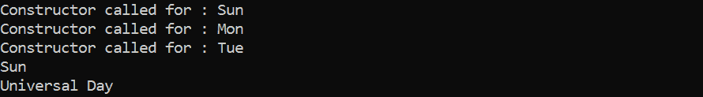

# Java 枚举

> 原文：<https://www.tutorialandexample.com/java-enumeration>

在计算机语言中，枚举表示一组命名的常数。例如，一副扑克牌中的四种花色可以由枚举类型花色的成员“枚举成员俱乐部”、“方块”、“红心”和“黑桃”来表示。列举的自然种类是另一个例子(如星系，一个月中的星期，颜色等。).

当我们在编译时知道每个潜在的值时，比如菜单选项、舍入模式、命令行标志等。，枚举被使用。枚举类型的常数不需要总是保持一致。

Java 中的枚举是类类型。枚举和其他类有相同的特性，即使我们不需要用新的实例化它们。由于这个特性，Java 枚举是一个非常有效的工具。它们可以像类一样添加构造函数、实例变量和方法，甚至可以创建接口。

与类不同，枚举不能从其他类继承或扩展，这一点要记住(即成为超类)。

枚举是用 Java 中的 enum 数据类型表示的。Java 中的枚举比 C/C++中的枚举能力更强。变量、方法和构造函数都可以在 Java 中添加。Enum 的主要目标是允许我们创建自定义数据类型(枚举数据类型)。

## 枚举的 Java 声明

类内部和外部都允许枚举声明，但方法内部不允许。

```
// An example of a simple enum when the enum is declared
// not in a class (Note that enum is
// the term here instead of class.)
enum Days {
	Sun,
	Mon,
	Tue;
}
public class Kamal {
	// method of the Driver
	public static void main(String[] args)
	{
		Days d1 = Days.Sun;
		System.out.println(d1);
	}
}
```

**输出:**

  

```
// inside of a class, an enum declaration
public class Test1 {
    enum Days {
        Sun,
        Mon,
        Tue;
    }
    // method of the driver
    public static void main(String[] args)
    {
        Days d1 = Days.Sun;
        System.out.println(d1);
    }
} 
```

**输出:**

  

*   常量应该出现在枚举的第一行，后面是变量、构造函数和其他项的列表。
*   根据 Java 命名约定，建议我们用全部大写字母命名 constant。

## 需要记住的要点

*   每个枚举内部都有一个类实现。

```
/* in the internal enum Days is changed into a class of Days.
{
     public static final Day Sun = new Day();
     public static final Day Mon = new Day();
     public static final Day Tue = new Day();
}*/ 
```

*   枚举类型的对象由每个枚举常量表示。
*   Switch 语句接受任何类型的参数，包括枚举类型。

```
// a Java programme that shows how to interact 
// with enums in switch cases (Filename Test3\. Java)
import java.util.Scanner;
// An Enum class
enum Days {
    SUN,
    MON,
    TUE,
    WED,
    THU,
    FRI,
    SAT;
}
// a class of drivers that includes an object for "days" and
// the main().
public class Test3 {
    Days days;
    // Constructor
    public Test(Days days) { this.days = days; } 
    // the switch is used to print a sentence regarding Days.
    public void daysIsLike()
    {
        switch (days) {
        case MON:
            System.out.println("Mon are very boring.");
            break;
        case FRI:
            System.out.println("Fri are the best.");
            break;
        case SAT:
        case SUN:
            System.out.println("Weekends are the best.");
            break;
        default:
            System.out.println("Midweek days are so-so days.");
            break;
        }
    }
    // method of the driver
    public static void main(String[] args)
    {
        String str = "MON";
        Test3 t1 = new Test3(Days.valueOf(str));
        t1.daysIsLike();
    }
} 
```

**输出:**

  

*   所有枚举常量本质上都是静态公共 final。枚举名称可用于访问它，因为它是静态的。我们不能创建子枚举，因为它是最终的。
*   枚举可以包含 main()方法的声明。因此，使用命令提示符，我们可以调用 enum。

```
// A Java application to show that main() can be 
// contained within an enum class.
enum Days {
    SUN,
    MON,
    TUE;
    // method of the driver
    public static void main(String[] args)
    {
        Days d1 = Days.SUN;
        System.out.println(d1);
    }
} 
```

**输出:**

  

## 枚举和构造函数:

*   加载枚举类时，枚举允许有构造函数，这些构造函数为每个枚举常量单独执行。
*   不能直接调用枚举构造函数，因为我们不能显式创建枚举对象。

## 枚举和方法:

*   枚举可以包含具体方法和抽象方法。如果一个枚举类有一个抽象方法，那么该枚举类的每个实例都必须实现它。

```
// Enums can have concrete methods and 
// constructors, as shown by a Java programme. 
// an enum (Note that enum is used in instead of class.)
enum Days {
    Sun,
    Mon,
    Tue;
    private Days()
    {
        System.out.println("Constructor called for : "
                           + this.toString());
    }
    public void daysInfo()
    {
        System.out.println("Universal Days");
    }
}
public class Test4 {
    // method of the driver
    public static void main(String[] args)
    {
        Days d1 = Days.Sun;
        System.out.println(d1);
        c1.daysInfo();
    }
} 
```

**输出:**

