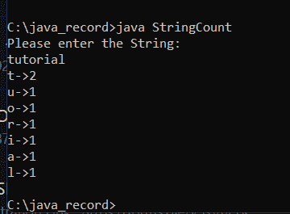

# Java 程序的结构

> 原文：<https://www.tutorialandexample.com/structure-of-java-program>

众所周知，Java 是一种面向对象、安全且独立于平台的编程语言。Java 编程语言允许我们构造各种各样的程序。因此，在深入研究之前，完全理解 Java 程序的基本结构是非常重要的。

Java 程序的结构包含以下部分:

1.  文件科
2.  包装声明
3.  导入报表
4.  接口部分
5.  类别定义
6.  类变量和变量
7.  主方法类
8.  方法和行为

### 文件科

对于一个 Java 程序来说，文档部分是一个关键但可选的部分。它包含了 Java 程序的基本细节。作者姓名、创建日期、版本、程序名称、公司名称和程序描述都包含在数据中。它使软件更容易阅读。当程序运行时，Java 编译器会忽略我们放在文档部分的任何内容。我们使用注释来格式化文档部分中的语句。单行、多行和文档注释都是可接受的注释类型。

*   **单行注释:**以正斜杠 **(//)** 开头。

    例如://这是一个 java 单行注释

*   **多行注释:**以/ ***** 开头，以 ***/结尾。**

    例如:/*这是 java 中的多行注释

*   **文档注释:**以 **(/**)** 开头，以 ***/** 结尾。

    例如:/* *这是 java 中的文档部分*/

### 包装部分

包的声明是可选的，紧跟在文档部分之后。在这一节中，我们确定了类所在的包名。请记住，一个 Java 程序只能有一个 package 语句。在定义任何类或接口之前，必须声明它。它是必需的，因为 Java 类可以放在几个包和目录中，这取决于模块，它们用在。这个包有一个它属于所有这些类的单亲指南。为了声明包名，我们使用单词 package。例如:

```
package Tutorial; //tutorial is the declared package
package example. Tutorial; // Tutorial is the main package; an example is a subpackage. 
```

### 导入报表

这个包中包含了许多预定义的类和接口。必须先导入特定包中的任何类，然后才能使用它。存储在另一个包中的类由 import 语句表示。为了导入这个类，我们使用了 import 关键字。它出现在 package 语句之后和类定义之前。import 语句可用于导入给定包中的单个类或所有类。我们可以在 Java 程序中使用大量的 import 语句。例如:

```
import java.util.* // it will import all the classes and methods from util package
import java.util.scanner // it will only import the scanner class
import java.lang.*
import java .awt.* 
```

### 接口部分

这部分是可选的。如果有必要，我们可以在这部分建立一个接口。为了创建一个接口，我们使用了 interface 关键字。类和接口彼此略有不同。它只有方法和常量的声明。它不能被实例化，这是另一个区别。implements 关键字让我们可以在类中使用接口。通过使用 extends 关键字，一个接口也可以与其他接口一起使用。例如:

```
interface animal
{
 	void shout ();
	void hunt ();
void eat ();
	void sleep ();
} 
```

### 类别定义

该类在本节中定义。它在 Java 软件中起着至关重要的作用。没有这个类，我们无法编写任何 Java 程序。一个 Java 程序中可以包含一个或多个类定义。我们使用 class 关键字来定义类。该类充当 Java 程序的模板。它包括用户定义的过程、变量和常量的详细信息。main()方法至少出现在每个 Java 程序的一个类中。例如:

```
class Tutorial // class declaration
{
            // methods declaration
	// variable declaration
 	// logic of the program 
	// executable statements
} 
```

### 类变量和常量

我们在这一部分定义变量和常数，它们将在程序的后面使用。在 Java 应用程序中，变量和常量是在类定义之后立即定义的。参数值存储在变量和常量中。它在软件运行时使用。通过使用修饰语，我们可以额外确定和指定变量的范围。它建立了变量的生命。例如:

```
class Tutorial // class declaration
{
            int size ; // variable declaration 
	String name ;
	double average;

}
```

### main()方法

我们在这一节中定义 main()方法。每个 Java 应用程序都需要它。因为所有的 Java 应用程序都是在 main()函数中开始运行的，换句话说，它充当了课堂的开始，显然是在课堂上。在 main 方法中，我们创建对象并调用方法。我们调用 main()方法而不创建对象。main()函数可以在不构造对象的情况下调用，因为静态方法可以在不创建对象的情况下调用。为了定义 main()方法，我们使用以下语法:

```
public class Tutorial 
{
public static void main (String a [])
{
		// Variable declaration
		// object creation
		// method declaration
		// method calls
}
} 
```

### 方法和行为

使用这些方法，我们在这一部分定义了程序的功能。我们想要遵循的指令集包含在方法中。这些指令的运行时执行完成了所请求的任务。方法是用于执行特定操作或动作的一部分、一组或一段代码。由于它，代码可以变得更加重用。一项技术一旦开发出来，就会被反复应用。您不需要重复编写相同的代码。此外，简单地添加或删除代码块，它提供了简单的代码修改和可读性。该方法在被调用或调用时执行。例如:

```
public class Tutorial 
{
public static void main (String a [])
{
		void display ()
		{
			system.out.print(“Welcome to tutorial and example”);
		}
// statements
}
} 
```

让我们按照上面所有的文档步骤试着写一个程序:

### StringCount.java

```
/* java program Documentation
A string is provided to you; your task is to determine the frequency of each character in the string and output that information. You can solve this problem by utilizing a hashing algorithm or a hash map. When generating a hash map, you must give a character as the key record and an integer as the value record. The characters of the given string must now be stored in the key record, according to logic. You must keep track of how many characters are in the string in each key-value record. If a character appears again, the hash map's frequency count for that character needs to be increased. Finally, you need to traverse the hash map and print the character along with its count values */
// import the required packages

import java.io.*;
import java.util.*;
import java.lang.*;
public class StringCount
// class declaration
{
	public static void main (String [] args) 
 	// main method declaration
{
		Scanner sc = new Scanner (System.in);
		// scanner class for input at runtime
                      System.out.println(“Please enter the String:”);
		String repString = sc.next ();
		// string input
		FrequencyString StringFreq=new FrequencyString();
		// object creation and calling
		     StringFreq.Frequency (repString);
	}
}
class FrequencyString
{
    void Frequency (String s)
	// not static method of FrequencyString class out of main class
    {
        HashMap<Character,Integer> Freq = new HashMap <> ();
        // Hash map creation for storing characters and integers for easy traversal
        for (int i = 0; i < s.length (); i++)
        {
            if (Freq.containsKey (s.charAt(i)))
            {
                Freq.put (s.charAt (i), Freq.get (s.charAt (i))+1);
	// increasing count if the character is already present in the string
            }
            else
            {
                Freq.put (s.charAt (i),1);
	     // Storing each character of string in hashmap if it is not present in the  
 	     // hashmap

            }
        }

        for (int i = 0; i < s.length (); i++)
        {
            if (Freq.get (s.charAt (i)) != 0)
            {
                System.out.println(s.charAt (i)+" -> "+Freq.get (s.charAt (i)));
 	     // printing the character frequency in the string along with the 
                // character
                Freq.put (s.charAt (i),0);
            }
        }
    }
} 
```

**输出:**

