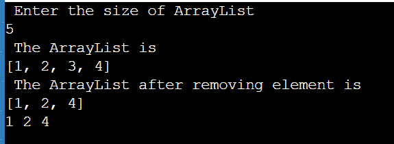
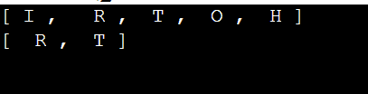
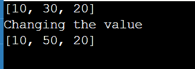

# Java 列表实现

> 原文：<https://www.tutorialandexample.com/java-list-implementations>

ArrayList 和 LinkedList 是 List 的两种通用实现。大多数时候你可能会使用数组列表，因为它很快，并且提供了固定时间的位置访问。当一次移动许多块时，它可以利用 System.arraycopy，而不是为列表中的每个元素分配一个节点对象。ArrayList 可以和 Vector 相比，没有同步成本。

如果您经常将元素添加到列表的开头，或者重复遍历列表以从其内部移除成员，您可能会考虑使用 LinkedList。在 LinkedList 中，这些操作需要恒定的时间，而在 ArrayList 中，它们需要线性时间。但是你的表现代价很高。

## Java 中的数组列表

java.util 包包含基本的集合构造块 ArrayList。Java 中提供了动态数组。在需要大量数组操作的程序中，虽然比标准数组慢，但它可能是有用的。在 java.util 包中，可以找到这个类。

## 用 Java 实现数组列表的程序

ArrayListImplementation.java

```
import java.io.*;
import java.util.*;
class ArrayListImplementation{
	public static void main(String[] args)
	{
		Scanner sc1 = new Scanner(System.in);
		System.out.println ( " Enter the size of ArrayList " ) ;
		int n=sc1.nextInt();
		// Declaring the ArrayList
		ArrayList <Integer> a1 = new ArrayList <Integer> (n) ;
        // using for loop to add elements to the ArrayList
		for ( int i = 1 ; i < n ; i++ )
			a1 . add ( i ) ;
        // printing the ArrayList
        System.out.println ( " The ArrayList is " ) ;
		System . out . println ( a1 ) ;
        // removing the element at index 2
		a1 . remove ( 2 ) ;
		System.out.println ( " The ArrayList after removing element is " ) ;
		System . out . println ( a1 ) ;
        // using for loop to add elements to the ArrayList
		for ( int i = 0 ; i < a1 . size ( ) ; i++)
			System . out . print ( a1 . get ( i ) + " ") ;
	}
}
```

**输出**

  

## Java 中的链表

集合架构的链表元素是 java.util 包的一部分。LinkedList 数据结构是一种线性数据结构，其中每个元素都是一个唯一的对象，其数据部分和地址部分不保存在单个位置。指针和地址用于连接元素。每个元素被称为一个节点。

### LinkedList 构造函数

必须先创建 LinkedList 类的对象，然后才能创建 LinkedList。LinkedList 类包括许多允许创建列表的构造函数。此类中可访问的构造函数包括:

### 1.LinkedList():

用这个函数对象()创建一个空链表。

**语法**

```
LinkedList r = new LinkedList(); 
```

### 2.linkedlist(集合 c)

这个 function Object()用于构建集合中所有已提供项目的有序列表，由该集合的迭代器返回。

**语法**

```
LinkedList l = new LinkedList(C);
```

## 用 Java 实现链表的程序

java

```
// Main class
public class LinkedListImplementation {
	// Driver code
	public static void main ( String args [ ] )
	{
		LinkedList < String > l = new LinkedList < String > () ;
		l . add  (  "  R " ) ;
		l . add ( " O " ) ;
		l . addFirst ( " I " ) ;
		l . addLast ( " H " ) ;
		l . add ( 2 , " T " ) ;
		System . out . println ( l ) ;
		l. remove ( " B " ) ;
		l . remove ( 3 ) ;
		l . removeFirst ( ) ;
		l . removeLast ( ) ;
		System . out . println ( l ) ;
	}
} 
```

**输出**

  

## 链表操作程序

ListOperations.java

```
import java.util.*;
public class ListOperations {
    public static void mainv( String args [ ] )
    {
        LinkedList < Integer > l = new LinkedList < > ( ) ;
        l . add ( 10 ) ;
        l . add ( 20 ) ;
        l . add ( 1 , 30 ) ;
        System . out . println ( l ) ;
        // Updation of elements
        System . out . println ( " Changing the value " ) ;
        l . set ( 1 , 50 ) ;
        // After changing the values of LinkedList
        System . out . println ( l ) ;
         // removal of elements
         ll . remove ( 1 ) ;
         // After changing the values of LinkedList
         System . out . println ( l ) ;
         // Iteration
         for ( int i = 0 ; i < l . size ( ) ;  i++ ) {
            System . out . print (l . get ( i ) + " " ) ;
        }
    }
}
```

**输出**

