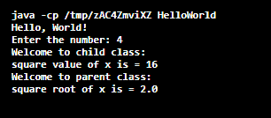
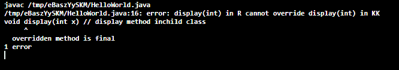
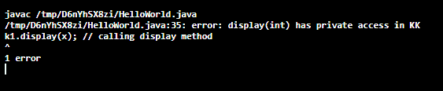
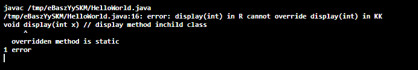
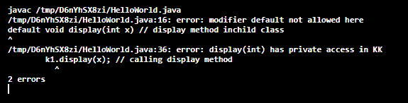
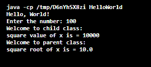

# Java 中的方法覆盖

> 原文：<https://www.tutorialandexample.com/method-overriding-in-java>

**超驰**

重写也被称为运行时多态性，它是关于不同类中具有相同签名的相同方法。重写只能应用于方法。

**方法覆盖**

方法重写是一种现象，当有两个或多个方法具有相同的方法名、相同的参数但在不同的类中时，就会出现这种现象。它们是父类和子类。方法重写只能在继承概念中应用。方法重写也称为运行时多态性。

**举例:**

```
class Parent
{
void add (int x)
}
class Child
{
void add(int x)
} 
```

在上面的例子中，方法“add()”具有相同的方法名和相同的参数，并且同时出现在父类和子类中。

### 方法重写的方式

方法重写可以通过

1.  父类和子类中的方法应该具有相同的名称和相同数量的参数。
2.  父类和子类中的方法也应该具有相同的返回类型。
3.  在 final 和 static 方法中都禁止方法重写。

### Java 中方法覆盖的优势

1.  我们可以多次实现相同的方法。
2.  我们也可以调用父类方法，而不用使用 super 关键字创建对象。
3.  Super 关键字，用于从子类访问父类的方法，而无需为父类创建对象。
4.  它还提高了源代码的可读性。
5.  它还定义了类的行为。

### 方法重写的缺点

1.  我们不能重写私有、静态和最终方法。
2.  我们不能覆盖包外的方法。
3.  我们不能降低被覆盖方法的可见性。
4.  如果类不在继承中，我们不能重写方法。

### 关于方法重写的几点

1.  方法重写也称为运行时多态性。
2.  方法重写在不同的类(即父类和子类)中具有相同的方法名、相同的参数和相同的返回类型。
3.  方法重写用于使用 super 关键字在父类中实现方法。
4.  方法重写发生在两个具有继承关系的类中。
5.  与方法重写相比，方法重载提供了更好的性能。
6.  我们不能重写 final 和 private 方法。

### 方法重载示例程序:

```
//Program to implement method overriding in java
import java .io.*;
import java .lang.*;
importjava.util.*;
class KK // parent class
{
void display(int x) // dispaly method in parent class
{
System.out.println(" Welcome to parent class: ");
    // printing the square root of the argument passed
System.out.println(" square root of x is = "+ Math.sqrt(x));
} // display
} // KK
class R extends KK
{
void display(int x) // display method inchild class
{
System.out.println(" Welcome to child class: ");
    // printing the square value of the argument passed
	System.out.println(" square value of x is = "+ (x*x));
} // display
} // R

classHelloWorld // class with main
{
public static void main(String[] args) // main method
    {
        // creating object for Scanner class which is present utill package
        Scanner sc = new Scanner(System.in);
System.out.println("Hello, World!");
System.out.println(" Enter the number: ");
int x = sc.nextInt(); // reading the input
        R r1 = new R() ; // object creation for R class
        r1.display(x); // calling display method
        KK k1 = new KK(); // object creation for KK class
        k1.display(x); // calling display method
    } // main
} // HelloWorld
```

**输出:**

  

在上面的程序中，我们用相同的参数和相同的返回类型在父类和子类中创建了一个方法“display()”。我们已经为父类和子类创建了对象，并传递了参数。这样我们就可以执行不同的操作，如上面程序中所示。这里，我们导入了 lang 包来访问“Math.sqrt()”函数，以找到平方值。因此我们可以看到程序的输出。

### 防止方法重写的方法

1.  通过使用 final 关键字声明重写方法(例如:final void display())。
2.  使用静态方法而不是非静态方法。
3.  通过在重写方法中使用 privet 访问修饰符。
4.  通过在重写方法中使用默认访问修饰符。

### 防止方法重写的示例程序

**1。通过使用最后一个关键字:**

final 关键字用于停止继承。如果类不是继承，我们就不能执行方法重写。

```
//Program to prevent method overriding using final keyword:
import java .io.*;
import java .lang.*;
importjava.util.*;
class KK // parent class
{
final void display(int x) // Final method
{
System.out.println(" Welcome to parent class: ");
    // printing the square root of the argument passed
System.out.println(" square root of x is = "+ Math.sqrt(x));
} 
} 
class R extends KK // child class
{
void display(int x) // display method inchild class
{
System.out.println(" Welcome to child class: ");
    // printing the square value of the argument passed
	System.out.println(" square value of x is = "+ (x*x));
} // display
} // R

classHelloWorld // class with main
{
public static void main(String[] args) // main method
    {
        // creating object for Scanner class which is present utill package
        Scanner sc = new Scanner(System.in);
System.out.println("Hello, World!");
System.out.println(" Enter the number: ");
int x = sc.nextInt(); // reading the input
        R r1 = new R() ; // object creation for R class
        r1.display(x); // calling display method
        KK k1 = new KK(); // object creation for KK class
        k1.display(x); // calling display method
    } 
} 
```

在这个程序中，我们使用 final 关键字在父类中声明了该方法。父类方法被覆盖，但是我们可以覆盖最终的方法，所以程序的输出应该是一个错误，被覆盖的方法是最终的。

**输出:**

  

**2。** **通过使用私有访问修饰符:**

访问修饰符用于定义方法或变量的范围。如果我们使用私有访问来定义一个方法，那么该方法的作用域将只在类内，我们不能在类外访问该方法。如果不访问方法，我们就不能重写方法。

```
//Program to prevent method overriding using private access modifier
import java .io.*;
import java .lang.*;
importjava.util.*;
class KK // parent class
{
private void display(int x) // Static method
{
System.out.println(" Welcome to parent class: ");
    // printing the square root of the argument passed
System.out.println(" square root of x is = "+ Math.sqrt(x));
} 	
} 
class R extends KK // child class
{
void display(int x) // display method inchild class
{
System.out.println(" Welcome to child class: ");
    // printing the square value of the argument passed
	System.out.println(" square value of x is = "+ (x*x));
} // display
} // R

classHelloWorld // class with main
{
public static void main(String[] args) // main method
    {
        // creating object for Scanner class which is present utill package
        Scanner sc = new Scanner(System.in);
System.out.println("Hello, World!");
System.out.println(" Enter the number: ");
int x = sc.nextInt(); // reading the input
        R r1 = new R() ; // object creation for R class
        r1.display(x); // calling display method
        KK k1 = new KK(); // object creation for KK class
        k1.display(x); // calling display method
    } 
}
```

**输出:**

  

在这个程序中，我们使用私有访问修饰符声明了一个方法，所以该方法的范围在类内，所以我们不能从另一个类访问该方法。因此我们不能覆盖这个方法。所以我们得到了一个错误。

**3。通过使用静态方法**

防止方法重写的另一种方法是使用静态方法。如果我们声明一个静态方法，它将变成一个类方法而不是一个对象方法，我们不能重写类方法。

```
//Program to prevent method overriding using static method rather than non-static 
// method:
import java .io.*;
import java .lang.*;
importjava.util.*;
class KK // parent class
{
static void display(int x) // Static method
{
System.out.println(" Welcome to parent class: ");
    // printing the square root of the argument passed
System.out.println(" square root of x is = "+ Math.sqrt(x));
} 	
} 
Class R extends KK // child class.
{
void display(int x) // display methodinchild class
{
System.out.println(" Welcome to child class: ");
    // printing the square value of the argument passed
	System.out.println(" square value of x is = "+ (x*x));
} // display
} // R

classHelloWorld // class with main
{
public static void main(String[] args) // main method
    {
// creating object for Scanner class which is present utill package
        Scanner sc = new Scanner(System.in);
System.out.println("Hello, World!");
System.out.println(" Enter the number: ");
int x = sc.nextInt(); // reading the input
        R r1 = new R() ; // object creation for R class
        r1.display(x); // calling display method
        KK k1 = new KK(); // object creation for KK class
        k1.display(x); // calling display method
    } 
}
```

在这个程序中，我们使用 static 关键字在父类中声明了一个方法。如果一个方法使用 static 关键字声明了一个方法，它将成为一个类方法而不是对象方法，我们不能覆盖一个类方法，所以输出应该是一个错误，我们不能覆盖一个静态方法。

**输出:**

  

**4。通过在覆盖方法**中使用默认的访问修饰符。

只有当被覆盖方法的访问在包内而不是包外时，这才是可能的。为了获得这种情况，我们必须使用 private 和 child class 以及默认的访问修饰符来声明父类方法。

```
//Program to prevent method overriding using default access modifier
import java .io.*;
import java .lang.*;
importjava.util.*;
class KK // parent class
{
private void display(int x) // Static method
{
System.out.println(" Welcome to parent class: ");
    // printing the square root of the argument passed
System.out.println(" square root of x is = "+ Math.sqrt(x));
} 	
} 
class R extends KK // child class
{
default void display(int x) // display method inchild class
{
System.out.println(" Welcome to child class: ");
    // printing the square value of the argument passed
	System.out.println(" square value of x is = "+ (x*x));
} // display
} // R

classHelloWorld // class with main
{
public static void main(String[] args) // main method
{
        // creating object for Scanner class which is present utill package
        Scanner sc = new Scanner(System.in);
System.out.println("Hello, World!");
System.out.println(" Enter the number: ");
int x = sc.nextInt(); // reading the input
        R r1 = new R() ; // object creation for R class
        r1.display(x); // calling display method
        KK k1 = new KK(); // object creation for KK class
        k1.display(x); // calling display method
    } 
}
```

**输出:**

  

我们可以使用 super 关键字从子类中访问父类方法。

```
//Program to access parent class method from child class
import java .io.*;
import java .lang.*;
importjava.util.*;
class KK // parent class
{
void display(int x) 
 {
System.out.println(" Welcome to parent class: ");
    // printing the square root of the argument passed
System.out.println(" square root of x is = "+ Math.sqrt(x));
} 	
} 
Class R extends KK // child class.
{
void display(int x) // display method inchildclass
{
System.out.println(" Welcome to child class: ");
    // printing the square value of the argument passed
	System.out.println(" square value of x is = "+ (x*x));
	super.display(x); // calling parent class method
} // display
} // R

classHelloWorld // class with main
{
public static void main(String[] args) // main method
    {
        // creating object for Scanner class which is present utill package
        Scanner sc = new Scanner(System.in);
System.out.println("Hello, World!");
System.out.println(" Enter the number: ");
int x = sc.nextInt(); // reading the input
        R r1 = new R() ; // object creation for R class
        r1.display(x); // calling display method
    } 
}
```

**输出:**

  

### 结论

在本文中，我们讨论了 java 中的方法覆盖和执行方法覆盖的规则。我们讨论了如何防止方法重写。我们执行了关于方法覆盖和防止方法覆盖的程序。我们讨论了方法重写的优点和缺点。