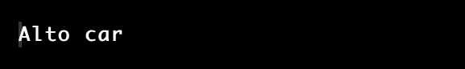

# Java 中的虚函数

> 原文：<https://www.tutorialandexample.com/virtual-function-in-java>

在面向操作的编程语言中，虚函数或虚方法是用相同的语法覆盖继承类中函数的功能以创建多态性的函数集合。

对于从 C++转换到 Java 的开发人员来说，虚函数在编程语言中的位置是一个问题。虚函数是在 C++中使用虚拟关键字指定的。但是，Java 的实现方式不同。在 C++中，查看虚函数。

面向对象编程 Java 支持 OOPs 概念，如多态、继承、封装等。对象、类和成员函数是所有这些思想的基础。除了 final、static 和 private 函数可用于支持多态性，Java 中的大多数示例方法都被认为与默认创建相关。

## 如何在 Java 中使用虚函数

Java 不使用虚拟关键字定义虚拟方法；相反，虚拟功能和方法通过使用不同的方法来实现:

*   我们可以用继承的类方法替换虚函数，以使用相同的名称。通常，父类定义虚函数，而继承类覆盖它。
*   类名是虚拟函数被期望实现的地方。使用类名的连接或指针，我们可以通过指向子类的条目来访问它。
*   在基类和任何派生类中，虚函数的标题和参数必须相同。
*   虚函数再次需要一个 IS-A 关联，用于指定继承中的类结构。
*   因为私有函数不能被修改，所以虚函数有时可以是私有的。
*   因为最终的方法可能会被覆盖，所以虚函数或方法不能被最终确定。
*   虚拟方法不应该是静态的，因为静态函数不能被重写。
*   Java 中的每个非静态方法都被定义为一个虚函数。
*   通过使用虚函数来实现 oops 原则(如实时多态性)是可能的。

为了更好地理解，考虑一个小程序:

**举例:**

 ****Dog.java**

```
import java.io.*;
import java.util.*;
//Parent class  
class Animal {  
void eating() //declaring the eating() function  
{  
System.out.println("In the Animal class");  
}  
}  

public class Dog extends Animal // Inheriting the Parent Class
{  
    void eating() // The function eating() is overrided from the Parent(Animal) class  
   {  
      System.out.println("This is the Dog class");  
   }  
   public static void main(String args[]){  
   Animal obj1 = new Dog(); //By using Animal class the child class(Dog) is get referenced 
   obj1.eating();  
  }  
} 
```

**输出**


在上面的示例程序中，虚函数 eating()用于覆盖 Dog 类。

Java 中每个可访问的、非静态的、非最终的过程都是虚函数。使用这些技术可以获得多态性。实现多态性的技术永远不可能是虚函数。

虚函数不应该是固定的、最终的或私有的方法。类名或对象名可以用来调用静态方法。虽然如果我们尝试，它将无法实现多态性。

## 作为虚函数的 Java 接口

在 Java 中，称为接口的类类型模板包含静态变量和抽象方法。因为下面的类提供了方法实现，所以所有的 Java 连接都被视为虚函数。

下面的例子是关于界面的:

**举例**:

```
interface Vehicle{    
void display();    
}    
public class Alto implements Vehicle{    
public void display()
{
System.out.println("Alto car");
}    
public static void main(String args[]){    
Alto obj = new Alto();    
obj.display();    
 }    
} 
```

**输出**:

  

上面的例子可以通过实现 Alto 类来执行接口方法。

## 纯虚函数

派生类函数是指我们不需要实现的虚函数。例如，Java 的抽象方法实际上是一个完全虚拟的函数。

下面的例子将描述纯虚函数:

**举例:**

 ****Demo.java**

```
abstract class Teacher {  
        final void teaching() //method of abstract class
        {  
        System.out.println("1 st teacher");  
        }  
        abstract void explain(); // it is the pure abstract method 
}  
    class Principal extends Teacher //Parent class is the Principal
        {  
        void explain(){  
        System.out.println("My teacher is explaining well");  
        }  
}  
public class Demo  //main class
      {  
        public static void main(String args[]){  
        Teacher obj = new Principal();  //an object obj is created for Demo class
        obj.explain();  
        }  
        } 
```

**输出:**

  

上面程序中的 explain()方法是纯虚函数。

## 运行时多态性

对已被重写的函数的调用是通过运行时多态性而不是编译时来处理的。当使用动态多态时，不是引用变量，而是调用函数。动态多态可以使用虚函数来实现。

**举例:**

**Placements.java**

```
class Programming{  
public void display() // it is the virtual function in class Programming
{  
System.out.println("welcome to this world");  
}  
}  
public class Placements extends Programming{  
public void display() // the method of child class(Placements)
{  
System.out.println("The best method for cracking placements.");  
}  
public static void main(String args[]){  
Programming obj = new Placements();  //an object obj is created
obj.display();  
}} 
```

**输出**


从上面的程序中，我们可以使用虚函数来实现动态多态性。

## 概述:

使用 Java 的虚函数时，请考虑以下因素:

*   虚函数是典型的 Java 方法。
*   为了设计虚函数，我们不应该声明任何特定的描述。
*   Java 不使用虚拟化的关键字来指定虚函数。
*   虚函数必须在父类中使用相同的标题在子类中创建，并且父类引用被用来引用派生类的对象。
*   除了 final、static 和 private 函数，所有的 Java 原型方法都被认为是虚函数。****