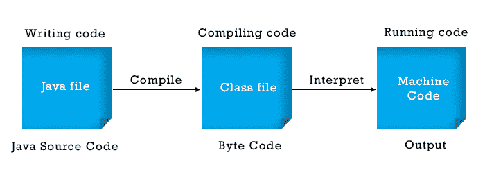

# Java 中的解释器是什么？

> 原文：<https://www.tutorialandexample.com/what-is-interpreter-in-java>

编程语言 Java 是平台中立的。因此，可以在任何支持 Java 处理器的平台上使用 Java。这段软件转换包含在类文件中的 Java 字节码。类)进出系统软件可以理解的代码。为此，Java 是独立于平台的。

在这一节中，我们将学习 Java 解释器，包括它们是什么，它们如何工作，以及它们有什么特征。此外，我们将研究它与编译器的不同之处。



## 翻译这个词是什么意思？

一个被称为解释器的软件程序运行着用 Java、PHP、Python 等稍微高级的编程语言编写的程序。每个程序设计都有一个我们提供的独特的解释器。

可以用两种方式运行高级软件编程语言程序:用编译器把它们编译成机器码，或者用解释器解释它们。

实现引擎还包含一个名为 JIT 的设备，它使用解释器的帮助将字节翻译成本机代码。因为解释器必须在每次调用该技术时执行一个字节，这减慢了实现阶段；JIT 的介入加快了速度，并确保相同的代码不会有多种解释。这是由 JIT 的概要分析子组件执行的。

## Java 中的解释器是如何工作的？

我们执行。类文件，将十六进制代码翻译成机器代码(JVM)。JVM JVM 使用 Java 解释将机器代码翻译成机器代码。JVM 在运行时使用翻译器后在主机系统上执行代码。

然后，Java 编译器将源代码转换成 Java 字节码。类似于如何使用 Java 解释器将字节码翻译成机器码，然后机器码与操作系统通信，Java 解释器将字节码转换或翻译成机器可理解的形式。

基金会处理 Java 运行时系统的所有功能。它读取产生的字节码并导入标准的 java 文件。每个加载了 JVM 的系统都被认为是支持 JVM 的。

## Java 解释器的加载

首先使用 java 命令指定该类，然后附带类名、解释器可用的参数以及命令行参数(如果需要)。使用以下指令加载该类:

```
% java [interpreter options] class name [arguments]   
```

前面命令中的类名必须是完全限定的标识符(它包含类名，如果有的话)。请记住。类应用程序不添加在类名之后。例如:

```
java Price 
java com.javaprogramming.price.Laptop 
```

在上面的命令中，第一个命令 Price 是一个类的名称；上面例子的第二个命令是 java 编程。价格是包含存储在其中的笔记本电脑类别的包名。

Java 维护约定，并在装入类后使用 main()函数查找该类。只要 JVM 找到 main()函数，解释器就会调用 main()方法来启动应用程序。在 main()方法被执行之后，进一步的线程和指向其他类的指针被使用。

## Java 解释器的特点

在执行时，它保持顺序，同时将源代码逐行转换成机器语言。

*   使用解释器不会产生中间机器码。
*   每一行的错误一次显示一个。
*   该程序的计算效率比编译器慢。
*   程序的分析和执行需要更少的时间。

然后使用 Java 编译器将源代码转换成字节码。类似于 Java 翻译器如何将字节码转换成机器代码，然后与计算机系统通信，Java 解释器将字节码转换或翻译成机器可以理解的所需格式。

## Java 解释器的用途是什么？

Java 开发生态系统的实时(JIT)编译器转换。将类文件转换成机器码实际上是一个解释器。

Java 虚拟机(JVM)将 Java 字节码转换成机器码或从机器码转换成 Java 字节码，然后使用 Java 解释器在虚拟机上执行。

Java Translator 的唯一功能是将编译后的 Java 代码从字节码(。类)文件转换为可在设备上执行的内存中本机代码(输入设备)。在执行 Java 应用程序之前，这个过程在运行时执行。

## 在 Java 中使用解释器的优势

跨平台**–**使用解释语言，我们可以共享它的源程序代码，这些代码可以在任何机器上运行，不会有任何问题。

代码调试 -使用解释器更简单，因为他们逐行扫描代码并立即返回警告信息。此外，如果客户有权访问源代码，他们可以调试或修改它。

**更少的存储和步骤**–解释器不像编译器那样创建新的不同文件。因此，源代码可以立即执行，不需要额外的内存或第二步。

**执行流程**–与编译语言不同，解释器允许你暂停执行，并通过逐行读取文本随时修改代码。然而，如果您在代码结束后再次运行它，它将再次从头开始。

## 使用解释器的缺点

**更慢–**因为解释器逐行读取、评估和翻译代码，所以它通常比编译器慢。

**必要的需求文件**-要运行代码，用户或任何拥有共享代码的人必须在他们的系统上已经设置了解释。

不太安全 -与编译器相反，解释器不产生可执行文件。因此，这对任何重视其安全性的组织或公司都没有好处。为了与他人共享程序，我们还必须公开我们的源代码，这是一种不安全的公共交流形式。

## 解释器和编译器之间的区别


| **解释器** | **编译器** |
| 因为有解释器，所以完整的源代码是逐行翻译的。 | 可以一次性翻译代码。 |
| 完成一项任务所需的时间比编译器长得多，因此比编译器慢。 | 与口译员相比，它包含的时间更少。 |
| 与编译器相比，它的效率非常低。 | 与口译员相比，它更有效率。 |
| 与编译器相比，CPU 的使用要少得多。 | 与解释器相比，CPU 的使用率更高。 |
| 只是只检查语法错误。 | 可以考虑和分析语法和意义上的错误。 |
| 解释器的规模通常小于编译器的规模。 | 编译器的规模很大。 |
| 口译员非常灵活。 | 编译器没有解释器灵活。 |
| 当出现错误时，只重组程序的一部分。 | 一个错误可能导致整个软件的重组。 |
| 像 Java 这样的编程语言使用解释器。 | C 和 C++等编程语言使用编译器。 |

