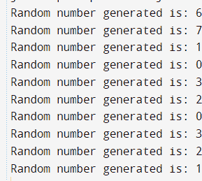

# Java 可调用示例

> 原文：<https://www.tutorialandexample.com/java-callable-example>

## Java 中什么是可调用的？

Callable 是 Java 中的一个接口。构造线程有两种方法:一种是继承 thread 类，另一种是将 Runnable 与 Thread 结合起来。不能强制线程在结束或 run()结束时返回结果是 Runnable 所缺乏的特性。Java 中引入了 Callable 接口来促进这一功能。

### 可调用示例:

让我们创建一个实现 callable 接口的 java 代码。

让我们看看使用 Callable 接口的代码片段，在 0 到 5 秒的延迟之后，产生一个 0 到 20 之间的随机整数。

CallableExample.java

```
// A Java code for the Callable interface implementation
// For generating random numbers between 0 - 20  

// Importing the packages required.
import java. util. concurrent. Callable;  
import java.util.Random;  

class Jtp implements Callable {  
public Object call () throws Exception {  
Random obj = new Random ();  
// Object creation for the Random class using new   
Integer num = obj.nextInt(20);  
// generating a random number between 0 to 20 using nextInt method.
Thread.sleep(num * 1000);  
// the thread is kept in sleep mode for some random time  
return num;  
	}  
} 
```

前面的代码示例演示了可调用接口。但是这项工作还没有完成。主线程可访问的返回对象必须在 call()方法退出后存储。这很重要，因为主线程必须知道 call()方法返回值。同样的目的也可以通过使用未来物体来实现。来自单独线程的响应从 call()函数发送，并存储在 Future 对象中。

未来是一个应用程序，就像 Callable 一样。因此，必须付诸实践才能使用。然而，未来的接口不需要手动实现。Java 库中的 FutureTask 类已经实现了 Runnable 和 Future 接口。

**CallableExample1.java**

```
// A Java code for the Callable interface implementation
// For generating random numbers between 0 - 20  
import java. util. concurrent. Callable;  
import java.util.Random;  
import java.util.concurrent.FutureTask;  
  // importing the packages required.  

Class JCal implements Callable  
{  
@Override  
public Object call () throws Exception  
{  
Random obj = new Random ();  
// Object creation for the Random class   
Integer num = obj.nextInt(10);  
// generating a random number between 0 to 9 using nextInt method.  

Thread.sleep(num * 1000);  
// the thread is kept in sleep mode for some random time
// returning the object created that contains a random number  
return num;  
}  
}  

public class CallableExample1 {  
  // start of the main method 
  public static void main (String args[]) throws Exception {  

    // creating an array of 5 objects of the FutureTask class  
    FutureTask[] treads = new FutureTask[10];  

    // using a loop for creating and running 10 threads  
    for (int j = 0; j < 10; j++)  
    {  
      // Object creation for the JavaCallable class  
      Callable cobj = new JavaCallable();  

      //Creation of the FutureTask reference with Callable object
      treads[j] = new FutureTask(cobj);  

      Thread tobj = new Thread(treads[j]);  
      tobj.start();  
    }  

    // Using a loop for generating the random numbers  
    for (int i = 0; i < 10; i++)  
    {  

      // Calling the get () method to invoke the thread 
      Object ojb1 = treads[i]. get ();  

      // While waiting for the result, the get method maintains control. 
      //When the method is disrupted, the get method may throw the checked exception.
      // Due to this, we must include the throws statement in the main method.  

       // printing the numbers generated randomly
      System.out.println("Random number generated is: " + obj1);  

    }  
  }  
} 
```

**输出:**

  

我们在代码中创建了 10 个独立的线程。call()方法由每个线程调用，生成一个随机数并返回它。主线程使用 get()函数从各个线程接收生成的随机数对象。FutureTask 类实现 get()方法，该方法在 Future 接口中定义。

**可调用接口:**

*   如果我们使用可调用接口，那么必须定义 call()方法。
*   对象是接口的 call()函数的返回类型。因此，call()函数返回一个对象。
*   call()方法可能会引发异常。
*   可调用接口不允许创建线程。