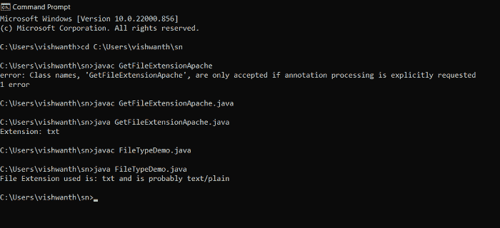
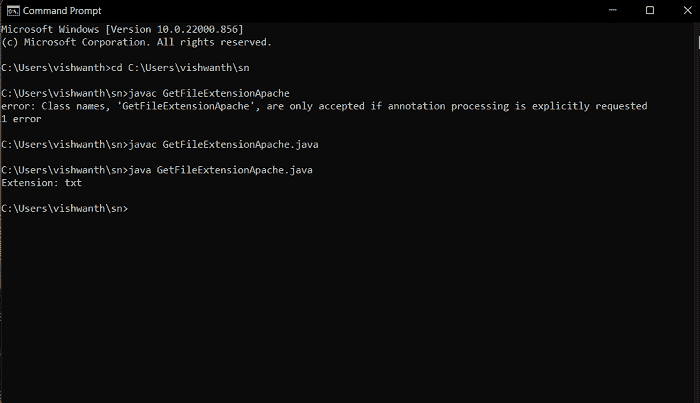

# Java 文件扩展名

> 原文：<https://www.tutorialandexample.com/java-file-extension>

计算机文件的后缀称为文件扩展名。它很容易识别，因为它出现在句号(。)在文件名中。

以 Demo.java 文件为例；Demo 是文件名，而。java 是文件扩展名，两者都表示文件格式。

在这一节中，我们将学习如何使用 Java 程序来获取文件的扩展名。

## Java 文件类

*   io 包包含 Java 文件类的定义。java.nio 包是另一个新的 java 包，用于执行输入/输出任务。它最早出现在 JDK4 中。
*   它在 Java 程序中被用来执行某些文件操作。
*   File 类有各种构造函数和方法，可以使用文件路径名来重命名、删除或创建新文件以及其他操作。
*   必须创建 File 类实例才能使用这些构造函数和方法。
*   File 类的实例是不可变的；因此，一旦使用特定的路径名创建了它们，就不能对它们进行修改。

## 如何获取文件扩展名？

在 Java 中，有两种方法可以获得文件扩展名。

下面的程序使用 File 类来确定我们作为输入提供的文件的文件扩展名。

**FileTypeDemo.java**

```
import java.io.* ;  
import java.nio.file.Files ;  
public class FileTypeDemo   
{  
    /*main method*/  
    public static void main(String ar[])  
    {  
        /* declaring a File instance with the path of the File */  
        File f = new File("C:/Users/vishwanth/sn/dem.txt") ;  //location
        /* If file exists */  
        if(f.exists())   
        {  
            String fType = "Undetermined" ;  //undetermined
            String fName = f.getName() ;   
            String extension = "";  
            int i = fName.lastIndexOf('.') ;  //lastIndexOf() method

            if (i > 0)   
            {  
                extension = fName.substring(i + 1) ;  
            }  
            try   
            {  
                fType= Files.probeContentType(f.toPath()) ;  
            }  
            catch (IOException ioException)   //catches io exception
            {  
                System.out.println("Cannot determine type of file "+ f.getName()+ " due to the exception: "+ ioException) ;  
            }  

            /* Print the file extension. */  
            System.out.println("File Extension used is: " + extension + " and is probably " + fType) ;  
        }  
        else   
        {  
            System.out.println("File does not exist!") ;  //prints file does not exist
        }  
    }  
} 
```

**输出:**



在上面显示的图像中，提供了上述程序的输出。由于文件“dem.txt”存在，程序会将文件“dem”的文件扩展名打印为 txt。

在上面引用的 Java 程序中，

*   它从 io 包中创建 File 类的实例“f”。它生成提供给构造函数的路径的一个实例。
*   使用下一行中的 if 语句检查文件是否存在。如果条件合适，将创建用于存储文件类型、文件名和文件扩展名的变量。
*   lastIndexOf()函数返回作为参数提供的最后一个字符。
*   substring()方法用于获取文件扩展名后的句点(。)
*   nio 包的 probeContentType()方法返回一个表示内容类型的字符串。由于它可能会引发 IOException，所以在 try-catch 块中指定它。
*   最后，使用 print()命令在控制台上显示文件扩展名和内容类型。

## 使用 Apache Commons IO 库

Apache Commons IO 组件改编自 Java API，它提供了多种方法来对文件执行多种操作，而无需首先构造文件的对象。下面的代码中使用了 FilenameUtils.getExtension()方法来获取文件扩展名。

get file extension Apache . Java

```
import java.io.IOException ;  
import org.apache.commons.io.FilenameUtils ;  
public class GetFileExtensionApache  
{  
    /* Driver Code */  
    public static void main(String []args)  
    {  
        try   
        {  
            usingFilenameUtils();  
        }  
        catch(IOException e)   
        {  
            System.out.println(e.getMessage()) ;  
        }  
    }  
    public static void usingFilenameUtils() throws IOException  
    {  
          /* now, provide the file path of the required file */
        String path = " C:/Users/vishwanth/sn/dem.txt" ;  
        System.out.println("Extension: " + FilenameUtils.getExtension(path)) ;  
    }  
} 
```

**输出:**

上面的 Java 代码中使用了 FilenameUtils 类的 getExtension()函数来获取文件扩展名，而无需构造 file 对象。



上面显示的图像显示了上述程序的输出。输出包含程序中提供的文件的扩展名。由于文件“dem”是一个 txt 文件，程序显示“Extension: txt”作为其输出。