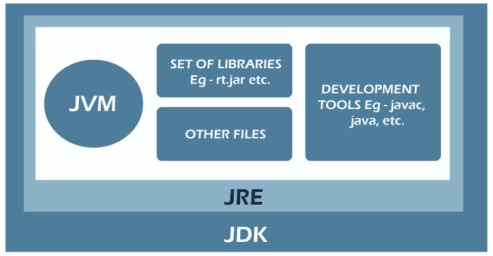

# Java 位置

> 原文：<https://www.tutorialandexample.com/java-location>

PATH 是一个环境变量，系统软件现在使用它来查找可执行文件(。exe)或 java 二进制文件(Java 或 javac 命令)。路线一旦选定，就不能更改。PATH 变量使我们不必每次启动程序时都在命令行界面上手动输入程序的完整路径。此外，route 本质上是一个包含几个快捷键的变量。

Java 是连续的、基于类的、面向对象的等等。高级编程语言。通常，Java 程序被编译成可以在任何 Java 编程语言(JVM)上执行的字节码，与计算机的体系结构无关。Java 版本 18 是最新的。下面列出了 Windows 和 Linux 的环境变量。由于操作系统设置的不同，JVM、JRE 和 JDK 3 都是特定于平台的。然而，Java 是平台中立的。在设置环境之前，有几个要素必须了解，通过下图可以更好地理解:



JDK:JDK(Java 开发工具包)是一套面向计算机程序员的工具，包括 Java 编译器、Javadoc、Jar 和调试器。

**JRE，**甚至是 Java 运行时环境，是为最终用户设计的软件，包括运行 Java 应用程序所需的 Java 库组件。JDK 可以被认为是 JRE 的一个子集。

**JVM** : JVM (Java 虚拟机)是一个抽象机器。它是一个为 Java 字节码执行提供运行时设置的标准。有几个软件和硬件系统的 JVM。

现在让我们用图形来讨论如何建立一个 Java 环境。为了演示视觉帮助，让我们使用 Windows 操作系统。

在这里，我们将概述不同的操作系统阶段。它们如下:

1.窗户

2.Linux 操作系统

## 1.Windows 操作系统

在 Windows 中配置生态系统需要以下步骤:

**第一步:**从网站下载 Java 8 JDK。对于 Windows (32 位)和 Windows (64 位)，分别选择倒数第二个链接和最后一个链接，如下所示。


第二步:下载 the.exe 程序后运行它，并按照屏幕上的指示在他们的电脑上安装 Java。一旦在计算机上安装了 Java，就必须配置环境变量。

**第三步:**从控制面板菜单中选择系统和安全。单击下面的按钮，从高级系统设置菜单中选择环境变量。

  

**步骤 4:** 最后一步是更改控制参数下的“Path”选项，以包含 Java 环境的路径。选择“Path”变量和编辑按钮，如下所示。


**第五步:**从可用路径列表中选择 New 后，添加 Java 安装的路径。“C: Program Files”或“C: Program Files(x86)”文件夹是 Java 的正常安装位置。如果您在其他地方安装了 Java，请在那里添加路径。


## 2.操作系统 Linux

在 Linux 上安装 Java 有几种方法。但是我们将讨论通过终端安装 Java 的最快和最简单的方法。我们将在 Linux 上设置 OpenJDK。Java 编程语言由 OpenJDK 实现，open JDK 是免费提供的开源软件。在 Linux 操作系统中配置环境所需的步骤:

**Step1:** 第一步，选择应用>配件>端子。

**步骤 2:** 键入以下命令:

```
sudo apt-get install openjdk-8-jdk
```

**步骤 3:** 在“终端”中，利用安装的位置，对“JAVA HOME”(环境变量)执行下面给出的命令。(注意:下面给出了默认路径。)

```
export JAVA_HOME = /usr/lib/jvm/java-8-openjdk
```

**步骤 4:** 在“终端”中，使用“路径”(环境值)的安装目录输入下面给出的命令。(请注意，默认的配置路径如图所示，但是如果您需要在其他地方安装 OpenJDK，您可以更改它。)

```
export PATH = $PATH:/usr/lib/jvm/java-8-openjdk/bin
```

完成了 Java 在 Linux 下的安装过程。

> **注:**
> 
> 在终端中输入 java 版本，确认安装成功。你会看到 Java 正在你的电脑上运行。

*   用于编写 Java 应用程序的简单文本工具是记事本和 gedit。在 Windows 上，记事本是可访问的，而在 Linux 上，gedit 是可访问的。
*   Eclipse IDE:这种组合开发环境(IDE)已经成为创建基于 Java 的软件的最流行的环境。Eclipse 可以下载。