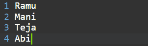

# Java 映射示例

> 原文：<https://www.tutorialandexample.com/java-map-example>

***在 Java 中，Map 是一个接口，主要用来表示键和值对。***Java 集合框架中这种映射的中心概念和主题就是在数据结构中提供 Map 的功能。

Java 映射不允许重复的键。它将只启用唯一的键，但是它可以接受重复的值。所以在这里，值对和键被称为一个条目。

java 中提供了地图界面。util 在键和值之间映射的包。

学生和科目的地图。每个科目(键)都与学生集(值)相关。

工人和业主的地图。每个所有者(键)都与工人的(值)集相关。

**例如:**

关键字值

红苹果

黄香蕉

白萝卜

使用这些键可以完成删除、搜索和更新操作。

主要有三个类用于映射链接 HashMap、Treemap 和 HashMap。

对于 Map 的实现，有两个接口:Map 和排序 Map。

**链接散列表:**链接散列表继承了散列表，用于插入的维护和映射的实现。

**TreeMap:** TreeMap 保持升序，用于实现映射和排序映射。

**HashMap:** Hash map 不维护任何顺序，用于实现 Map。

在 java 中，不能在 Map 类型中创建对象，所以我们需要一个扩展 Map 的类来创建对象。

语法:Map ht = new HashMap()；

map<key value="">contacts = new HashMap<>()；//对于散列表</key>

### 地图界面中的方法:

put (obj k，obj Val):

此方法用于将条目插入到地图中。

2 . putl fake(K 键，V 值):

它用于在地图中插入指定的地图。

3 .移除(对象 k):

此方法删除映射中指定键的条目。

4.设置< Map. Entry<key value="">>条目设置():</key>

它是键和值对的集合。

void clear():

它用于重置和清除地图。

6 .包含键(obj):

这个方法告诉我们这个键是否被映射。它将一个关键元素作为参数，当它被映射时返回 true 否则返回 false。

7 .包含值(obj):

这个方法告诉我们值是否被映射，是通过一个键还是多个键。

get(obj):

此方法主要用于检索由键映射的值。

9.size():

它返回地图上可用的键或值的数量。

10.putAll ():

条目将从指定的映射插入到该映射中。

11.replace(键，值):

此方法用于用特定或指定的值替换键值

12 .拆除(钥匙):

此方法从由键表示的映射中移除条目。

13.remove(键，值):

它删除与映射的值条目相关联的键。

14.keySet():

它返回地图上出现的所有键集。

values():

它用于返回地图上显示的所有值。

16.entrySet():

它返回映射上所有键或值映射的集合。

**Java Map 示例代码(非通用)旧样式:**

```
import java.io. *;
import java.util.*;
public class Map1
{
	public static void main (String [] args)
	{
		Map ht=new HashMap ();
		ht.put (1," Ramu");
		ht.put (2," Mani");
		ht.put (3," Teja");
		ht.put (4," Abi");
		Set st=ht. entrySet ();
		Iterator it=st. iterator ();
		while (it. hasNext ())
		{
			Map.Entry entry= (Map.Entry) it.next();
			System.out.println(entry. getKey () +" "+entry. getValue ());	
		}
	}
} 
```

**输出:**

  

### Java Map 示例代码(GENRIC)新样式:

```
import java.io. *;
import java.util.*;
public class Map2
{
	public static void main (String [] args)
	{

		Map<Integer, String> ht=new HashMap<Integer, String>();  
		ht.put (1," Ramu");
		ht.put (2," Mani");
		ht.put (3," Teja");
		ht.put (4," Abi");
		for (Map.Entry m:ht.entrySet())
		{
			System.out.println(m.getKey()+" 									"+m.getValue());
		}
	}
}
```

**输出:**

  

## 在地图上执行的操作

### 1.元素的添加

*为了给 Map 添加一个元素，我们使用了 **put()方法*** ，但是 *HashMap* 并没有确认插入顺序。所以这些方面是基于散列来索引的，以使它们在内部更有效。

### 2.改变元素

键对地图中的元素进行索引，值可以通过更新或插入我们需要更改的键来更改。

### 3.元素的移除

*为了从条目中删除一个元素，我们使用 **remove()** 方法*，这将删除与条目映射中的值相关联的键的映射。