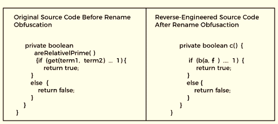
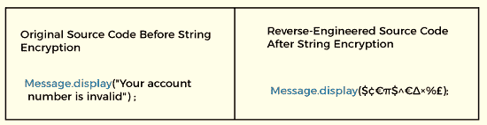
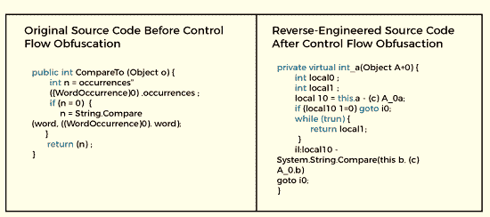
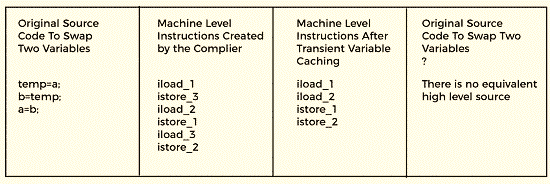

# Java 混淆器

> 原文：<https://www.tutorialandexample.com/java-obfuscator>

混淆是使一些事情变得不清楚或难以解释的过程。混淆器在编程中被用来保护源代码免受黑客攻击。在本文中，我们将学习代码混淆，混淆器如何工作，混淆工具，以及它们的应用。我们还将学习如何混淆 Java 应用程序。

## 代码混淆

在计算机科学领域，“混淆”这个词经常被使用。在编程上下文中，模糊处理是通过对可执行代码进行一些更改来使代码变得模糊，但代码仍按预期运行。混淆代码的目的是使其对黑客毫无用处。

应用程序或程序的输出不受模糊处理的影响，尽管它可能会改变方法指令或元数据。混淆代码主要用于使逆向工程具有挑战性。代码混淆器是我们在这种方法中使用的工具。

## 代码混淆器

只要有足够的时间和精力，几乎每个编程代码都可以被逆向工程。许多反编译器可以在各种平台上公开访问，包括 Java、Android、.NET，iOS 等。它们可以用来快速方便地从可执行文件或库中提取源代码。因此，黑客可能很容易理解这些代码。

我们利用代码混淆器来解决上述问题。这些资源在不修改代码操作的情况下保护代码免受黑客攻击。

## 混淆器的操作

模糊处理以多种方式用于提供针对逆向工程的多层保护。这些方法包括以下内容:

*   重命名模糊处理
*   字符串加密
*   控制流混淆
*   指令模式转换
*   伪代码插入
*   未使用的代码和元数据删除
*   二进制链接/合并
*   不透明谓词插入
*   防篡改
*   反调试

## 重命名模糊处理

许多混淆器使用这种基本技术。变量和方法的名称被修改。当变量和方法有不同的名字时，理解代码就更加困难。值得注意的是，它对代码的运行方式没有影响。重命名可以使用字母、数字、难以辨认、不可打印的字符等。

  

## 字符串加密

即使在使用重命名混淆之后，代码中的所有字符串仍然可以被清楚地读取。用户可见的消息(如错误消息)通常包含在字符串中。它隐藏可执行文件中的字符串，如果需要，还会还原原始字符串。

  

## 控制流混淆

它生成迭代结构和条件分支。它产生合法的可执行逻辑，但是在反编译时，会产生不确定的语义结果。它让代码变得具有挑战性，这样黑客就不容易理解它。请注意，该技术可能会导致方法的运行时性能降低。

  

## 指令模式转换

编译器产生的指令用这种方法变成其他指令。这些通常是合法的机器语言命令，不能翻译成高级语言。

  

## 伪代码插入

伪代码被插入到可执行文件中，但应用程序的逻辑不受影响。反编译程序被破坏了。这一增加使得逆向工程代码分析比调暗代码更具挑战性。

## 未使用的代码和元数据删除

通过删除调试信息、不必要的元数据和被利用的代码，应用程序可以变得更小，攻击者可以获得的信息也更少。它提高了应用程序的性能。

## 二进制链接/合并

它从几个输入可执行文件或库创建一个或多个输出二进制文件。它减小了应用程序的大小，尤其是在与修剪和重命名结合使用时。因此，它限制了黑客可以获取的信息。

## 不透明谓词插入

包括条件分支，其总是评估预定的结果。这些是静态分析无法预测或确定的结果。它提供了可能有缺陷但永远不会运行的代码。唯一的目的是迷惑试图破译源代码的黑客。

## 防篡改

混淆器可以将应用程序的自我保证限制在代码中，以确保程序没有被修改。如果检测到变更，它可以在仍然有效的范围内关闭，导致不稳定的崩溃(隐藏崩溃的原因)，或者执行一些其他特定的任务。

## 反调试

混淆器可以通过注入代码来检测我们的生产程序是否在调试器中运行，从而增加一层应用程序自我安全。如果使用调试器，它可能会破坏敏感的。

## 为什么我们需要使用混淆器？

Java 反编译器使得用 Java 编写的应用程序的逆向工程变得简单。Java 反编译器显示源代码，所以我们使用混淆器来保护它。混淆器允许我们保护我们的源代码免受黑客攻击。保护源代码的最好方法就是使用这种方法。不同的平台有不同的混淆器。有许多免费的 Java 混淆器实用程序可用。

## Java 混淆工具

*   Java 优化程序
*   DashO Android 和 Java 混淆器
*   KlassMaster 重型保护
*   Javaguard

### ProGuard Java 优化器

它是 Java 类文件(字节码)的开源混淆器、优化器、收缩器和预验证器。

### DashO Android 和 Java 混淆器

这个主动保护实用程序混淆 Java 和 Katlin 应用程序以提供安全性。

### KlassMaster 重型保护

这也保护了字节码。该工具的优点是它可以混淆和最小化代码和字符串常量。该工具的另一个好处是能够在保存混淆日志后将堆栈跟踪转换回可读形式。

### Javaguard

这个重要的字节码混淆器工具缺少很多文档。

## Java 混淆示例 1

### 原始代码片段

```
class X{
   static
       int n(int a, char b){
        return 1 ;
      }
    }

class Y extends X{
   boolean n(int c, char d){
     return false ;
    }
 }
```

### 模糊代码片段

```
class X{
   static
       int n(int a, char b){
        return 1 ;
      }
    }

class Y extends X{
   boolean n(int c, char d){
     return false ;
    }
 } 
```

### 去混淆代码片段

```
class class_0_pub{
class_0_pub(){}

static
  int method_ret_int(int i, char c){
      return 1 ;
   }
}

class class_1_pub extends class_0_pub{

 boolean
   method_1_ret_boolean(int i, char c){
     return false ;
   }

 class_1_pub(){}
}
```

### 混淆符号交叉引用

X -> class_0_pub

n ->方法 _ret_int

答->我

b -> c

Y -> class_1_pub

布尔 n ->布尔方法 _1_ret_boolean

## Java 混淆示例 2

### 模糊代码片段

```
import javax.swing.JOptionPane;

public class Program1
{
  public static void main(String args[]) {
    String first, second;
    double choice;
    double radius,width,area,length;
    String value = " "; //initialize the string
    value = JOptionPane.showInputDialog("Please chose one of the options:"+"\n"+"a)Enter 1 to calculate the area of the Circle"+"\n"+"b)Enter 2 to calculate the area of the Triangle"+"\n"+"c)Enter 3 to calculate the area of the Square"+"\n"+"d)Enter 4 to calculate the area of the Rectangle"+"\n"+"e)Enter 5 to calculate the area of the Cube"+"\n"+"f)Enter 6 to exit the program");
    choice = Double.parseDouble(value);
    while (choice != 6) {
      //if(choice!=1||choice!=2||choice!=3||choice!=4||choice!=5)
      // JOptionPane.showMessageDialog(null,"Wrong option entered",  " error",
      // JOptionPane.ERROR_MESSAGE);
      if (choice == 1) { //calculate the area of circle
        first = JOptionPane.showInputDialog("Enter the value of radius");
        radius = Double.parseDouble(first);
        area = Math.PI*radius*radius;
        //print out the result
        JOptionPane.showMessageDialog(null,"The area of the Circle:    "+area,"result",JOptionPane.INFORMATION_MESSAGE);
      } else
        if (choice == 2) { //calculate the area of triangle
          first = JOptionPane.showInputDialog("Enter the value of length");
          second = JOptionPane.showInputDialog("Enter the value of width");
          length = Double.parseDouble(first);
          width = Double.parseDouble(second);
          area = (width*length)/2;
          JOptionPane.showMessageDialog(null,"The area of triangle:     "+area,"result",JOptionPane.INFORMATION_MESSAGE);
        } else
          if (choice == 3) { //calculate the area of square
            first = JOptionPane.showInputDialog("Enter the value of length");
            length = Double.parseDouble(first); //change string into integer
            area = length*length;
            JOptionPane.showMessageDialog(null,"The area of the square:    "+area," result",JOptionPane.INFORMATION_MESSAGE);
          } else
            if (choice == 4) { //calculate the area of rectangle
              first = JOptionPane.showInputDialog("Enter the value of length");
              second = JOptionPane.showInputDialog("Enter the value of width");
              length = Double.parseDouble(first);
              width = Double.parseDouble(second);
              area = width*length;
              JOptionPane.showMessageDialog(null,"The area of the rectangle:     "+area,"result",JOptionPane.INFORMATION_MESSAGE);
            } else
              if (choice == 5) { //calculate the area of cube
                first = JOptionPane.showInputDialog("Enter the value of length");
                length = Double.parseDouble(first);
                area = 6*length;
                JOptionPane.showMessageDialog(null,"The area of the cube:  "+area,"result",JOptionPane.INFORMATION_MESSAGE);
              }
      value = JOptionPane.showInputDialog("Please chose one of the options:"+"\n"+"a)Enter 1 to calculate the area of the Circle"+"\n"+"b)Enter 2 to calculate the area of the Triangle"+"\n"+"c)Enter 3 to calculate the area of the Square"+"\n"+"d)Enter 4 to calculate the area of the Rectangle"+"\n"+"e)Enter 5 to calculate the area of the Cube"+"\n"+"f)Enter 6 to exit the program");
      choice = Double.parseDouble(value);
    } //end of while loop
    System.out.println("Program terminated\n");
    System.exit(0);
  } //end of main
} 
```

### 去混淆代码片段

```
import javax.swing.JOptionPane;

public class Program1
{
public static void main(String l1[]) {
String l10,O11;
double l100;
double O101,l110,l111,O1000;
String l1001 = " ";
l1001 = JOptionPane.showInputDialog("P\154\145\141se c\150o\163e\040\157ne of the \157\160\164i\157ns:" + "\012" + "\141\051\105\156t\145r\0401\040\164o\040\143alc\165late \164\150e\040\141r\145a\040of \164\150e\040C\151\162c\154e" + "\012" + "b\051Enter 2 t\157\040c\141lc\165l\141\164e the \141\162\145a\040o\146 t\150e\040Tr\151\141n\147\154e" + "\012" + "c\051Enter 3\040t\157 \143a\154\143ulate the ar\145\141 \157\146\040th\145 \123quar\145" + "\012" + "\144)\105\156\164\145r\0404\040t\157\040\143\141\154c\165\154a\164e\040t\150e\040ar\145a\040o\146 \164h\145 R\145c\164a\156g\154e" + "\012" + "\145)\105\156\164\145r\0405\040t\157\040\143\141\154c\165\154a\164\145\040\164h\145 \141\162ea\040o\146\040t\150e\040Cub\145" + "\012" + "\146)\105\156\164e\162 \066 \164o \145xit the p\162\157gr\141m");
l100 = Double.parseDouble(l1001);
while (l100 != 6) {
if (l100 == 1) {
l10 = JOptionPane.showInputDialog("\105n\164\145\162\040t\150e\040v\141\154\165\145\040o\146\040r\141\144iu\163");
O101 = Double.parseDouble(l10);
l111 = Math.PI * O101 * O101;
JOptionPane.showMessageDialog(null, "\124\150\145\040\141r\145a\040of\040\164\150e Ci\162\143l\145\072\040\040 \040" + l111, "result", JOptionPane.INFORMATION_MESSAGE);
} else
if (l100 == 2) {
l10 = JOptionPane.showInputDialog("Ent\145r\040\164\150e\040v\141l\165e \157\146\040\154en\147ht");
O11 = JOptionPane.showInputDialog("\105\156\164\145\162 \164h\145 value of\040width");
O1000 = Double.parseDouble(l10);
l110 = Double.parseDouble(O11);
l111 = (l110 * O1000) / 2;
JOptionPane.showMessageDialog(null, "T\150e area \157f\040t\162i\141\156g\154e:     " + l111, "re\163ult", JOptionPane.INFORMATION_MESSAGE);
} else
if (l100 == 3) {
l10 = JOptionPane.showInputDialog("\105\156\164\145\162 \164h\145 value\040of lengt\150");
O1000 = Double.parseDouble(l10);
l111 = O1000 * O1000;
JOptionPane.showMessageDialog(null, "\124he area \157f \164h\145 \163\161uare:    " + l111, " re\163ul\164", JOptionPane.INFORMATION_MESSAGE);
} else
if (l100 == 4) {
l10 = JOptionPane.showInputDialog("\105\156\164er t\150e\040v\141lu\145\040\157f len\147\164h");
O11 = JOptionPane.showInputDialog("E\156\164er the\040v\141l\165e \157\146 width");
O1000 = Double.parseDouble(l10);
l110 = Double.parseDouble(O11);
l111 = l110 * O1000;
JOptionPane.showMessageDialog(null, "T\150e are\141\040o\146 \164h\145 rectangle:     " + l111, "\162\145\163\165\154t", JOptionPane.INFORMATION_MESSAGE);
} else
if (l100 == 5) {
l10 = JOptionPane.showInputDialog("E\156ter t\150\145\040v\141l\165\145\040of lengt\150");
O1000 = Double.parseDouble(l10);
l111 = 6 * O1000;
JOptionPane.showMessageDialog(null, "T\150e area \157f\040t\150e\040\143\165\142e:  " + l111, "r\145sult", JOptionPane.INFORMATION_MESSAGE);
}
l1001 = JOptionPane.showInputDialog("P\154ease\040\143h\157s\145 \157ne of the options\072" + "\012" + "\141)\105\156\164e\162 \061 \164o c\141\154culat\145\040th\145 \141r\145a \157f\040th\145 \103i\162cl\145" + "\012" + "\142\051\105\156\164e\162 \062 to \143\141lculat\145\040th\145 \141re\141 \157f\040\164h\145 \124r\151an\147le" + "\012" + "c\051\105\156ter 3\040t\157 \143alc\165\154ate th\145\040ar\145a\040of\040t\150\145 \123q\165a\162e" + "\012" + "\144)Ente\162\0404\040t\157 \143alc\165\154ate th\145\040a\162\145\141\040o\146 \164\150e\040R\145c\164a\156g\154e" + "\012" + "\145)Ent\145\162 \065 \164o\040\143\141\154\143ula\164\145 \164\150\145\040a\162ea\040o\146 \164h\145 C\165b\145" + "\012" + "\146)\105\156\164e\162 \066 \164o \145\170it t\150e\040\160r\157\147r\141m");
l100 = Double.parseDouble(l1001);
}
System.out.println("\120r\157\147\162a\155 \164e\162mi\156a\164ed\012");
System.exit(0);
}
} 
```

### 混淆符号交叉引用

双倍->双倍

信息 _ 消息->信息 _ 消息

JOptionPane -> JOptionPane

数学->数学

π->π

程序 1 ->程序 1

字符串->字符串

系统->系统

区域-> l111

参数-> l1

选择-> l100

退出->退出

第一-> l10

javax -> javax

长度-> O1000

出局->出局

parseDouble -> parseDouble

println -> println

半径-> O101

第二-> O11

showInputDialog-> showInputDialog

showMessageDialog -> showMessageDialog

秋千->秋千

值-> l1001

宽度-> l110