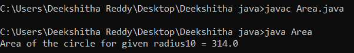
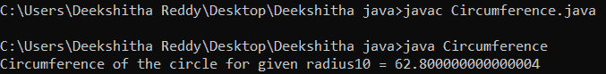
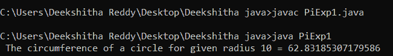
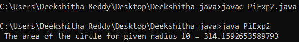
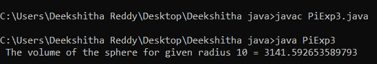
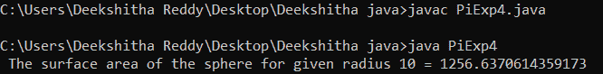
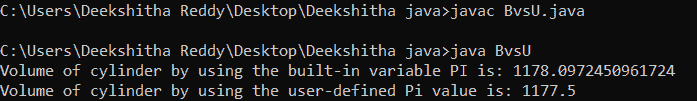

# Java Pi

> 原文：<https://www.tutorialandexample.com/java-pi>

## 圆周率是什么？

几何中有许多公式使用圆周率常数来计算周长、面积和体积。一个圆的周长除以它的直径得到一个可以确定的数学常数。

常数π的值约为 3.14。Pi 在 Java 中有一个内置的常量字段，它是 Math 类(java.lang)的一部分。

## 什么是数学。Java 里的 PI？

在 Java 中，静态最终双常数数学。圆周率和数学中的圆周率一样。在数学课上，数学。圆周率常数用于执行各种数学和科学计算，例如确定球体的表面积和体积或圆的面积和周长。圆周率在现实生活中有着至关重要的作用和无数的应用。下面列出了其中的一些。

航空工程师使用圆周率来确定飞机机身的尺寸。

Pi 通过分析眼睛的解剖结构来帮助医学科学。

生物化学家用π来分析 DNA 的结构。

为了预测该州的人口动态，统计学家使用圆周率。

下面的程序没有使用内置的常量字段，显示了如何使用常量值 pi。

Area.java

```
import java.util.Scanner;  
public class Area  
{  
    public static void main(String ar[])   
    {  

        final double pi = 3.14;  
        int radius = 10; 
        double area = pi*(radius*radius);   
        System.out.println("Area of the circle for given radius" + radius + " = " + area);  
    }  
} 
```

**输出:**



Circumference.java

```
import java.util.Scanner;  
public class Circumference  
{  
    public static void main(String ar[])   
    {  final double pi = 3.14;  
        int radius = 10; 
        double circumference = 2*(pi*radius); 
       System.out.println("Circumference of the circle for given radius" + radius + " = " + circumference);  
    }  
} 
```

**输出:**



上述代码中的最后一个双变量 pi 用于将 pi 值设置为 3.14。此外，计算面积和周长，并显示在上面的输出中。

现在让我们看看下面的可执行示例，看看如何获取和使用 Math 的值。Java 中的 PI。

PiExp1.java

```
public class PiExp1 {
        public static double circleCircumference(int radius) {
                 return Math.PI * (2 * radius); 
}
          public static void main(String[] args) {
             	int radius = 10;
   System.out.println(" The circumference of a circle for given radius " + radius + "       = " + circleCircumference(radius));
	}
}
```

**输出:**



PiExp2.java

```
public class PiExp2 {

	public static double circleArea(int radius) {

		return Math.PI * Math.pow(radius, 2);
	}
 public static void main(String[] args) {
       int radius = 10;
System.out.println(" The area of the circle for given radius " + radius + " = " + circleArea(radius));
	}
}
```

**输出:**



PiExp3.java

```
public class PiExp3 {

  public static double sphereVolume(int radius) {

		return (4 / 3) * Math.PI * Math.pow(radius, 3);
	}
 public static void main(String[] args) {

		int radius = 10;

		System.out.println(" The volume of the sphere for given radius " + radius + " = " + sphereVolume(radius));
	}
} 
```

**输出:**



PiExp4.java

```
public class PiExp4 {
 public static double sphereSurfaceArea(int radius) {

		return 4 * Math.PI * Math.pow(radius, 2);
	}

 public static void main(String[] args) {
int radius = 10;
System.out.println(" The surface area of the sphere for given radius " + radius + " = " + sphereSurfaceArea(radius));
	}
}
```

**输出:**



使用用户自定义变量和内置变量计算圆柱体体积的程序。

bvsu . java 档案

```
import java.lang.Math.*;  
public class BvsU 
{    
    public static void main(String[] args)   
    {  
       final double pi=3.14;  
        double r = 5;  
        double l = 15;          
         double a = r * r * Math.PI;  
        double v = a * l;  
        System.out.println("Volume of cylinder by using the built-in variable PI is: " + v);  
       double a1 =r * r * pi;  
        double v1 = a1 * l;  
     System.out.println("Volume of cylinder by using the user-defined Pi value is: " + v1);  
    }  
} 
```

**输出:**



在程序中使用 Pi 常量的两种方法都显示在前面提到的 Java 代码中。这两种方法都是通过乘法运算来计算和显示圆柱体的面积。

本文讨论了圆周率数学常数，实现它的 Java 程序，以及一个使用它作为例子的程序。